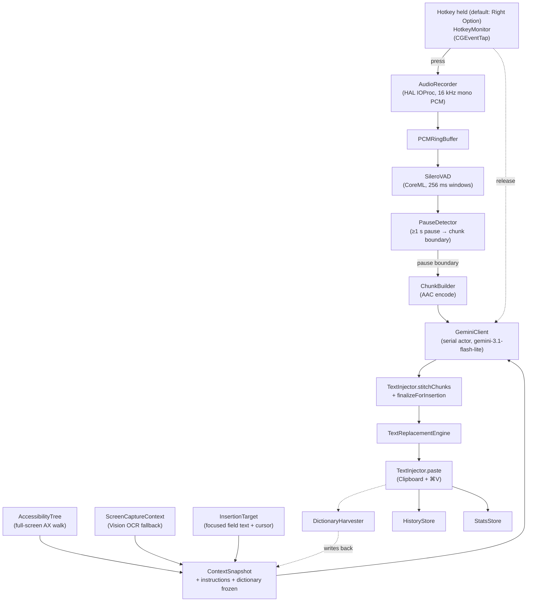

# Architecture overview

**Snapshot of the system as of 2026-05-15.** Regenerable on demand from the code — when a section drifts from `NoType/`, regenerate this file rather than editing it for accuracy. Source of truth is the code; rationale (why a piece exists, what was rejected, what we tried) lives in `docs/solutions/`.

---

## Data flow

Solid arrows = audio / text path. Dotted arrows = control / async signal.

---

## Modules

| Folder | Owns | Source-of-truth doc |
|---|---|---|
| `NoType/Hotkey/` | Configurable hotkey press / release detection via CGEventTap (default: Right Option; `HotkeyBinding` persisted in UserDefaults) | `Hotkey/CLAUDE.md` |
| `NoType/Recording/` | Core Audio HAL capture (`AudioDeviceCreateIOProcIDWithBlock`), Silero VAD, PCM ring buffer, chunk slicing & encoding | `Recording/CLAUDE.md` |
| `NoType/Context/` | Full-screen AX walk, optional OCR fallback, secure-field masking | `Context/CLAUDE.md` |
| `NoType/Instructions/` | Per-app `AppCategory`, user / category instructions, search-field AX override, classifier | `Instructions/CLAUDE.md` |
| `NoType/Dictionary/` | Personal dictionary (cache-prefix section + replacement pairs); `DictionaryHarvester` | `Dictionary/CLAUDE.md` |
| `NoType/Gemini/` | API client (transcription + classifier), request shape, retry policy | `Gemini/CLAUDE.md` |
| `NoType/Injection/` | Clipboard save / restore + ⌘V paste; `stitchChunks` + `finalizeForInsertion` | `Injection/CLAUDE.md` |
| `NoType/History/` | Last-10 transcript JSON; lifetime `StatsStore` aggregate | `History/CLAUDE.md` |
| `NoType/Storage/` | `JSONFileStorage` — shared file-IO plumbing for the four actor stores | `Storage/CLAUDE.md` |
| `NoType/Keychain/` | Gemini API key storage (`SecretStore` → `KeychainStore`) | `Keychain/CLAUDE.md` |
| `NoType/Updates/` | Sparkle 2 controller + custom `SPUUserDriver` (in-sidebar banner) | `Updates/CLAUDE.md` |
| `NoType/Permissions/` | Microphone / Accessibility / Screen Recording TCC state | `Permissions/CLAUDE.md` |
| `NoType/Onboarding/` | First-launch wizard | `NoType/Onboarding/` (no CLAUDE.md) |
| `NoType/UI/` | SwiftUI surfaces: menu-bar, popover, main window, HUDs, settings | `UI/CLAUDE.md` |

---

## External integrations

| External | Used for | Decision |
|---|---|---|
| Gemini API (`gemini-3.1-flash-lite`) | Transcription + app classifier | [solutions/tooling-decisions/gemini-3-1-flash-lite-2026-05-15.md](../solutions/tooling-decisions/gemini-3-1-flash-lite-2026-05-15.md) |
| Silero VAD (CoreML) | Voice activity detection | [solutions/tooling-decisions/silero-vad-coreml-2026-05-15.md](../solutions/tooling-decisions/silero-vad-coreml-2026-05-15.md) |
| Sparkle 2 (SPM) | Auto-updates | [solutions/tooling-decisions/sparkle-2-with-custom-banner-ui-2026-05-15.md](../solutions/tooling-decisions/sparkle-2-with-custom-banner-ui-2026-05-15.md) |
| `ScreenCaptureKit` + `Vision` | OCR fallback when AX is empty | [solutions/architecture-patterns/screenshot-ocr-fallback-2026-05-15.md](../solutions/architecture-patterns/screenshot-ocr-fallback-2026-05-15.md) |
| macOS Accessibility API | AX tree + `CGEventTap` | [solutions/design-patterns/full-screen-ax-tree-2026-05-15.md](../solutions/design-patterns/full-screen-ax-tree-2026-05-15.md), [solutions/design-patterns/right-option-cgeventtap-2026-05-15.md](../solutions/design-patterns/right-option-cgeventtap-2026-05-15.md) |
| macOS Keychain | Gemini API key | [solutions/tooling-decisions/byok-keychain-storage-2026-05-15.md](../solutions/tooling-decisions/byok-keychain-storage-2026-05-15.md) |
| GitHub Pages (`weylandd.github.io/NoType/appcast.xml`) | Sparkle appcast feed | (in the Sparkle decision above) |

No other external network calls. No telemetry — see [solutions/conventions/no-telemetry-with-statsstore-carveout-2026-05-15.md](../solutions/conventions/no-telemetry-with-statsstore-carveout-2026-05-15.md).

---

## Threading model

| Component | Lives on |
|---|---|
| `HotkeyMonitor` | Dedicated `Thread` with its own `RunLoop` (required for `CGEventTap`) |
| `AudioRecorder` (HAL IOProc) | Dedicated serial `DispatchQueue` (`app.notype.recording.ioproc`, qos `.userInteractive`) |
| `AudioRecorder` (PCM storage) | `NSLock`-guarded ring buffer; producer = IOProc dispatch, consumer = VAD task / chunk builder |
| `SileroVAD` | `actor`; called from a detached `Task` consuming `AsyncStream<[Float]>` |
| `RecordingSession` | `@MainActor` (owns UI-bound state) |
| `GeminiClient` | `actor` |
| `HistoryStore`, `StatsStore`, `InstructionsStore`, `DictionaryStore` | `actor` each |
| `AppState`, `PermissionsViewModel`, `OnboardingState`, `AppearanceController`, `HUDController` | `@MainActor` |
| UI (`MenuBarExtra`, popover, HUDs, main window) | `@MainActor` |

Cross-thread plumbing: `AsyncStream<[Float]>` (audio tap → VAD), `await` actor calls (session ↔ Gemini, session ↔ stores), `@Observable` mirrors (services → SwiftUI).

---

## Invariants (the rules the system rests on)

1. **One Gemini request in flight per session.** New chunks queue and may batch into one round-trip. → [solutions/architecture-patterns/serial-gemini-actor-2026-05-15.md](../solutions/architecture-patterns/serial-gemini-actor-2026-05-15.md)
2. **Local concatenation, never re-emit.** Each Gemini call returns only its own chunk's text; the client joins them. → [solutions/design-patterns/local-chunk-concatenation-2026-05-15.md](../solutions/design-patterns/local-chunk-concatenation-2026-05-15.md)
3. **Cache-friendly part ordering is load-bearing.** The 6 / 7 / 8 user-message text parts in every Gemini request are byte-stable across chunks of one session. → `NoType/Gemini/CLAUDE.md` "Why this order"; pinned by `GeminiRequestBuilderTests`.
4. **No audio retention.** PCM lives only in the in-memory ring buffer + transient m4a blobs; nothing on disk. History stores text only.
5. **No injection mid-recording.** Text is pasted exactly once, after the final chunk's response arrives. Partial transcripts are internal state only.
6. **`RecordingSession` is a value, not a global.** Created on press, dropped on release. No "current session" singleton.
7. **Secure fields are always masked.** Type-level — `AccessibilityTree.snapshot()` returns `RedactedAXSnapshot`, never raw text. → `NoType/Context/CLAUDE.md` "Secure-field masking" + [solutions/design-patterns/full-screen-ax-tree-2026-05-15.md](../solutions/design-patterns/full-screen-ax-tree-2026-05-15.md).

---

## Where to look next

- **Code-level rules and cache-prefix detail:** per-module `CLAUDE.md` (auto-loaded by Claude Code when working in the module).
- **Why a piece exists / what we rejected:** [`docs/solutions/`](../solutions/).
- **Coding conventions** (concurrency, error model, logging, force-unwrap, testing): [`docs/solutions/conventions/`](../solutions/conventions/).
- **Known gaps not yet shipped:** [`docs/TECHDEBT.md`](../TECHDEBT.md) → [`docs/solutions/documentation-gaps/`](../solutions/documentation-gaps/).
- **Build / release / notarize:** [`docs/build.md`](../build.md).
- **Permissions and onboarding:** [`docs/permissions.md`](../permissions.md).

---

## Regenerating this file

Ask: "Regenerate `docs/architecture/overview.md` with a current Mermaid diagram, module table, external-integrations list, threading model, and invariants — no history, only current state." The agent regenerates from code + per-module `CLAUDE.md`s. Don't merge a regenerated overview without spot-checking that the new sections still match what `NoType/` ships.
