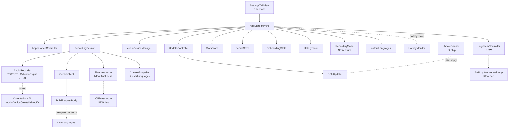
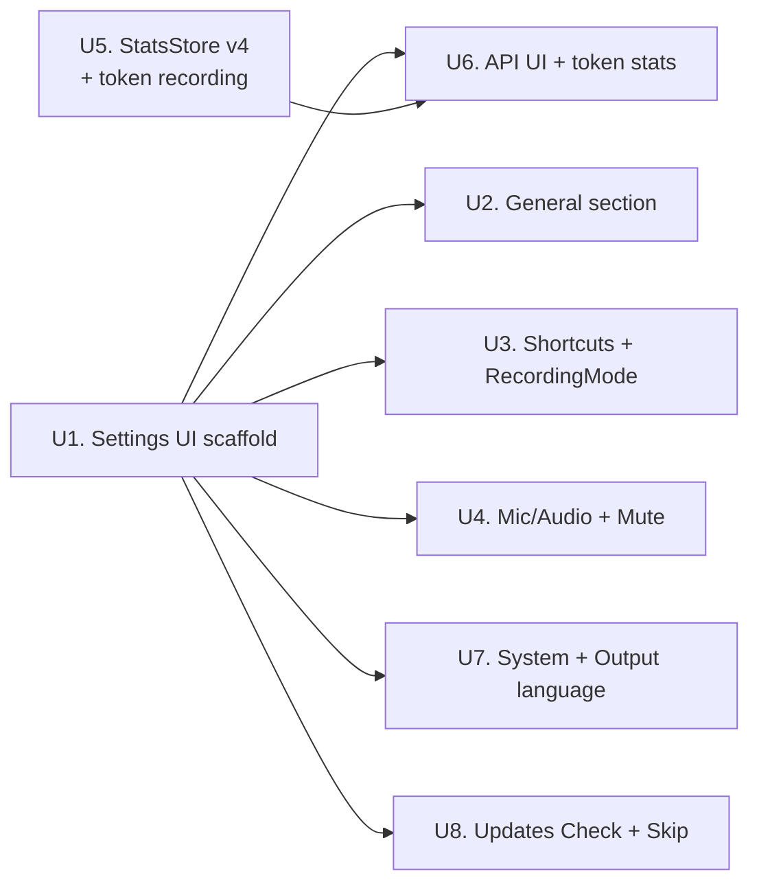

# Settings Screen

## Summary

Полноценный Settings-экран как 4-й sidebar tab в main window, реализуется через scrolled-with-headers form и **8 implementation units** в dependency-order: scaffold → 4 section content units с system integrations → StatsStore backend → API section UI → System section + Output language cache-prefix integration → Updates Check + per-version skip. Расширяет существующие модули (`AppearanceController`, `AudioDeviceManager`, `GeminiClient`, `StatsStore`, `UpdateController`, `HotkeyMonitor`, `RecordingSession`) и добавляет 2 новые системные dependencies (`SMAppService`, `IOPMAssertion`). **U4 несёт substantial architectural work** — переписывает `AudioRecorder` с `AVAudioEngine` на pure Core Audio HAL чтобы устранить recording-start audio glitch (R16-reframed; Music interruption Mute toggle отложен — решал не ту проблему). Новые абстракции — `RecordingMode` enum, `LoginItemController`, `SleepAssertion` (как `final class`).

---

## Problem Frame

Текущий `SettingsView` — лёгкий sheet с 4 контролами, и пользователь не имеет UI для ротации Gemini-ключа, мониторинга расхода токенов, добавления language-hint, контроля music-ducking или per-version skip обновлений. Подробное обоснование и landscape анализ конкурентов — в origin требованиях.

---

## Requirements

Все R-IDs трасируются к [origin requirements doc](../brainstorms/2026-05-17-settings-screen-requirements.md). Этот план реализует **все** R1–R26 кроме **R9 (Sound effects)**, который дропнут из v1 scope per user direction (см. Scope Boundaries).

**Settings UI architecture:** R1, R2, R3, R4, R5, R26
**General section:** R6 (Theme), R7 (Open on login), R8 (Prevent sleep), R10 (Reset onboarding). R9 dropped.
**Shortcuts section:** R11 (Hotkey binding), R12 (Recording modes ×3, includes Hold+Space constraint), R13 (Cancel shortcut)
**Microphone & Audio section:** R14 (Mic picker), R15 (BT toggle), **R16 reframed (Covers AE8 reframed)** — был «Music interruption picker None/Mute», теперь «Audio playback continuity during recording» (eliminate recording-start glitch on BT headphones via Core Audio HAL rewrite). Mute toggle отложен — оригинальный feature solved wrong problem; реальная пользовательская боль — glitch на старте, не громкость.
**API section (BYOK only):** R17 (Gemini key + Edit), R18 (Token stats UI), R19 (StatsStore extension)
**System section:** R20 (Output language picker), R21 (cache-prefix integration), R22 (Delete all transcripts), R23 (Check for updates), R24 (per-version skip via X), R25 (Paste delay slider)

**Origin actors:** A1 (BYOK user — supported in v1), A2 (SaaS/login user — section visibility designed but mode itself out of scope)
**Origin acceptance examples:** AE1 (covers R3, R26), AE2 (R12), AE3 (R13), AE4 (R17), AE5 (R20, R21), AE6 (R24), AE7 (R22), AE8 (R16), AE9 (R10)

---

## Scope Boundaries

Carried verbatim from origin Scope Boundaries:
- Silence remover, support non-standard keyboards, In-app Screen Recording / OCR toggle (TCC достаточно; `docs/solutions/documentation-gaps/screen-capture-settings-section-2026-05-15.md` **остаётся открытой**), Music interruption «Pause» (требует private `MediaRemote`), SaaS/login mode UI (Profile/Plan-секция отдельным брейном когда SaaS появится), $-cost conversion, per-app token breakdown, Localization (English-only v1), «Skip this version» как явный UI-control (только через X на pill), Migration старой `SettingsView` sheet (удаляется целиком), Dictionary master toggle (остаётся в Dictionary-табе), Show dock icon, Show «monophone» panel.

Plan-local additions:
- **Sound effects feature (R9 в origin)** — дропнут из v1 scope per user direction. Toggle убирается из General-секции; никакого `AudioServicesPlaySystemSound` кода не добавляется. R9 переходит в этот scope-boundaries list и не реализуется этим планом.

---

## Context & Research

### Relevant Code and Patterns

**UI scaffold + sidebar:**
- `NoType/UI/MainWindow.swift` — `MainTab` enum (Home/Instructions/Dictionary); добавление 4-го case `settings` — точка расширения. Окно заблокировано `MainWindowMetrics.canvasSize = 1080×760` через `FixedSizeWindowConfigurator` → main pane ~860×720 budget после sidebar (220 pt).
- `NoType/UI/AppearanceController.swift` (R6) — `@MainActor @Observable`, `notype.appearanceMode`, picker pattern из старого `SettingsView` строки 78–84.
- `NoType/UI/DSComponents.swift` + `NoType/UI/DesignTokens.swift` — готовые: `DSSeparator`, `DSIconButton`, `DSCloseButton(size: .standard|.compact)`, `DSBadge`, `DSKbd`, `DSPrimaryButton`, `DSSecondaryButton`, `DSWordChip`. **Нет** готовых `DSSettingsSection` / `DSSettingsRow` — добавим (см. U1).
- `NoType/UI/HistoryPopover.swift` — footer уже содержит `OpenMainWindowButton`; header сейчас без gear — восстановим в U1.
- Старый `NoType/UI/SettingsView.swift` — dead-code (нет live entry-points), удаляется в U1.

**Hotkey + recording modes:**
- `NoType/Hotkey/HotkeyBinding.swift` — `code: String` (JS-style), `notype.hotkey.bindingCode`, `isAllowedAsHotkey` отвергает Escape/Power/CapsLock. `HotkeyBinding.code` **scalar** — не поддерживает combos, R12 Hold+Space реализуется как `RecordingMode` enum (отдельно от binding).
- `NoType/Hotkey/HotkeyMonitor.swift` — escape hardcoded `keycode == 53` (строки 41–43, 250–262); рефакторим под `cancelBinding` параметр.
- `NoType/AppState.swift` строки 99–122, 412–584 — текущая state machine с переплетёнными Hold + Double-tap; рефакторим под `RecordingMode` enum (U3).
- `NoType/Onboarding/MacKeyboardView.swift` — переиспользуемый picker для R11.

**Audio:**
- `NoType/Recording/AudioDeviceManager.swift` — `preferBuiltInOverBluetooth` под `notype.preferBuiltInOverBluetooth` (default ON через `object as? Bool ?? true`).
- `NoType/Recording/AudioRecorder.swift` — текущая реализация на `AVAudioEngine` + `installTap` вызывает recording-start audio glitch на BT-headphones (AVAudioEngine внутренне создаёт aggregate input+output device при start, ломая BT-output). U4 переписывает на pure Core Audio HAL (`AudioDeviceCreateIOProcIDWithBlock`).

**Gemini + cache prefix:**
- `NoType/Gemini/GeminiClient.swift` — `validateKey` (строки 238–254) переиспользуется для R17; `buildRequestBody` (строки 374–436) — точка расширения для R21 (новая part при `User languages:` в position 4).
- `NoType/Gemini/Models.swift` — `UsageMetadata { promptTokenCount, candidatesTokenCount, cachedContentTokenCount }` уже парсится, не используется — wire в U5.
- `NoTypeTests/GeminiRequestBuilderTests.swift` — пинит `texts.count == 6 / 8`; **гарантированно сломает 5+ тестов** при добавлении `User languages:` — обновляем test fixtures FIRST (U7 execution note).

**Stores + JSON:**
- `NoType/History/StatsStore.swift` — `currentVersion = 3` (строка 84), `healIfPreV3` (строки 136–155) — pattern для `healIfPreV4` в U5.
- `NoType/Storage/JSONFileStorage.swift` — atomic write + corruption recovery; не модифицируем.
- `NoType/History/HistoryStore.swift` — `remove(id:)` per-row; добавим `deleteAll()` actor method в U7.
- `NoType/Context/ContextSnapshot.swift` — frozen-at-session-start; добавим `userLanguages: [String]` поле (U7).
- `NoType/Recording/RecordingSession.swift` — `start()` собирает ContextSnapshot; добавим SleepAssertion lifecycle (U2) и token aggregation (U5).

**Updates / Sparkle:**
- `NoType/Updates/UpdateController.swift` — `Phase` state machine + `pendingUpdateReply` для bridge с `SPUUserDriver` reply callbacks.
- `NoType/Updates/UpdateUserDriver.swift` — `@preconcurrency import Sparkle`. **Research finding**: `SPUUserUpdateChoice.skip` существует out-of-box (Sparkle сам персистит в `SUSkippedVersion` UserDefaults) — никакой собственный flag не нужен.
- `NoType/UI/UpdateBanner.swift` — `.available(update)` ветка сейчас монолитная Button; разносим на body+X-chip в U8.
- `NoType/Updates/CLAUDE.md` Hard rule «Don't ship Check for Updates without Skip surface» — снимается в U8 (обе surface'ы прилетают вместе).

**Existing UserDefaults keys** (consistency naming для новых):
`notype.hotkey.bindingCode`, `notype.selectedInputDeviceUID`, `notype.preferBuiltInOverBluetooth`, `notype.appearanceMode`, `notype.dictionaryEnabled`, `notype.pasteRestoreDelayMs`, `notype.onboarding.{currentStep,furthestStep,complete}`, `notype.permissions.screenRecording.hasAsked`. Новые: `notype.recordingMode`, `notype.cancelHotkey.bindingCode`, `notype.openOnLogin`, `notype.preventSleepDuringRecording`, `notype.outputLanguages`. (`notype.userMode` и `notype.musicInterruption` deliberately **not** shipped в v1 — UserMode см. Key Technical Decisions; MusicInterruption — R16 reframed как HAL rewrite в U4, Mute toggle отложен.)

### Institutional Learnings

- **Cache-prefix invariant + always-present-with-empty-body precedent** — `docs/solutions/architecture-patterns/per-app-categorization-instructions-2026-05-15.md` + `docs/solutions/architecture-patterns/personal-dictionary-2026-05-15.md`. R21 mirrors `User dictionary:` shape (always present, body `(empty)` when list empty, frozen at session start).
- **Cache-prefix budget** — `docs/solutions/architecture-patterns/gemini-prompt-section-audit-2026-05-17.md`. Post-Tier-2 trim: ~2700 tokens full, ~960 lite. `User languages:` добавляет ~5–30 токенов в session frozen part — внутри бюджета.
- **StatsStore schema evolution** — `docs/solutions/architecture-patterns/json-history-store-2026-05-15.md` + `docs/solutions/architecture-patterns/json-file-storage-helper-2026-05-16.md`. v3→v4 миграция через `healIfPreV4` (mirror existing `healIfPreV3`); tolerant decoder с `decodeIfPresent ... ?? 0`.
- **No-telemetry carve-out** — `docs/solutions/conventions/no-telemetry-with-statsstore-carveout-2026-05-15.md`. Token aggregates extend carve-out: local-only, never leave device, не decrement'ятся при `deleteHistoryEntry` (как и word counts). U5 включает doc update этого файла.
- **BYOK Keychain Edit path** — `docs/solutions/tooling-decisions/byok-keychain-storage-2026-05-15.md`. R17 reuses `validateKey` → `SecItemUpdate` upsert flow; никакого нового Keychain кода.
- **Sparkle 2 custom banner + Check trigger** — `docs/solutions/tooling-decisions/sparkle-2-with-custom-banner-ui-2026-05-15.md`. Documented reconsideration trigger «Users start asking for Check for Updates — add a manual trigger, but keep the banner as the primary surface» — R23/R24 закрывают это вместе.
- **CGEventTap + HotkeyBinding combo limitation** — `docs/solutions/design-patterns/right-option-cgeventtap-2026-05-15.md`. **R12 Hold+Space НЕ расширяет `HotkeyBinding` schema** (она scalar `code: String`) — реализуется как orthogonal `RecordingMode` enum + session-scoped spacebar detector. Это closes Conflict C1 из research findings.
- **DS primitive extension pattern** — `docs/solutions/design-patterns/ds-primitives-opt-in-extension-patterns-2026-05-17.md`. Новые `DSSettingsSection` / `DSSettingsRow` следуют opt-in defaults pattern с backwards-compat.
- **@Observable + initializer-only DI** — `docs/solutions/conventions/module-architecture-and-naming-2026-05-15.md`. Новый `LoginItemController` следует pattern; `SleepAssertion` — `final class` с RAII deinit; никаких `ObservableObject` / `@Published`.
- **Swift 6 concurrency** — `docs/solutions/conventions/swift-6-concurrency-and-async-2026-05-15.md`. `TimelineView` ban actual для token-stats live-update сценариев — используем `@State` + `.task`-loop вместо.
- **Bluetooth input avoidance** — `docs/solutions/architecture-patterns/bluetooth-input-avoidance-2026-05-16.md`. R15 — pure exposure existing toggle.

### External References

- [`SMAppService.mainApp`](https://developer.apple.com/documentation/servicemanagement/smappservice) — macOS 13+ public API для Login Items, без entitlements.
- [`IOPMAssertionCreateWithName`](https://developer.apple.com/documentation/iokit/1557134-iopmassertioncreatewithname) + `kIOPMAssertPreventUserIdleSystemSleep` — публичный C API, без TCC prompt'ов.
- [Core Audio HAL — `AudioDeviceCreateIOProcIDWithBlock`](https://developer.apple.com/documentation/coreaudio/audiodevicecreateioprocidwithblock) — pure HAL recording, no `AVAudioEngine`, no aggregate device side-effects.
- [«It's over between us, AVAudioEngine» — SuperMegaUltraGroovy](https://supermegaultragroovy.com/2021/01/26/it-s-over-avaudioengine/) — root-cause analysis of macOS AVAudioEngine output-disruption pattern (informs U4 rewrite decision).
- [Sparkle 2 `SPUUserUpdateChoice`](https://sparkle-project.org/documentation/) — `.skip` / `.install` / `.dismiss` reply tri-state.

---

## Key Technical Decisions

- **Settings лежит в main window sidebar 4-м tab'ом, не отдельным ⌘, окном**: единый surface, переиспользует `MainWindowMetrics`/sidebar/DesignTokens/onboarding-wizard host. Подтверждено пользователем в брейнштормах (см. origin Key Decisions).
- **Sub-navigation = scrolled-with-headers**: main window заблокирован на 1080×760, внутренний sidebar внутри Settings съел бы ещё ~150 pt и оставил main pane слишком тонким для form-density. Все 5 секций живут в `ScrollView` с H2 headers (`General`, `Shortcuts`, `Microphone & Audio`, `API`, `System`).
- **`RecordingMode` enum, orthogonal к `HotkeyBinding`**: enum `{ hold, doubleTapLock, holdSpacebarLock }` персистится под `notype.recordingMode`. Hold+Space реализуется как session-scoped spacebar detector в `HotkeyMonitor`, **не** через расширение `HotkeyBinding.code: String` (которое scalar и не поддерживает combos — задокументировано в `right-option-cgeventtap-2026-05-15.md`). Это closes brainstorm Deferred Q.
- **Recording mode default = `doubleTapLock` для existing и new installs**: preserves today's both-work behavior. Default `.hold` сломал бы UX тех, кто полагается на double-tap (текущее единственное доступное «advanced» поведение).
- **Hold+Space picker option UI-disabled для не-modifier hotkeys**: избегаем коллизию spacebar-в-text-field (юзер с letter-hotkey удерживает букву + случайный пробел → unintended lock). Picker option показывает tooltip объясняющий ограничение.
- **Output language как новая cache-prefix part на position 4**: между `Category instruction:` и `User dictionary:`, **always-present с `(empty)` body** при пустом списке. Mirrors `User dictionary:` precedent (а не omit-when-empty как у `User instruction:`) — byte-stable по умолчанию для всех BYOK-юзеров, у которых нет языков. Frozen at session start через `ContextSnapshot.userLanguages` (как `userInstruction`).
- **Output language list = full ~100 Gemini-supported языков** через `Locale` standard / BCP-47 source (ship'аем JSON-resource `SupportedLanguages.json` для maintainability). Per user direction.
- **Per-session `IOPMAssertion`, не global**: assertion acquired в `RecordingSession.start()`, released в `stop()`/`cancel()` — RAII-style. Не AppState global because lifecycle tied to recording, not to app being open.
- **R16 reframed: «Audio playback continuity» через Core Audio HAL rewrite (U4)**. Исходный «Music interruption Mute via AVAudioSession.duckOthers» решал не ту проблему (юзеру не нужен Mute — нужно чтоб НЕ БЫЛО recording-start glitch); plus AVAudioSession не существует на macOS (`API_UNAVAILABLE(macos)`). Реальный fix — переписать `AudioRecorder` с `AVAudioEngine` на pure Core Audio HAL (`AudioDeviceCreateIOProcIDWithBlock`). Mute toggle отложен из v1 (отдельная nice-to-have).
- **Sparkle per-version skip = built-in `SPUUserUpdateChoice.skip` reply**: research нашёл, что Sparkle 2 уже персистит per-version skip через `SUSkippedVersion` UserDefaults. X chip на pill dispatches `pendingUpdateReply?(.skip)`; никакого собственного UserDefaults flag не нужен.
- **R23 Check + R24 Skip → bundle в одном unit (U8)**: closes the `NoType/Updates/CLAUDE.md` Hard rule reversal («Don't ship Check without Skip surface»). Обе surface'ы прилетают вместе → Hard rule снимается в этом же unit.
- **API section rendered unconditionally в v1** (no `UserMode` infrastructure shipped): v1 — BYOK-only release, и enum / UserDefaults key / conditional rendering для несуществующего SaaS mode = premature infrastructure with zero current value (scope-guardian finding, confidence 100). API section renders as plain section block с `// TODO: when SaaS mode lands, gate this section on userMode` comment. R3 / R26 / AE1 остаются origin requirements — их mode-aware infrastructure deferred until SaaS mode actually exists (cheap to add then because the section is already a concrete block).
- **Settings tab всегда visible в sidebar:** Settings = top-level navigation, не gated. API-секция inside Settings = unconditional в v1; gating logic откладывается до момента SaaS mode shipping.
- **Mic picker и Hotkey binding — duplicated, не migrated**: per origin Key Decision. Оригиналы остаются в popover footer / onboarding wizard; Settings даёт дополнительную точку доступа.
- **Старая `SettingsView.swift` удаляется полностью**: research подтвердил dead-code (нет live entry-points в popover).
- **Popover gear восстанавливается в HistoryPopover header**: cross-window navigation через `appState.pendingTabSelection: MainTab?` flag; `MainWindowView.onAppear` читает/clears flag после применения.
- **`DSSettingsSection` + `DSSettingsRow` — новые DSComponents primitives**: justified по convention «If a button/chip/pill appears in 2+ surfaces with the same spec, it lives in DSComponents.swift» (UI/CLAUDE.md). 5 секций × 4–6 rows = 25+ повторений без primitive.
- **`TokenUsage` живёт отдельным path, не в `HistoryEntry`**: token aggregates → `StatsStore` напрямую через новый `record(entry:tokens:)` overload. `HistoryEntry` остаётся transcript-preview shape (cap 10) — добавлять туда tokens бессмысленно.
- **`StatsStore` schema v3→v4 через `healIfPreV4`**: mirror existing `healIfPreV3` exactly. Tolerant decoder с `decodeIfPresent ... ?? 0` для всех новых token-fields.

---

## Open Questions

### Resolved During Planning

- **UI form sub-навигации** → scrolled-with-headers (main window 1080×760 constraint)
- **Hold+Space mode при не-modifier hotkey** → picker option UI-disabled с tooltip + runtime `RecordingMode.effective(stored:hotkey:)` auto-downgrade guard
- **`StatsStore` schema migration v3→v4** → `healIfPreV4` callback (purely additive, no v3-field zeroing)
- **Что Sparkle 2 предлагает out-of-box для per-version skip** → `SPUUserUpdateChoice.skip`; fallback `notype.update.skippedVersion` UserDefaults если empirical smoke fail'ит
- **Reset onboarding confirm shape** → simple confirmDialog «Reopen onboarding wizard? Your API key, hotkey, and microphone choice will be preserved.»
- **Delete all transcripts confirm shape** → macOS `confirmationDialog` с destructive «Delete all» button + текст «Your usage stats (session counts, word totals, token usage, and app breakdown) will be preserved.»
- **Где жить user-mode flag** → **deferred** entirely; не shipим в v1. API section renders unconditionally (v1 = BYOK-only). When SaaS mode ships, the gating decision (UserDefaults vs server-authoritative response) makes sense in that context — premature к moment'у v1 Settings (scope-guardian fix).
- **Объём списка языков** → full ~100 Gemini-supported (per user direction)
- **Language picker display-name language** → English («Russian», «Japanese», not «Русский»/«日本語»). Simplest implementation, no Locale-based switching. (Resolved 2026-05-18 mid-walkthrough.)
- **`DSSettingsSection` / `DSSettingsRow` visual layout** → implementing agent picks defaults from `DesignTokens` (padding via `DS.Space`, headers via `DS.Font`, separators via `DSSeparator`). Visual iteration deferred to ce-frontend-design if needed post-implementation. No upfront design decision required. (Resolved 2026-05-18 mid-walkthrough.)
- **TokenUsage display formatting** → `NumberFormatter` с `Locale.current` (системные настройки локали — en-US → «1,234»; ru-RU → «1 234»). No custom thousand-separator или k/M abbreviation в v1. (Resolved 2026-05-18 mid-walkthrough.)
- **SleepAssertion lifecycle через partial-recovery** → release on terminal failures only (acquired session still alive through recoverable chunk failures per `RecordingSession.isTerminal(_:)` classification — see U2 Approach «Recoverable-only failures... do not release»). No additional wiring decision needed; ce-work follows U2 Approach text directly. (Implementation-detail clarified 2026-05-18 mid-walkthrough — removed from Deferred to Implementation as already-specified.)

### Deferred to Implementation

- **HAL ioproc real-time thread safety** — `AudioDeviceCreateIOProcIDWithBlock` callback runs on Core Audio's real-time render thread. Implementation must verify `PCMRingBuffer` + `AVAudioConverter` access patterns don't introduce blocking allocations or lock contention that could cause buffer underruns (currently `PCMRingBuffer` uses `NSLock` — should be fast enough but needs hardware validation).
- **Manual hardware smoke test for R16-reframed** — primary success criterion is «BT headphones + music playing + hotkey press → no glitch». Cannot be unit-tested; needs real-device validation на AirPods + Apple Music / Spotify before merging.

---

## High-Level Technical Design

> *This illustrates the intended approach and is directional guidance for review, not implementation specification.*

**Module touch graph:**



**Cache prefix part-order matrix (R21):**

| Position | Part | Visibility | Source of truth |
|---|---|---|---|
| 1 | `App:` / `Category:` | always | activeApp + category |
| 2 | `User instruction:` | omit when empty | userInstruction |
| 3 | `Category instruction:` | omit when nil | categoryInstruction |
| **4 (NEW)** | **`User languages:`** | **always; body `(empty)` when `[]`** | **`ContextSnapshot.userLanguages`** |
| 5 | `User dictionary:` | always | dictionary |
| 6 | `Insertion target:` | always | insertionTarget |
| 7 | `On-screen context:` | always (full); skipped in lite | tree + screenText |
| 8 | `Prior chunks (this session):` | always (full); skipped in lite | session priors |
| 9 | per-call instruction | always | per-call |

Lite-path сохраняет position 4 — `User languages:` присутствует в обеих формах prompt'а.

**Implementation Unit dependency graph:**



U5 (backend-only) можно начать параллельно с U1. U2/U3/U4/U7/U8 sibling-independent после U1. U6 ждёт U1 + U5.

---

## Implementation Units

### U1. Settings UI scaffold + sidebar tab + DS section primitives

**Goal:** Добавить Settings как 4-й sidebar tab в main window с scrolled-with-headers form, новые `DSSettingsSection`/`DSSettingsRow` primitives, mode-aware API section visibility hook, popover gear redirect на Settings tab, удалить старый dead-code `SettingsView.swift`.

**Requirements:** R1, R2, R3, R4, R5, R26 (covers AE1 partial)

**Dependencies:** None (blocks U2, U3, U4, U6, U7, U8)

**Files:**
- Create: `NoType/UI/Settings/SettingsTabView.swift` (scrolled-with-headers root, 5 section blocks)
- Create: `NoType/UI/Settings/SettingsSection.swift` (DS primitive wrapper if extracted from DSComponents)
- Modify: `NoType/UI/MainWindow.swift` (add `case settings` к `MainTab`; route `.settings` в `mainPane`; handle `pendingTabSelection` в `MainWindowView.onAppear` + `onChange scenePhase == .active`)
- Modify: `NoType/UI/DSComponents.swift` (add `DSSettingsRow` primitive: title + optional subtitle + trailing AnyView slot)
- Modify: `NoType/UI/HistoryPopover.swift` (restore gear icon button в header; tap → если main window уже виден, выставить `selectedTab = .settings` напрямую; иначе set `appState.pendingTabSelection = .settings` + `openWindow(id: "main")`; всегда dismiss popover)
- Modify: `NoType/AppState.swift` (add `pendingTabSelection: MainTab?` для cross-window navigation; **NOT** `userMode` flag — see Key Technical Decisions / scope-guardian fix)
- Delete: `NoType/UI/SettingsView.swift` (dead-code старый sheet)
- Test: `NoTypeTests/SettingsTabViewTests.swift` (render scenarios; section presence; pendingTabSelection consumption + auto-clear)

**Approach:**
- `MainTab` extends with `case settings = "settings"`; `iconName` + `label` follow существующий pattern (no special-case code).
- `SettingsTabView` = `ScrollView` containing 5 H2 section headers (`General`, `Shortcuts`, `Microphone & Audio`, `API`, `System`). Каждая section использует `DSSettingsSection` (visual: header text + VStack with `DSSeparator` между rows).
- `DSSettingsRow` shape: `(title: String, subtitle: String? = nil, @ViewBuilder trailing: () -> some View)`. Layout: `HStack { VStack { title; subtitle } Spacer() trailing() }` с padding'ом из `DS.Space`.
- **API section rendered unconditionally в v1.** No `UserMode` flag, no UserDefaults key, no conditional rendering — v1 is BYOK-only, so API section always appears. Add `// TODO: when SaaS mode lands, gate this section on userMode` comment above the API-section block в `SettingsTabView`. R3 / R26 / AE1 remain origin-defined requirements — their mode-aware infrastructure is deferred to when SaaS mode actually exists (cheap to add then because the section is already a concrete block; nothing to retrofit).
- **Popover gear:** в `HistoryPopover.headerView` добавить `DSIconButton(name: "gear")` справа от recordingPill area; tap → **if main window already visible**: set `selectedTab = .settings` directly (no pending-flag needed); **else**: set `appState.pendingTabSelection = .settings` + `openWindow(id: "main")`. Always dismiss popover.
- **Cross-window tab navigation:** `appState.pendingTabSelection: MainTab?`. `MainWindowView.onAppear` AND `onChange(of: scenePhase)`: **unconditionally clear** `pendingTabSelection` after reading — `let pending = appState.pendingTabSelection; appState.pendingTabSelection = nil; if let pending { selectedTab = pending }`. Prevents stale flag consumed by wrong window-open trigger (e.g., 3-hours-later Sparkle banner click landing on Settings instead of update detail). Optional short-timer expiry (30s) as belt-and-braces if cross-window race becomes observable.

**Patterns to follow:**
- `NoType/UI/HomeView.swift` для tab-root structure
- `NoType/UI/AppearanceController.swift` для @Observable + UserDefaults persistence + NSApp nil-guard pattern
- `docs/solutions/design-patterns/ds-primitives-opt-in-extension-patterns-2026-05-17.md` для DS primitive extension с backwards-compat defaults
- `NoType/UI/CLAUDE.md` Hard rule «If a button/chip/pill appears in 2+ surfaces with the same spec, it lives in DSComponents.swift»

**Test scenarios:**
- Happy path: Given main window opens, when sidebar renders, then «Settings» appears as 4th nav item (after Dictionary).
- Happy path: Given user clicks Settings sidebar item, when main pane renders, then 5 section headers visible: General, Shortcuts, Microphone & Audio, API, System.
- Happy path (Covers AE1 v1-flavor): Given v1 (BYOK-only release), when SettingsTabView renders, then API section block is unconditionally present in view tree.
- Happy path: Given user clicks popover gear AND main window NOT visible, when callback dispatches, then `pendingTabSelection == .settings` AND `openWindow` called AND popover dismisses.
- Happy path: Given user clicks popover gear AND main window already visible, when callback dispatches, then `selectedTab` becomes `.settings` directly (no pending flag set) AND popover dismisses.
- Edge case: Given `pendingTabSelection == .settings` when main window appears, then `selectedTab` becomes `.settings` AND `pendingTabSelection` cleared atomically.
- Edge case (anti-stale): Given `pendingTabSelection == .settings` set 1 hour ago AND main window opens for unrelated reason (e.g. Sparkle banner click navigation), when `onAppear` runs, then `pendingTabSelection` cleared regardless AND selectedTab still lands on Settings (this is by design — clear first, apply second). Document the trade-off in code comment.

**Verification:** Build compiles; main window opens with 4th sidebar tab labeled «Settings»; clicking it renders empty 5-section layout (content TBD by subsequent units); popover gear opens main window on Settings tab; old `SettingsView.swift` no longer in tree; no compile errors anywhere downstream.

---

### U2. General section content + Login Items + Sleep prevention + Reset onboarding

**Goal:** Заполнить General section: Theme picker, Open on login toggle (SMAppService), Prevent sleep during recording toggle (IOPMAssertion в RecordingSession lifecycle), Reset onboarding button. Sound effects (R9) — deliberately dropped из v1 scope (см. Scope Boundaries).

**Requirements:** R6, R7, R8, R10 (Covers AE9). R9 dropped.

**Dependencies:** U1

**Files:**
- Modify: `NoType/UI/Settings/SettingsTabView.swift` (General section content)
- Create: `NoType/System/LoginItemController.swift` (@MainActor @Observable wrapping `SMAppService.mainApp`; status + register/unregister + System Settings deep-link)
- Create: `NoType/System/SleepAssertion.swift` (RAII-style **`final class`** wrapper вокруг `IOPMAssertionCreateWithName` / `IOPMAssertionRelease`. Reference semantics required — struct has no deinit, so the C handle would leak on missed explicit release. Class deinit calls `IOPMAssertionRelease(id)` as safety net.)
- Modify: `NoType/Recording/RecordingSession.swift` (acquire `SleepAssertion` via `appState.acquireSleepAssertionIfNeeded()` в `start()`; release via `appState.releaseSleepAssertion()` в `stop()` / `cancel()` / terminal-error / recoverable-failures-only-end paths)
- Modify: `NoType/AppState.swift` (add `preventSleepDuringRecording: Bool` UserDefaults-backed @Observable; expose `loginItemController: LoginItemController`; **own** `activeSleepAssertion: SleepAssertion?` (`@MainActor`-isolated) plus `acquireSleepAssertionIfNeeded()` / `releaseSleepAssertion()` methods — single ownership prevents double-release across RecordingSession value copies during partial-recovery flows)
- Modify: `NoType/Onboarding/OnboardingState.swift` (add `resetWizard()` method: `currentStep = .welcome, furthestStep = .welcome, complete = false`; preserves API key + hotkey + mic)
- Test: `NoTypeTests/LoginItemControllerTests.swift` (status enum mapping; URL string for System Settings deep-link)
- Test: `NoTypeTests/SleepAssertionTests.swift` (init/release lifecycle; assertion handle not leaked)
- Test: `NoTypeTests/OnboardingStateTests.swift` (extend) — `resetWizard` preserves SecretStore + HotkeyBinding + selectedInputDeviceUID

**Approach:**
- **Theme picker:** `Picker("", selection: $appearance.mode) { ForEach(AppearanceMode.allCases) ... }.pickerStyle(.segmented)` — exact pattern из старого SettingsView строки 78–84.
- **Open on login:** `LoginItemController.status` — `@Observable var status: SMAppService.Status` обновляется через polling или `KVO` (`SMAppService` не имеет publisher'а; используем `Task` рефреш при `onAppear` + после `register`/`unregister`). Toggle ON → `try await SMAppService.mainApp.register()`; OFF → `try await SMAppService.mainApp.unregister()`. Status `.requiresApproval` → inline note + "Open Login Items in System Settings" button (URL `x-apple.systempreferences:com.apple.LoginItems-Settings.extension`).
- **Prevent sleep:** UserDefaults key `notype.preventSleepDuringRecording`, default `false`. `SleepAssertion` is `final class` (NOT struct — struct has no `deinit`, so missed explicit release would leak the C handle). `init() throws` calls `IOPMAssertionCreateWithName(kIOPMAssertPreventUserIdleSystemSleep as CFString, kIOPMAssertionLevelOn, "NoType active recording" as CFString, &id)`; `release()` calls `IOPMAssertionRelease(id)` (idempotent — sets a flag to skip second call); `deinit` calls `release()` as safety net.
- **Ownership in AppState, not RecordingSession:** `AppState` holds `activeSleepAssertion: SleepAssertion?` (`@MainActor`-isolated, single source of truth). `acquireSleepAssertionIfNeeded()` no-ops if `preventSleepDuringRecording` is off OR if assertion already exists. `releaseSleepAssertion()` releases + nils. `RecordingSession.start()` calls acquire; `stop()` / `cancel()` / `isTerminal(error)` paths call release. Recoverable-only failures (chunk markers but session continues) **do not** release — session is still active. Single ownership prevents the value-type-copy double-release bug from `RecordingSession is a value, not a global` (architecture invariant 6).
- **Reset onboarding:** `Button("Reset onboarding")` → `confirmationDialog("Reopen the onboarding wizard?", isPresented: $showConfirm) { Button("Reopen") { onboarding.resetWizard() }; Button("Cancel", role: .cancel) {} } message: { Text("Your API key, hotkey, and microphone choice will be preserved.") }`.
- `OnboardingState.resetWizard()`: устанавливает `currentStep = .welcome`, `furthestStep = .welcome`, `complete = false`. Не трогает SecretStore, HotkeyBinding, selectedInputDeviceUID. Onboarding wizard сам обнаружит существующий API-key (per AE9) и не requestит заново.

**Patterns to follow:**
- `NoType/UI/AppearanceController.swift` для @Observable controller pattern с UserDefaults + NSApp guard
- `NoType/Permissions/ScreenRecordingPermission.swift` для async system API wrapper pattern
- `NoType/Permissions/SystemSettingsPane.swift` для `x-apple.systempreferences:` deep-link pattern

**Test scenarios:**
- Happy path: Given user toggles Open on login ON, when `register` completes, then `status` becomes `.enabled` AND UI reflects «Enabled».
- Edge case: Given `SMAppService.status == .requiresApproval`, when row renders, then «Approval required» chip + Settings deep-link visible.
- Edge case: Given user denies in System Settings → Login Items, when next status refresh runs, then UI flips back to OFF state (status `.notRegistered`).
- Happy path: Given `preventSleepDuringRecording == true`, when `RecordingSession.start()` runs, then `SleepAssertion` created (assertion ID non-zero).
- Happy path: Given session has active sleep assertion, when `RecordingSession.stop()` succeeds, then assertion released (ID handle cleared).
- Edge case: Given `preventSleepDuringRecording == false`, when `start()` runs, then no assertion created.
- Edge case: Given session active with assertion AND user cancels (CancellationError path), when cancellation handler runs, then assertion released (no leak).
- Edge case: Given session active with assertion AND Gemini terminal failure, when session aborts, then assertion released.
- Integration (Covers AE9): Given user clicks Reset onboarding and confirms, when wizard opens, then API-key step pre-fills from Keychain (not blank) AND hotkey binding picker shows current binding (not default) AND mic-check uses current pinned mic.
- Edge case: Given user dismisses confirm dialog, when no reset fires, then `OnboardingState.complete` remains true AND wizard stays closed.

**Verification:** Toggling Open on login creates entry в System Settings → Login Items; long dictation session (>5min) не уходит в sleep when toggle ON; Reset onboarding opens wizard from welcome без потери data.

**Execution note:** `SleepAssertion` lifecycle через все session-end paths критичен — добавь explicit test для CancellationError path и для terminal-error path до integration testing.

---

### U3. Shortcuts section + RecordingMode refactor + Hold+Space + Cancel shortcut

**Goal:** Заполнить Shortcuts section: hotkey binding picker (переиспользует `MacKeyboardView`), Recording mode picker (3 mutually-exclusive modes), Cancel recording shortcut picker с validation. Рефакторит existing AppState recording-mode state machine под enum-driven mode dispatch и добавляет session-scoped spacebar detection для Hold+Space mode.

**Requirements:** R11, R12 (Covers AE2), R13 (Covers AE3)

**Dependencies:** U1

**Files:**
- Modify: `NoType/UI/Settings/SettingsTabView.swift` (Shortcuts section content)
- Create: `NoType/Hotkey/RecordingMode.swift` (enum `{ hold, doubleTapLock, holdSpacebarLock }` + UserDefaults persistence + display labels)
- Create: `NoType/UI/Settings/HotkeyBindingPicker.swift` (extracted reusable picker if `MacKeyboardView` too coupled to onboarding; else thin wrapper)
- Create: `NoType/UI/Settings/CancelShortcutPicker.swift` (separate picker для cancel — accepts Escape, doesn't accept recording hotkey)
- Modify: `NoType/Hotkey/HotkeyBinding.swift` (add `isModifierClass: Bool` helper; add `isAllowedAsCancelBinding: Bool` allowlist that permits Escape but rejects nothing else by default)
- Modify: `NoType/Hotkey/HotkeyMonitor.swift` (accept `cancelBinding: HotkeyBinding` parameter; replace hardcoded `keycode == 53` с `if event.matches(cancelBinding)`; add optional `onSpacebarLock` callback activated when **effective** recordingMode == `.holdSpacebarLock` AND session active)
- Modify: `NoType/AppState.swift` (refactor `handleHotkeyPress` / `handleHotkeyRelease` to switch on **effective** recordingMode via `RecordingMode.effective(stored:hotkey:)` pure helper — see Approach; add cancel-binding rebind path; add validation refuse «cancel == recording»)
- Test: `NoTypeTests/RecordingModeEffectiveTests.swift` (pin matrix: stored = `.holdSpacebarLock` + hotkey non-modifier → effective = `.hold`; stored = `.doubleTapLock` + hotkey letter → effective = `.doubleTapLock`; stored = any + hotkey modifier → effective = stored)
- Test: `NoTypeTests/RecordingModeTests.swift` (enum round-trip; default = `.doubleTapLock`)
- Test: `NoTypeTests/HotkeyMonitorTests.swift` (extend) — cancel binding match cases + Hold+Space sequence + non-modifier hotkey collision guard
- Test: `NoTypeTests/AppStateRecordingModeTests.swift` (state-machine transitions per mode; rebind refuse mid-session)

**Approach:**
- `RecordingMode`: `enum RecordingMode: String, CaseIterable, Codable { case hold, doubleTapLock, holdSpacebarLock }` под `notype.recordingMode`, default `.doubleTapLock` для existing + new installs.
- **State machine refactor:** `handleHotkeyPress` сначала branches by `recordingMode`:
  - `.hold`: только hold-to-record logic; release всегда `finalizeRecording`. Double-tap detection пропускается.
  - `.doubleTapLock`: текущее поведение (Hold OR Double-tap-to-lock) — сохраняется как default.
  - `.holdSpacebarLock`: hold = record; spacebar-press during hold = `lockedRecording = true`; releasing hotkey while locked = ignore; hotkey tap after lock = `finalizeRecording`.
- **Spacebar detector via SECOND CGEventTap с consume (`.defaultTap`)**: основной hotkey tap остаётся `.listenOnly` (invariant сохранён для всех клавиш кроме Space-в-active-session). При старте session AND effective `recordingMode == .holdSpacebarLock` — install **второй** короткоживущий `CGEventTap` (`.defaultTap`, event mask = `kCGEventKeyDown` only) который consumes Space (keyCode 49) когда hotkey ещё held. Callback returns nil из tap → Space-event НЕ попадает в text-field; вместо этого fires `onSpacebarLock` для AppState. При session end OR mode change — uninstall secondary tap. Это устраняет коллизию (literal space печатается в Slack/Mail/etc. при попытке locked recording) для ВСЕХ hotkey классов (modifier + non-modifier). **Hotkey invariant 2 weakened narrow-scope**: основной tap всё ещё listenOnly; secondary tap (Space-only, gated на active session + .holdSpacebarLock mode) consumes Space. Документировано в обновлении `NoType/Hotkey/CLAUDE.md`.
- **Hold+Space picker UI gate:** в picker rendering: если `appState.hotkey.isModifierClass == false` → option `.holdSpacebarLock` отрендерен disabled с tooltip («Hold+Space requires a modifier-class hotkey (Option, Command, etc.) to avoid spacebar typing collisions»).
- **Runtime guard for stale combination:** add pure helper `RecordingMode.effective(stored: RecordingMode, hotkey: HotkeyBinding) -> RecordingMode` — returns `.hold` when `stored == .holdSpacebarLock && !hotkey.isModifierClass`, else returns `stored`. AppState's `handleHotkeyPress` uses **effective** mode, not stored — so a user who picked `.holdSpacebarLock` with Right Option, then rebinds to letter "S", silently runs as `.hold` without surprise spacebar lock. The stored UserDefaults value remains `.holdSpacebarLock` so returning to a modifier hotkey reactivates the mode. Optional belt-and-braces: surface a non-blocking warning chip in Settings/Shortcuts when stored ≠ effective.
- **Cancel shortcut:** new `HotkeyBinding`-typed @Observable `cancelHotkey: HotkeyBinding` под `notype.cancelHotkey.bindingCode`, default `HotkeyBinding(code: "Escape")`. Picker рендерит standard keyboard view как для recording, но с `allowEscape: true`. Validation на set: `newCancel.code != currentHotkey.code` — otherwise reject с inline error.
- `HotkeyMonitor.installTap` принимает `cancelBinding` параметром при construct; tap callback сравнивает event keycode с `cancelBinding.virtualKeyCode` instead of hardcoded `53`. Cancel binding swap mid-session refused в AppState (mirror existing hotkey rebind rule).

**Patterns to follow:**
- `NoType/Hotkey/HotkeyMonitor.swift` `detectTransition(prev:curr:bit:)` pure helper — добавь similar pure helper для cancel-match
- `NoType/AppState.swift` `applyHotkeyBinding` для rebind refuse pattern
- `NoType/Onboarding/Steps/OnboardingHotkeyStep.swift` для picker UX
- `docs/solutions/design-patterns/right-option-cgeventtap-2026-05-15.md` — Hold+Space ortogonal к HotkeyBinding (Conflict C1 closed)

**Test scenarios:**
- Happy path (Covers AE2): Given recordingMode == `.holdSpacebarLock` AND user holds hotkey, when spacebar pressed during hold, then `lockedRecording = true` AND releasing hotkey does NOT finalize; tapping hotkey again finalizes.
- Happy path: Given recordingMode == `.hold` AND user holds for 0.5s, when release, then `finalizeRecording` fires; no double-tap consideration.
- Happy path: Given recordingMode == `.doubleTapLock` AND user double-taps within 300ms, when second tap lands, then `lockedRecording = true` (today's behavior preserved).
- Edge case: Given recordingMode == `.holdSpacebarLock` AND hotkey is non-modifier (e.g. letter "S"), when picker renders, then `.holdSpacebarLock` option disabled with tooltip visible on hover.
- Edge case (Covers AE3): Given user tries to set Cancel shortcut to same key as Recording hotkey, when validation runs, then rejected with inline error AND cancel binding unchanged.
- Happy path: Given Cancel binding = `Escape`, when CGEventTap sees Esc keyDown during active recording, then cancel callback fires (matches existing behavior).
- Happy path: Given user changes Cancel binding to `F12`, when next Esc keyDown lands during recording, then NO cancel fires (binding changed); F12 keyDown triggers cancel instead.
- Edge case: Given user tries Cancel-binding rebind during active recording, when AppState applies, then rejected with log warning AND binding unchanged.
- Edge case: Given recordingMode == `.holdSpacebarLock` AND no session active, when spacebar pressed standalone, then onSpacebarLock callback NOT fired (session-gated).
- Integration: Given recordingMode changes from `.doubleTapLock` to `.hold` mid-app, when next press happens, then state machine routes through `.hold` branch (no double-tap detection).
- Edge case: Given unknown raw value in UserDefaults for recordingMode, when load fails, then defaults to `.doubleTapLock` (preserves today's behavior).

**Verification:** All 3 modes work end-to-end with default hotkey; Hold+Space option correctly disabled for non-modifier hotkeys; Cancel binding settable to any non-conflicting key (including F-keys, modifiers); existing double-tap-to-lock preserved as default behavior; mid-session rebind refused for both hotkey and cancel-binding.

**Execution note:** State-machine refactor touches load-bearing existing flow. Test-first для каждого mode's full lifecycle (press/spacebar/release sequences) **before** modifying `handleHotkeyPress`/`handleHotkeyRelease`. Existing `HotkeyMonitorTests` + AppState integration tests must still pass after refactor.

---

### U4. Microphone & Audio section + Audio playback continuity (Core Audio HAL rewrite)

**Goal:** Заполнить Microphone & Audio section (Mic picker + BT toggle, ничего сложного для UI). **Главная работа этого unit** — переписать `AudioRecorder.swift` с `AVAudioEngine` на pure Core Audio HAL (`AudioDeviceCreateIOProcIDWithBlock` + `AudioDeviceStart`), чтобы устранить recording-start audio glitch который существует уже сегодня (баг: при старте recording с BT-наушниками музыка прерывается на ~1s из-за AVAudioEngine-aggregate-device side-effect — задокументировано [тут](https://supermegaultragroovy.com/2021/01/26/it-s-over-avaudioengine/) и [тут](https://github.com/AudioKit/AudioKit/issues/2130)).

**R16 reframe**: оригинальный «Music interruption picker (None/Mute)» решал не ту проблему — юзеру не нужно приглушать музыку, ему нужно чтоб НЕ БЫЛО glitch'а. После HAL-rewrite glitch исчезает; Mute toggle становится не нужен в v1 (отдельная nice-to-have для будущих итераций). Settings Audio-секция шипает только с Mic picker + BT toggle.

**Requirements:** R14 (Mic picker dup), R15 (BT toggle), R16 reframed (audio continuity, Covers AE8 reframed)

**Dependencies:** U1

**Files:**
- Modify: `NoType/UI/Settings/SettingsTabView.swift` (Microphone & Audio section content)
- Modify (substantial rewrite): `NoType/Recording/AudioRecorder.swift` — replace `AVAudioEngine` + `installTap` + `AVAudioEngineConfigurationChange` notification с pure Core Audio HAL: `AudioDeviceCreateIOProcIDWithBlock` + `AudioDeviceStart` + use existing `AudioDeviceManager` HAL listeners для device-change handling. Keep `PCMRingBuffer` + `AVAudioConverter` (resampling) + `AsyncStream<[Float]>` API unchanged — RecordingSession-сторона не меняется.
- Modify: `NoType/Recording/AudioDeviceManager.swift` — `apply(_:to:)` теперь не нужен в текущем виде (нет `AVAudioEngine` target); вместо этого добавить `openIOProc(on:format:callback:)` helper или вернуть HAL device id для использования в AudioRecorder.
- Modify (minimal): `NoType/Recording/RecordingSession.swift` — AsyncStream API preserved, никаких изменений consumer-сайда.
- Modify: `NoType/UI/Settings/SettingsTabView.swift` — Microphone & Audio section: Mic picker + BT toggle only. **Music interruption picker НЕ shipим в v1.**
- **NOT created**: ~~`NoType/Recording/MusicInterruption.swift`~~, ~~`NoType/Recording/AudioSessionGate.swift`~~ — оба обнуляются (Mute feature отложен; AVAudioSession не существует на macOS).
- Test: `NoTypeTests/AudioRecorderHALTests.swift` (new) — start/stop lifecycle parity with old behavior; format conversion (44.1k → 16k mono float32); device-change handling.
- Test: hardware smoke protocol (manual) — BT headphones (AirPods) + Apple Music playing + hotkey press → **music continues without glitch**. Это primary success criterion R16-reframed.

**Approach:**
**HAL rewrite (главная часть):**
- Drop `AVAudioEngine` entirely from `AudioRecorder`. Why: on macOS, `AVAudioEngine.start()` implicitly creates aggregate input+output device → activates output side → glitches BT-headphone music output. Нет public API чтобы disable output side. Pure Core Audio HAL bypasses this.
- New flow в `AudioRecorder.start()`:
  1. Pick effective input device via существующий `AudioDeviceManager.shared.effectiveDevice` (unchanged).
  2. Read device's native format via `AudioObjectGetPropertyData(kAudioDevicePropertyStreamFormat, ...)`.
  3. Build `AVAudioConverter` (input format → 16kHz mono float32) — same as today. AVAudioConverter работает standalone без `AVAudioEngine`.
  4. Call `AudioDeviceCreateIOProcIDWithBlock(deviceID, dispatchQueue, ioBlock)`. `ioBlock` receives input AudioBufferList в real-time; same role as current `installTap` callback.
  5. Inside ioBlock: copy input samples → run AVAudioConverter → append к `PCMRingBuffer` → emit VAD windows via `AsyncStream` continuation (same logic as today).
  6. Call `AudioDeviceStart(deviceID, ioProcID)`.
- New flow в `AudioRecorder.stop()`:
  1. `AudioDeviceStop(deviceID, ioProcID)`.
  2. `AudioDeviceDestroyIOProcID(deviceID, ioProcID)`.
  3. Existing `continuation.finish()` etc.
- **Device-change handling:** existing `AudioDeviceManager`'s HAL listeners (`kAudioHardwarePropertyDevices` + `kAudioHardwarePropertyDefaultInputDevice`) уже fire on BT connect/disconnect + default-input change. Hook AudioRecorder в эти listeners — on change: stop+destroy current ioproc, recompute effective device, recreate ioproc на новом device. Same UX as current `AVAudioEngineConfigurationChange` handler.
- Reuse: `PCMRingBuffer` unchanged, `AVAudioConverter` unchanged, `AsyncStream<[Float]>` API unchanged. RecordingSession side **does not change**.

**Settings UI part (тривиальная):**
- **BT-avoidance toggle:** `Toggle("Prefer built-in over Bluetooth", isOn: $audioDeviceManager.preferBuiltInOverBluetooth)` — exact reuse существующего pattern из старой SettingsView.
- **Mic picker:** instantiate `MicInputPicker()` инлайн в Microphone & Audio section — переиспользуем существующий компонент.
- **No Music interruption picker** в v1 UI — отложен до post-HAL-rewrite iteration.

**Patterns to follow:**
- `NoType/Recording/AudioDeviceManager.swift` — Core Audio HAL property-read pattern (`AudioObjectGetPropertyData` etc.); HAL device-list listener pattern.
- `docs/solutions/architecture-patterns/bluetooth-input-avoidance-2026-05-16.md` — BT-avoidance policy (already pure HAL via `pickEffectiveDevice`).
- `NoType/UI/MicInputPicker.swift` (no modifications needed).
- External: Whisper.cpp's macOS recorder, BlackHole, Loopback — pure HAL recorder patterns. Bastian Bechtold's [Audio APIs Part 1: Core Audio / macOS](https://bastibe.de/2017-06-17-audio-apis-coreaudio.html) — practical reference.

**Test scenarios:**
- Happy path: Given recording starts on built-in mic at 44.1kHz, when session runs 30s, then PCM stream yields correct sample count + correctly resampled 16kHz mono frames (parity with current AVAudioEngine path).
- Happy path: Given USB mic plugged in at session start, when ioproc dispatches samples, then format conversion produces 16kHz mono float32 frames (same as today).
- Edge case (smoke, **release-blocker для R16-reframed**): Given AirPods connected + Apple Music playing, when user presses hotkey, then **music continues without glitch / dropout / quality degradation**. Primary R16-reframed success criterion. Manual hardware test — не unit-testable.
- Edge case: Given mid-session, user unplugs USB mic, when HAL device-list listener fires, then ioproc stops+destroys cleanly, reopens на new effective device, recording continues без crash (parity с current `AVAudioEngineConfigurationChange` handler).
- Edge case: Given mid-session, user pairs AirPods AND `preferBuiltInOverBluetooth == true`, when HAL listener fires, then `pickEffectiveDevice` returns built-in mic, ioproc rebuilds на built-in (no surprise switch to BT).
- Edge case: Given device disappears (unplugged + no fallback available), when ioproc fails to reopen, then AsyncStream finishes cleanly, session видит tail, user gets partial transcript (parity с current behavior).
- Integration: Given session of 5 chunks с VAD pause detection, when full lifecycle runs (start → multiple VAD windows → chunk boundaries → stop), then ChunkBuilder + PauseDetector + Silero работают identically (no consumer-side regression).

**Verification:** Build succeeds; recording produces correctly-resampled PCM identical к current behavior; **manual smoke test на hardware confirms NO audio glitch when starting recording с BT headphones + music** (это main goal R16-reframed); existing `PauseDetectorTests`, `ChunkBuilderTests`, `AudioDeviceManagerTests` pass; new `AudioRecorderHALTests` pass.

**Execution note:** **Characterization-first.** Это substantial rewrite core recording-path. Перед удалением AVAudioEngine кода — write integration tests которые snapshot current behavior (start/stop lifecycle, format conversion contract, device-change handling) против existing path. Then rewrite. Then verify byte-for-byte parity PCM output для same input fixture. Это единственный safe way заменить load-bearing class без behavioral regressions.

---

### U5. StatsStore v3→v4 migration + per-session token recording

**Goal:** Расширить `StatsStore` schema до v4 с token fields per-day. Wire per-session token aggregate через `RecordingSession` success path в `StatsStore.record`. Tolerant decoder для старых v3 файлов через `healIfPreV4`. Backend-only — no UI; UI прилетает в U6.

**Requirements:** R19 (Covers AE7 indirectly через preserve-on-delete invariant)

**Dependencies:** None (parallel to U1)

**Files:**
- Modify: `NoType/History/StatsStore.swift` (bump `currentVersion = 4`; add `tokenInput / tokenOutput / tokenCached: Int = 0` к `DayBucket`; add `healIfPreV4` callback mirror'ящий `healIfPreV3`; add `record(entry:tokens:)` overload + `tokenTotals(overLastDays:)` helper)
- Create: `NoType/Gemini/TokenUsage.swift` (value type: `struct { let input: Int; let output: Int; let cached: Int }` + `static let zero` + `+` operator + Codable)
- Modify: `NoType/Gemini/GeminiClient.swift` — **decision**: pick one of two paths and document in commit message: (a) **new method `transcribeWithUsage(...) async throws -> (text: String?, tokens: TokenUsage)`** alongside existing `transcribe(...) -> String?` — preserves backwards-compat with `PromptEvalTests` / `PromptEvalHarness` and lets RecordingSession opt in. (b) **breaking-change rename** of `transcribe` / `transcribeBatch` / `transcribeShort` return types to tuples — requires synchronous updates of ALL call sites listed below. Recommend (a) for v1 (smaller blast radius). Aggregation rule: on successful response return its `usageMetadata` mapped to `TokenUsage`; on retried calls only the final successful attempt's `usageMetadata` contributes (matches Gemini per-response billing).
- All Gemini transcription call sites that **must update** if path (b) chosen: `NoType/Recording/RecordingSession.processBatch`, `NoType/Recording/RecordingSession.splitRetry`, `NoType/Recording/RecordingSession.processLitePath`, `NoTypeTests/PromptEvalHarness.runFixture`, `NoTypeTests/PromptEvalTests.*` callers. `classifyApp` and `validateKey` have different signatures — not affected.
- **`TokenUsage` attribution at request granularity, not per-chunk.** `transcribeBatch` returns `(responses: [ChunkResponse], tokens: TokenUsage)` — single per-request `TokenUsage`, NOT divided across chunks (Gemini's `usageMetadata` is per-response, not per-chunk-in-batch). `ChunkResponse` does NOT carry tokens.
- Modify: `NoType/Recording/RecordingSession.swift` (accumulate `sessionTokens: TokenUsage = .zero` — sum one `TokenUsage` per Gemini call (lite-path call, full batched call, splitRetry call); expose в `summary.tokens`)
- Modify: `NoType/AppState.swift` (in `finalizeRecording` success arm, pass `session.summary.tokens` to `await statsStore.record(entry:tokens:)`)
- Modify: `docs/solutions/conventions/no-telemetry-with-statsstore-carveout-2026-05-15.md` (extend carve-out paragraph — token aggregates local-only, never decremented on `deleteHistoryEntry`)
- Test: `NoTypeTests/StatsStoreTests.swift` (extend) — token accumulation, `tokenTotals(overLastDays:)` windowing, `healIfPreV4` migration round-trip
- Test: `NoTypeTests/TokenUsageTests.swift` (`+` operator, `.zero`, Codable round-trip)
- Test: `NoTypeTests/GeminiClientTokenAggregationTests.swift` (sum across batched-call chunks + retries within one chunk)
- Test: `NoTypeTests/RecordingSessionTokenTests.swift` (session-level aggregation в partial-recovery scenarios — failed chunks contribute 0)

**Approach:**
- `TokenUsage`: simple value type. `static func + (TokenUsage, TokenUsage) -> TokenUsage` sums fields. `static let zero = TokenUsage(input: 0, output: 0, cached: 0)`. `Codable`.
- `StatsSnapshot.version = 4`. New fields в `DayBucket`:
  - `var tokenInput: Int = 0`
  - `var tokenOutput: Int = 0`
  - `var tokenCached: Int = 0`
  Decode via `decodeIfPresent ... ?? 0`.
- **`healIfPreV4` is purely additive — does NOT zero any existing v3 field.** Token fields default to 0 via `decodeIfPresent ... ?? 0` (tolerant decoder handles this naturally). All v3 fields (`totalWords`, `totalSessions`, `totalDurationSeconds`, `totalDurationWords`, `dayBuckets`, `appBuckets`, `dayAppBuckets`) MUST be preserved verbatim. The shape mirrors `healIfPreV3` — both bump the version and rely on tolerant decode — but the **semantics differ**: `healIfPreV3` zeroed duration fields because pre-v3 had no duration concept; `healIfPreV4` zeroes nothing because v3 already has every aggregate v4 needs. Do NOT copy `healIfPreV3`'s zeroing logic; the existence of token fields in the decoded shape with default-0 IS the migration.
- **Required test fixture (test-first):** `test_healIfPreV4_preservesV3Duration` — write a v3 `stats.json` with `totalDurationSeconds: 1234.5` and non-zero `dayBuckets` durations, load through v4-aware `StatsStore`, assert `loaded.totalDurationSeconds == 1234.5` AND `loaded.dayBuckets["2026-05-15"]?.durationSeconds` preserved AND token fields all = 0. Pins the no-zeroing contract.
- `StatsStore.record(entry: HistoryEntry, tokens: TokenUsage) async -> StatsSnapshot`: новый overload. Existing `record(entry:)` остаётся, делегирует к `record(entry:, tokens: .zero)` для backwards-compat. Per-day bucket: `tokenInput += tokens.input` (and so on); `dayAppBuckets` обновляется аналогично (per-app token breakdown в schema, не показывается в v1 UI per origin Scope — но schema готова).
- `StatsSnapshot.tokenTotals(overLastDays: Int? = nil) -> (input: Int, output: Int, cached: Int)`: mirror existing `totals(overLastDays:)` method (строки 193–216 текущего StatsStore.swift).
- **GeminiClient signature change:** `transcribe(...) async throws -> (text: String?, tokens: TokenUsage)`. On a successful response, return its `usageMetadata` mapped to `TokenUsage`. On retried calls (per existing `retryDecision`), only the final successful attempt's `usageMetadata` contributes — failed attempts contribute nothing. This matches Gemini's per-response billing model and avoids double-counting cached tokens that already include implicit-cache hits within a single response.
- **RecordingSession aggregation:** `ChunkResponse` уже carries chunk-indices + text; add `tokens: TokenUsage`. Session-level: `sessionTokens = responses.reduce(.zero) { $0 + $1.tokens }`. Failed chunks (text: nil per partial-recovery) contribute `.zero` tokens — natural.
- **No-telemetry carve-out doc extension:** add paragraph: «Per-day token aggregates (`tokenInput`/`tokenOutput`/`tokenCached`) — same carve-out: never sent to Gemini, never persisted outside `stats.json`, never decremented on `deleteHistoryEntry` (matches existing rule for word counts). Added in <PR-link to land>.»

**Patterns to follow:**
- `NoType/History/StatsStore.swift` `healIfPreV3` (lines 136–155) — mirror exactly for `healIfPreV4`
- `docs/solutions/architecture-patterns/json-history-store-2026-05-15.md` schema-evolution rule
- `docs/solutions/conventions/no-telemetry-with-statsstore-carveout-2026-05-15.md` — privacy carve-out extension pattern
- `NoType/Gemini/Models.swift` `UsageMetadata` — already-parsed source data

**Test scenarios:**
- Happy path: Given new session ending с TokenUsage(input: 100, output: 50, cached: 30), when `statsStore.record(entry:tokens:)` completes, then today's DayBucket has tokenInput=100, tokenOutput=50, tokenCached=30.
- Happy path: Given 5 sessions on same day each contributing token usage, when each records, then DayBucket aggregates correctly (sums per field).
- Edge case: Given old v3 `stats.json` on disk (no token fields), when StatsStore loads, then `healIfPreV4` activates, all token fields = 0, version bumped to 4, existing word/session/duration counts preserved.
- Edge case: Given Gemini response missing `usageMetadata`, when transcribe returns, then tokens == `.zero` (no crash).
- Edge case: Given Gemini response с partial `UsageMetadata` (e.g. `cachedContentTokenCount` nil), when aggregation runs, then nil fields treated as 0.
- Integration: Given batched-call returns 3-chunk response, when GeminiClient aggregates, then `(text, tokens)` тotals = sum of all 3 chunk usages.
- Integration: Given chunk fails recoverable (HTTP 5xx, marker placed), when retry succeeds, then tokens from successful retry recorded; failed-then-recovered chunk contributes recovered-retry tokens only.
- Integration: Given partial-recovery scenario с 4 chunks, 1 failing terminally (marker stays), when `session.summary.tokens` computed, then sum reflects only 3 successful chunks' tokens.
- Edge case (Covers AE7 indirect): Given user clicks Delete all transcripts, when action completes (U7's territory), then `history.json` emptied BUT `stats.json` (with token aggregates) untouched — verified via cross-store read.
- Edge case: Given `tokenTotals(overLastDays: 7)` called with no recorded sessions in last 7 days, when computed, then returns (0, 0, 0) (not nil, not error).
- Edge case: Given `tokenTotals(overLastDays: nil)` — All window — when called with stats across 30 days, then returns total across all days.

**Verification:** Old `stats.json` files migrate cleanly via `healIfPreV4`; new sessions accumulate tokens per-day; `tokenTotals(overLastDays:)` returns correct windowed sums; carve-out doc updated; existing `StatsStoreTests` pass + new test cases pass.

**Execution note:** Schema migration carries data-loss risk if tolerant decoder misbehaves. **Add `healIfPreV4` test BEFORE bumping `currentVersion = 4` в production code** — fixture-test round-trip (write v3 file, load v4-aware store, verify migration + preservation) end-to-end first.

---

### U6. API section UI: Gemini key management + windowed token stats (BYOK only)

**Goal:** Заполнить API section с masked Gemini-key + Edit modal (validate-before-save) + windowed token stats UI (Today/7d/30d/All × input/output/cached + derived cache hit rate). Section rendered **unconditionally в v1** (BYOK-only release; mode-aware visibility deferred — see Key Technical Decisions).

**Requirements:** R17 (Covers AE4), R18, R19 (UI surfacing)

**Dependencies:** U1 (scaffold + mode-aware gate), U5 (StatsStore token data)

**Files:**
- Modify: `NoType/UI/Settings/SettingsTabView.swift` (API section content — rendered unconditionally; add `// TODO: when SaaS mode lands, gate this section on userMode` comment above the block)
- Create: `NoType/UI/Settings/GeminiKeyRow.swift` (masked display + Edit button → modal sheet с SecureField + validate + save)
- Create: `NoType/UI/Settings/TokenStatsPanel.swift` (segmented range picker + 4 stat cells + derived cache hit rate)
- Modify: `NoType/AppState.swift` (no new logic — reuse existing `validateGeminiKey` + `updateAPIKey` paths)
- Test: `NoTypeTests/TokenStatsPanelTests.swift` (windowed total computation against fixtures + cache hit rate edge cases including divide-by-zero)
- Test: `NoTypeTests/GeminiKeyRowTests.swift` (Edit modal validation flow; mask format; cancel-without-save preserves key)

**Approach:**
- `GeminiKeyRow`:
  - Display state: «`AIzaSy•••••••• ` Edit» — first 6 chars from existing key + middle-dot mask, trailing Edit button.
  - Edit tap → `.sheet(...)` containing: SecureField для нового ключа, Link «Get key from Google AI Studio», Save + Cancel buttons.
  - Save flow:
    1. `try await appState.validateGeminiKey(newKey)` — existing path (line 339-341 of AppState).
    2. On success: `await appState.updateAPIKey(newKey)` — existing Keychain upsert (line 345-355).
    3. Sheet dismisses.
  - On failure: inline error message inside sheet. **Error display path MUST use `error.localizedDescription`, never the raw associated value** (`GeminiError.http(status:body:)` carries the unredacted Google API response body which could include partial key echo, project metadata, or quota identifiers). Specific case-mapped messages: «Invalid key — check format» for `GeminiError.missingKey`; «Authentication failed (401)» для `GeminiError.http(401)`; for unmatched cases use `error.localizedDescription` (which discards the body field for all `GeminiError` cases). Old key untouched.
- `TokenStatsPanel`:
  - Top: segmented `Picker` (Today / 7d / 30d / All) bound to `@State range: TokenStatsRange`.
  - 4 stat cells (HStack):
    - Input — `tokenTotals(over:).input`
    - Output — `tokenTotals(over:).output`
    - Cached — `tokenTotals(over:).cached`
    - Cache hit rate — derived: `cached / (input + cached)` × 100% formatted as «43%». If `input + cached == 0` show «—».
  - Refresh on range change: re-read from StatsSnapshot mirror в AppState (already updated post-session).
- API section header: `Section("API") { GeminiKeyRow() ; TokenStatsPanel() }` — rendered unconditionally в v1. Add comment: `// TODO: when SaaS mode lands, gate this section on userMode (e.g., wrap in `if appState.userMode == .byok { ... }`).`

**Patterns to follow:**
- `NoType/UI/HomeView.swift` `HomeRange` windowed pattern (Today/7d/30d/All) — mirror как `TokenStatsRange`
- `NoType/Onboarding/Steps/OnboardingAPIKeyStep.swift` для validate-then-save flow reuse
- `docs/solutions/tooling-decisions/byok-keychain-storage-2026-05-15.md` для Keychain upsert path
- `NoType/Storage/JSONFileStorage.swift` — atomic write semantics already in StatsStore

**Test scenarios:**
- Happy path: Given v1 (BYOK-only) AND key exists в Keychain, when row renders, then masked display shows `AIzaSy••••••••` AND Edit button visible AND API section unconditionally rendered.
- Happy path (Covers AE4): Given user opens Edit, pastes invalid key, clicks Save, when validation fails (`GeminiError.http(401)`), then error message displayed inline AND Keychain unchanged. Original key remains active.
- Happy path: Given user opens Edit, pastes valid key, clicks Save, when validation succeeds, then Keychain upserted via existing `updateAPIKey` AND sheet dismisses.
- Edge case: Given user opens Edit and clicks Cancel, when modal dismisses, then Keychain unchanged AND no validation call made.
- Edge case: Given user pastes empty/whitespace key и clicks Save, when `validateGeminiKey` rejects with `missingKey`, then inline error visible AND Keychain unchanged.
- Error path: Given `GeminiError.http(500, body: "secret-project-id-12345")`, when shown in the error label, then the body string («secret-project-id-12345») does NOT appear in the rendered UI text (the label uses `error.localizedDescription` which discards the body). Pins the no-body-leak contract at the UI layer.
- Happy path: Given range = 7d AND StatsSnapshot has input=1000, output=500, cached=300 over last 7 days, when panel renders, then cells show «1000», «500», «300» AND cache hit rate cell shows «23%» (300/1300).
- Edge case: Given range = Today AND StatsSnapshot has only zeros for today, when panel renders, then cells show «0», «0», «0» AND cache hit rate cell shows «—».
- Edge case: Given range = All AND StatsSnapshot spans 60 days, when panel renders, then cells show full lifetime totals.
- Happy path (Covers AE1, v1 flavor): Given v1 SettingsTabView renders, then API section appears unconditionally as one of 5 sections in the scrolled view. (Original AE1 «synthetic SaaS flip» test deferred until mode-aware infrastructure ships.)
- Integration: Given user updates key via Edit + Save, when next recording session triggers Gemini call, then new key used in request (Keychain reload behavior — AppState already invalidates cached key).

**Verification:** User может rotate Gemini key из Settings без app reinstall; token stats reflect actual usage in selected window; cache hit rate computes correctly including zero-denominator; section completely hidden для non-BYOK mode.

---

### U7. System section: Output language + Delete all + Paste delay + cache-prefix integration

**Goal:** Заполнить System section: Output language picker (full ~100 Gemini-supported список), Delete all transcripts button (history-only, preserves stats), Paste restore delay slider (expose existing). Реализовать Output language как новую always-present cache-prefix part на position 4, frozen at session start, byte-stable across chunks.

**Requirements:** R20, R21 (Covers AE5), R22 (Covers AE7), R25

**Dependencies:** U1

**Files:**
- Modify: `NoType/UI/Settings/SettingsTabView.swift` (System section content)
- Create: `NoType/UI/Settings/OutputLanguagePicker.swift` (search-filtered scrollable multi-select from full ~100 BCP-47 list; selected langs render as `DSWordChip` row)
- Create: `NoType/Settings/SupportedLanguages.swift` (loader для bundled JSON resource `SupportedLanguages.json`)
- Create: `NoType/Settings/SupportedLanguages.json` (JSON array of `{code: "ru", name: "Русский", englishName: "Russian"}` для ~100 Gemini-supported языков; sourced from `Locale.LanguageCode.isoLanguageCodes` filtered)
- Modify: `NoType/AppState.swift` (add `outputLanguages: [String]` @Observable UserDefaults-backed under `notype.outputLanguages` (encoded as `[String]` via JSONEncoder→Data→base64 OR direct `[String]` if `UserDefaults.set(_:forKey:)` supports `[String]` — last variant preferred); add `currentInstructionsContext()` exposes `userLanguages`)
- Modify: `NoType/Context/ContextSnapshot.swift` (add `userLanguages: [String] = []` field; mirror в `minimal(activeApp:)` factory)
- Modify: `NoType/Recording/RecordingSession.swift` (`start()` — **read `appState.outputLanguages` directly as a frozen local constant** and pass into `ContextSnapshot.userLanguages`. Mirrors `DictionaryContext` sourcing pattern; does NOT route through `InstructionsContext`.)
- Modify: `NoType/Gemini/GeminiClient.swift` (`buildRequestBody` AND `buildLiteRequestBody` — insert `User languages: <comma-list or (empty)>` part at position 4 (after `Category instruction:`, before `User dictionary:`))
- Modify: `NoTypeTests/GeminiRequestBuilderTests.swift` (extend `ctx`/`fullCtx` fixture с `userLanguages`; **add new tests**: `test_userLanguages_appearsAfterCategoryInstruction_beforeUserDictionary`, `test_userLanguages_emptyRendersEmptyBody_sectionStillPresent`, `test_userLanguages_byteStable_betweenChunks_ofSameSession`, `test_userLanguages_rendersCommaSeparated`, `test_userLanguages_appearsInLitePath`; **extend** `test_partOrderAndLabels_stableWithAndWithoutOCR` для new part count)
- Modify: `NoType/History/HistoryStore.swift` (add `deleteAll() async throws` actor method — empties array, atomic write via JSONFileStorage)
- Modify: `NoType/AppState.swift` (add `deleteAllHistory() async` calling `HistoryStore.deleteAll`; update `history: [HistoryEntry]` mirror)
- Test: `NoTypeTests/HistoryStoreTests.swift` (extend) — `deleteAll` empties array; cross-store verify `stats.json` untouched
- Test: `NoTypeTests/OutputLanguagePickerTests.swift` (search filter, multi-select state, UserDefaults round-trip, empty-list behavior)
- Test: `NoTypeTests/SupportedLanguagesTests.swift` (JSON resource loads without error; ~100 entries; sample lookups like `"en"`, `"ru"`, `"zh"`)

**Approach:**
- **`SupportedLanguages.json`:** hardcoded BCP-47 list bundled as resource. Shape: `[{"code": "en", "name": "English", "englishName": "English"}, {"code": "ru", "name": "Русский", "englishName": "Russian"}, ...]`. Source: `Locale.LanguageCode.isoLanguageCodes.compactMap { ... }` filtered to Gemini-supported subset (research: Gemini Flash-Lite поддерживает 100+ languages). Display picks `name` (native) для UX, `englishName` для filterable search.
- **Picker UI:** `ScrollView` containing `TextField("Search languages")` + filtered `LazyVStack` of language rows (checkbox + native name + english name). Selected languages render выше как `DSWordChip(style: .user)` strip; click chip removes language.
- **Cache-prefix integration** (R21):
  - `ContextSnapshot.userLanguages: [String]` — new field, default `[]`. Mirror в `.minimal(activeApp:)` with `[]`.
  - **NOT** added to `InstructionsContext` — that type is scoped to Instructions module's concerns (`userInstruction`, `promptForCategory`, `cachedCategoryForBundle`). Output language is not an instruction.
  - `RecordingSession.start()` reads `appState.outputLanguages` **directly** as a frozen local constant at session start (mirror's existing `DictionaryContext` sourcing pattern — see `NoType/Recording/RecordingSession.swift` for the precedent). Assigns into `ContextSnapshot.userLanguages`.
  - `GeminiClient.buildRequestBody`: insert part at position 4 (after `Category instruction:`, before `User dictionary:`):
    - Non-empty: `User languages: ru, en, ja`
    - Empty: `User languages: (empty)`
  - Same insertion в `buildLiteRequestBody`.
- **Persistence:** `notype.outputLanguages` хранится напрямую как `[String]` через `UserDefaults.set(_:forKey:)` (поддерживает array of plist primitives). Decode при load with `array(forKey:) as? [String] ?? []`.
- **Delete all:** `Button("Delete all transcripts")` (destructive style) → `.confirmationDialog("Delete all transcripts?", isPresented: $showConfirm, titleVisibility: .visible) { Button("Delete all", role: .destructive) { Task { await appState.deleteAllHistory() } }; Button("Cancel", role: .cancel) {} } message: { Text("Your usage stats (session counts, word totals, token usage, and app breakdown) will be preserved.") }`. The wording explicitly names token usage so users who inspect `stats.json` post-deletion are not surprised that per-day token aggregates remain.
- `HistoryStore.deleteAll()`: empties `entries` array; writes empty array via `JSONFileStorage.write` (атомарно). Стирает только `history.json`; не trogает `stats.json`.
- **Paste delay slider:** `Slider(value: $pasteDelayMs, in: 50...500, step: 10)` bound to `PasteSettings.restoreDelayMs` via `.onChange` (exact pattern из старой SettingsView).

**Patterns to follow:**
- `docs/solutions/architecture-patterns/per-app-categorization-instructions-2026-05-15.md` — frozen-at-session-start cache prefix precedent (User instruction)
- `docs/solutions/architecture-patterns/personal-dictionary-2026-05-15.md` — always-present-with-empty-body precedent (User dictionary)
- `docs/solutions/architecture-patterns/gemini-prompt-section-audit-2026-05-17.md` — cache prefix budget + invariants
- `NoType/Dictionary/DictionarySnapshot.swift` `promptEntries()` — comma-separated rendering pattern
- `NoTypeTests/GeminiRequestBuilderTests.swift` `ctx`/`fullCtx` fixture extension pattern

**Test scenarios:**
- Happy path: Given outputLanguages == ["ru", "en"], when buildRequestBody runs, then text parts include `"User languages: ru, en"` AT position 4 (after `Category instruction:`, before `User dictionary:`).
- Happy path: Given outputLanguages == [], when buildRequestBody runs, then text parts include `"User languages: (empty)"` at position 4 — section ALWAYS present (mirrors User dictionary).
- Happy path: Given outputLanguages == ["ru"] (single), when buildRequestBody runs, then text part renders `"User languages: ru"` (no trailing comma).
- Edge case (Covers AE5): Given user adds «Russian» to allowlist mid-app-lifecycle, when next recording session starts, then snapshot value captured в ContextSnapshot. All chunks of that session render byte-identical `User languages:` part.
- Edge case: Given outputLanguages == ["zh", "ja", "ko", "th"] (CJK + Thai), when buildRequestBody runs, then comma-separated rendering correct (UTF-8 stable, no encoding issues).
- Integration: Given session has 5 chunks AND outputLanguages == ["en"], when buildRequestBody called 5 times для session chunks, then `User languages:` text part is byte-identical across all 5 calls (verified via String equality).
- Integration: Given useLitePrompt == true (lite-path) AND outputLanguages == ["en"], when buildLiteRequestBody runs, then `User languages:` part also present at position 4 (lite path includes new section consistently).
- Edge case: Given outputLanguages persist saves and re-load, when AppState restarts, then UserDefaults round-trip preserves array exactly (order, codes).
- Happy path (Covers AE7): Given user clicks Delete all transcripts AND confirms, when action completes, then `history.json` emptied (HistoryStore.allEntries returns []) AND `stats.json` content unchanged (verified via separate StatsStore load).
- Edge case: Given history already empty, when user clicks Delete all + confirm, then no error AND no-op atomic write happens (JSONFileStorage handles).
- Edge case: Given user dismisses confirm dialog, when no callback fires, then `history.json` unchanged.
- Happy path: Given user drags paste delay slider to 300ms, when value changes, then `PasteSettings.restoreDelayMs == 300` AND `UserDefaults.standard.integer(forKey: "notype.pasteRestoreDelayMs") == 300`.
- Edge case: Given slider value attempted < 50 or > 500, when clamped, then stays in valid range (existing PasteSettings clamping).

**Verification:** Cache prefix tests pass для all positioning variations; output language picker persists choices across app restart; delete-all empties history without trogая stats; paste delay slider updates persist immediately.

**Execution note:** **Test-first** для cache prefix integration. `GeminiRequestBuilderTests` пинит current part count exactly (6 минимум / 8 full); добавление `User languages:` сломает ≥5 existing tests. Update fixtures AND new positioning tests FIRST (defining the new contract), THEN модифицируй `buildRequestBody`/`buildLiteRequestBody` чтобы tests прошли. Per `NoType/Gemini/CLAUDE.md` Hard Rule, prompt change требует explicit reviewer attention to GeminiRequestBuilderTests — reflect this in PR description.

---

### U8. Updates: Check for updates button + per-version skip via X chip

**Goal:** Добавить manual Check for updates button в System section + small X chip на sidebar update pill, fires `SPUUserUpdateChoice.skip` reply (Sparkle сам персистит per-version skip).

**Requirements:** R23, R24 (Covers AE6)

**Dependencies:** U1 (для System section host — но self-contained Updates work)

**Files:**
- Modify: `NoType/UI/Settings/SettingsTabView.swift` (System section — Current version row + Check for updates button)
- Modify: `NoType/Updates/UpdateController.swift` (add `func checkForUpdates()` calling `updater.checkForUpdates()`; add `func skipThisVersion()` dispatching `pendingUpdateReply?(.skip)` — distinct from existing `dismiss()` which dispatches `.dismiss`)
- Modify: `NoType/Updates/UpdateUserDriver.swift` (ensure existing `pendingUpdateReply` slot is properly routed for `.skip` — likely already works, verify nothing breaks)
- Modify: `NoType/UI/UpdateBanner.swift` (in `.available(update)` branch: split layout — main body still triggers `installNow()`; trailing add `DSCloseButton(size: .compact)` X chip; X tap → `updates.skipThisVersion()`)
- Modify: `NoType/Updates/CLAUDE.md` — TWO Hard rule changes:
  - REMOVE Hard rule «Don't ship a non-debug Check for Updates entry point without a 'skip this version' surface, which we don't have» — R23 + R24 jointly close this prohibition (X chip on pill is the per-version skip surface via `SPUUserUpdateChoice.skip`).
  - REMOVE Hard rule «Don't restore `checkNow()` as production API. It was removed in PR #8 — never wired up.» — Settings now has a production caller surface (the Check button is the wiring PR #8 deliberately deferred); the method is named `checkForUpdates()` (distinct identifier from old `checkNow()`) to avoid confusion with the removed API.
  - ADD explanatory note linking both removals back to this plan (2026-05-18-001).
- Test: manual smoke test protocol documented в this unit's Verification section (Sparkle SDK not easily unit-mockable per existing `NoType/Updates/CLAUDE.md` testing notes)
- Test: `NoTypeTests/UpdateControllerStateTests.swift` (Phase transitions через `checkForUpdates()` synthetic dispatch — без real Sparkle network)

**Approach:**
- `UpdateController.checkForUpdates()`: simple wrapper around `SPUUpdater.checkForUpdates()`. Existing phase state machine handles transitions (`.idle → .checking → .available(...) | .idle`).
- `UpdateController.skipThisVersion()`:
  ```
  guard let reply = pendingUpdateReply else { return }
  reply(.skip)
  pendingUpdateReply = nil
  pendingInstallReply = nil
  pendingCancellation = nil
  phase = .idle
  ```
  **Sparkle skip behavior assumption — verify before relying on it.** Research finding claims Sparkle persists `.skip` reply в `SUSkippedVersion` UserDefaults automatically. But Sparkle's persistence path may live в `SPUStandardUserDriver`, which NoType deliberately bypasses (per `NoType/Updates/CLAUDE.md`: «Sparkle's standard modal alert is bypassed entirely»). If persistence is driver-side, our custom `UpdateUserDriver` will dispatch `.skip` but Sparkle won't persist — same version reappears on next 24h check, AE6 fails silently.
- **Implementation sequence (gating order is load-bearing):**
  1. Land `skipThisVersion()` + X chip wiring (this unit).
  2. Run documented manual smoke against EdDSA-signed staged release: install v0.0.1-rc1 → wait for pill → click X → wait 25 hours → verify NO re-show → publish v0.0.1-rc2 → verify pill for new version.
  3. **Only if smoke passes:** remove the two Hard rules in `NoType/Updates/CLAUDE.md` and ship.
  4. **If smoke fails:** add fallback `notype.update.skippedVersion: String` UserDefaults; в `UpdateUserDriver.showUpdateFound(...)` filter against this flag before publishing `.available(update)` to controller. Smoke again, then remove Hard rules.
- `UpdateBanner.swift` `.available(update)` branch: change from monolithic Button to `HStack { mainBody (tap → installNow) ; DSCloseButton(size: .compact) (tap → skipThisVersion) }`. Ensure tap targets don't overlap (compact close button at trailing edge с padding).
- System section: `DSSettingsRow(title: "Version", subtitle: "\(CFBundleShortVersionString)") { DSPrimaryButton("Check for updates", size: .small) { updates.checkForUpdates() }.disabled(updates.phase == .checking) }`.
- **CLAUDE.md update:** in `NoType/Updates/CLAUDE.md` Hard rules section — replace the prohibition с positive statement explaining closure conditions. Reference this plan (2026-05-18-001) as the closing change.

**Patterns to follow:**
- `docs/solutions/tooling-decisions/sparkle-2-with-custom-banner-ui-2026-05-15.md` — documented reconsideration trigger
- `NoType/UI/DSComponents.swift` `DSCloseButton(size: .compact)` для X chip
- `NoType/Updates/UpdateController.swift` existing `dismiss()` method — mirror pattern для `skipThisVersion()`

**Test scenarios:**
- Happy path: Given user clicks «Check for updates» button, when SPUUpdater dispatches, then phase transitions `.idle → .checking → .idle` (no update) OR `.idle → .checking → .available(update)` (update found).
- Edge case: Given user clicks Check while phase already `.checking`, when click dispatches, then button disabled state prevents double-trigger.
- Edge case: Given Check offline (network error), when SPUUpdater fails, then phase becomes `.failed(message)` AND auto-bounces to `.idle` after 5s (existing behavior).
- Happy path (Covers AE6): Given Sparkle finds v0.2.0 AND user clicks X chip on pill, when reply lands, then `SPUUserUpdateChoice.skip` dispatched. Given next daily auto-check finds same v0.2.0, then NO pill re-appears (Sparkle skipped-version filter). Given Sparkle later finds v0.2.1, when auto-check runs, then pill appears for v0.2.1.
- Edge case: Given user clicks X on pill в `.available(v0.2.0)` state, when subsequent state transitions happen (e.g., user manually calls Check), then no re-show of v0.2.0 (skip persisted).
- Edge case: Given X clicked twice rapidly, when reply guard kicks in, then only first `.skip` dispatched (no double-reply on Sparkle reply slot).
- Manual smoke: Bake debug build с `SUScheduledCheckInterval = 60` → publish staging v0.0.1-rc1 → trigger Check → verify pill → click X → wait 60s → verify NO re-show → publish staging v0.0.1-rc2 → verify pill appears for new version.

**Verification:** Manual Check button works (shows «Up to date» or pill); X chip on pill silences re-show для dismissed version; next published version surfaces normally; `NoType/Updates/CLAUDE.md` Hard rule removed with explanation note linking back to this plan.

**Execution note:** Sparkle SDK integration testing opaque — unit tests cover only phase-state-machine paths via synthetic dispatch. End-to-end Sparkle behavior validated via documented manual smoke protocol against staged releases.

---

## System-Wide Impact

- **Interaction graph:** SettingsTabView reads/writes 7 AppState mirrors (`appearance`, `loginItemController`, `audioDeviceManager`, `updateController`, `statsStore`, `secretStore`, `historyStore`) + 2 new fields (`recordingMode`, `outputLanguages`). RecordingSession gains 1 new dependency (`SleepAssertion`). **AudioRecorder substantially rewritten** — AVAudioEngine swapped for Core Audio HAL ioproc; AsyncStream API preserved so RecordingSession unchanged consumer-side. GeminiClient signature change ripples to RecordingSession (`(text, tokens)` instead of just `String?`).
- **Error propagation:** Settings UI surface errors inline (in-modal or in-row), NOT через HUD — Settings = configuration surface, not recording surface. `validateGeminiKey` errors stay в Edit modal; `SMAppService.register` errors stay в Login row; HAL ioproc creation failure falls back к engine-error path (existing `AudioRecorder.AudioError.engineStartFailed` repurposed).
- **State lifecycle risks:**
  - `SleepAssertion` leak если cancellation/error paths не release — tested explicitly (U2 Execution note).
  - HAL ioproc leak если `AudioDeviceDestroyIOProcID` skipped on error path — explicit teardown in `AudioRecorder.stop()` plus defensive cleanup в `RecordingSession` finalize.
  - `TokenUsage` drift в partial-recovery scenarios — `RecordingSession.sessionTokens` aggregation includes only successful chunks (failed chunks contribute `.zero`) (U5).
  - `pendingTabSelection` flag leak если main window never appears — cleared в `onAppear`, but если popover gear clicked while main window hidden и user dismisses popover без open, flag stays set до next window appearance (acceptable behavior — flag idempotent).
- **API surface parity:** Internal-only changes — `GeminiClient.transcribe(...) -> (text: String?, tokens: TokenUsage)` (was `String?`). No public API.
- **Integration coverage:** AudioRecorder HAL-rewrite parity (PCM byte-equivalence + device-change handling, U4 characterization-first + hardware smoke); cache prefix part-count invariants (U7 test-first); StatsStore tolerant decoder v3→v4 migration (U5 test-first); Sparkle `.skip` end-to-end (U8 manual smoke).
- **Unchanged invariants:**
  - `HistoryEntry` schema unchanged (tokens travel via separate path).
  - Cache prefix part-ordering invariant extended (not broken) — new part inserted following established precedent; byte-stable per session.
  - `StatsStore` carve-out invariant («don't decrement on deleteHistoryEntry») extended to cover tokens (U5 doc update).
  - `HotkeyBinding.code: String` schema unchanged — Hold+Space implemented orthogonally via `RecordingMode`, not as binding combo (U3 closes brainstorm Deferred Q + Conflict C1).
  - Existing UserDefaults keys for paste delay, mic device, hotkey, appearance, BT toggle, dictionary, onboarding — all retained и surfaced; no migration required.

---

## Risks & Dependencies

| Risk | Likelihood | Impact | Mitigation |
|---|---|---|---|
| Core Audio HAL ioproc real-time thread contention с `PCMRingBuffer` lock | Low | Medium | Existing `PCMRingBuffer` использует short-hold `NSLock` — должно быть OK под HAL dispatch, но hardware smoke validate before merge. Если under-runs наблюдаются — переход на lock-free ring (atomic indices). |
| `User languages:` cache prefix change breaks GeminiRequestBuilderTests | High (by design) | Low | Test-first per U7 Execution note. Reviewer-bless required per `Gemini/CLAUDE.md` Hard Rule. |
| Hold+Space mode confuses users с non-modifier hotkeys | Low | Low | UI disables picker option for non-modifier hotkeys + tooltip explanation + runtime `effectiveRecordingMode` auto-downgrade guard. |
| Hotkey invariant 2 weakening — secondary `.defaultTap` consumes Space (load-bearing change) | Low | Medium | Secondary tap narrow-scoped: Space-only, gated на active session + `.holdSpacebarLock` mode. Uninstalled on session end / mode change. Document в `NoType/Hotkey/CLAUDE.md` Hard rules как explicit exception. Pin via test that Space is consumed in expected state AND passes through in all other states. |
| HAL rewrite regression in core recording path (U4) | High (rewrite) | High | Characterization tests pinning current AVAudioEngine behavior BEFORE rewrite; PCM byte-for-byte parity validation; manual smoke against multiple device topologies (built-in mic, USB mic, BT headphones, system speakers, AirPods). |
| Recording-start glitch fix may surface other audio races | Medium | Medium | HAL ioproc runs on real-time thread — ensure ring-buffer lock contention doesn't cause underruns (existing PCMRingBuffer is already lock-light, but verify under HAL dispatch). |
| `SleepAssertion` leak from missed session-cancellation path | Low | Medium | Test cancellation-path explicitly per U2 Execution note. RAII `deinit` as safety net. |
| `StatsStore` v3→v4 migration data loss | Low | High | Test-first per U5 Execution note. Tolerant decoder pattern proven by existing `healIfPreV3`. |
| Sparkle `.skip` reply doesn't actually skip per-version (research wrong) | Very low | Medium | Manual smoke per U8 verifies end-to-end against staged release before shipping to users. |
| Mode-aware visibility regression (BYOK users lose API access) | N/A в v1 | N/A | UserMode infrastructure не shipped в v1; API section rendered unconditionally. Regression class doesn't exist until SaaS mode ships. |
| Reset onboarding accidentally wipes Keychain/hotkey/mic data | Low | High | Test explicitly that `resetWizard` preserves Keychain key + HotkeyBinding + selectedInputDeviceUID (U2). |
| Recording mode default change breaks existing user expectations | Very low | Medium | Default `.doubleTapLock` for both new and existing installs preserves today's both-work behavior (no surprise). |
| `SupportedLanguages.json` resource bundling missed | Very low | Medium | Add JSON to `project.yml` resources block; U7 test verifies load doesn't throw. |
| Popover gear restoration creates double-entry UX (gear + footer Open button both visible) | Low | Low | Accepted — different jobs (gear targets Settings, footer Open targets last-active tab). |

**Dependencies:** macOS 15+ deployment target (ADR-001) already covers SMAppService (macOS 13+), IOPMAssertion (always), Core Audio HAL (always). Existing Sparkle 2 SPM dependency reused. No new SPM additions. ~~AVAudioSession~~ dropped (API_UNAVAILABLE на macOS).

---

## Documentation / Operational Notes

- **`NoType/Updates/CLAUDE.md`:** U8 removes one Hard rule + adds explanatory note. Maintains module-doc currency.
- **`docs/solutions/conventions/no-telemetry-with-statsstore-carveout-2026-05-15.md`:** U5 extends carve-out paragraph to cover token aggregates explicitly. Protects against future audit confusion.
- **`docs/TECHDEBT.md`:** `screen-capture-settings-section-2026-05-15.md` остаётся открытой — plan explicitly doesn't close it (scope-bounded).
- **Per-module CLAUDE.md updates after units land:**
  - `NoType/UI/CLAUDE.md` — note new Settings tab + `DSSettingsSection`/`DSSettingsRow` primitives.
  - `NoType/Hotkey/CLAUDE.md` — `RecordingMode` enum + cancel-binding parameter.
  - `NoType/Recording/CLAUDE.md` — `SleepAssertion` (final class, AppState-owned) integration + AudioRecorder Core Audio HAL rewrite (document new ioproc lifecycle, drop AVAudioEngine references).
  - `NoType/Hotkey/CLAUDE.md` — secondary `.defaultTap` exception для Hold+Space mode (invariant 2 narrow-scope weakening).
  - `NoType/Gemini/CLAUDE.md` — cache prefix table updated to show `User languages:` at position 4.
  - `NoType/History/CLAUDE.md` — `StatsStore` v4 schema + `record(entry:tokens:)` overload + carve-out note for tokens.
  - `NoType/Context/CLAUDE.md` — `ContextSnapshot.userLanguages` field.
- **No release notes update needed for v0.1.x maintenance releases** — this is feature work; CHANGELOG entry для next version (v0.2.0?) при release.

---

## Acceptance Examples Coverage Matrix

Trace from origin AEs through implementation units to the specific test scenarios that pin them. Implementer reading this table knows which AE they must satisfy by end of which unit. Reviewer auditing test coverage can verify each AE is mapped to at least one explicit test scenario.

| AE-ID | Covers Origin R-IDs | Plan Unit(s) | Test scenario reference |
|---|---|---|---|
| AE1 | R3, R26 | U1 (v1 flavor — unconditional render); deferred mode-aware flip | U1 happy-path «Given v1 (BYOK-only) AND SettingsTabView renders, then API section appears unconditionally as one of 5 sections». Original synthetic-flip test deferred. |
| AE2 | R12 | U3 | U3 happy-path «Given recordingMode == `.holdSpacebarLock` AND user holds hotkey, when spacebar pressed during hold, then `lockedRecording = true`...». |
| AE3 | R13 | U3 | U3 edge-case «Given user attempts to assign the same key to Cancel as the current Recording hotkey, when they confirm the choice, then the picker rejects with a validation message...». |
| AE4 | R17 | U6 | U6 happy-path «Given user opens Edit, pastes invalid key, clicks Save, when validation fails (`GeminiError.http(401)`), then error message displayed inline AND Keychain unchanged». |
| AE5 | R20, R21 | U7 | U7 edge-case «Given user adds «Russian» to allowlist mid-app-lifecycle, when next recording session starts, then snapshot value captured in ContextSnapshot. All chunks of that session render byte-identical `User languages:` part». |
| AE6 | R24 | U8 | U8 happy-path «Given Sparkle finds v0.2.0 AND user clicks X chip on pill, when reply lands, then `SPUUserUpdateChoice.skip` dispatched... no pill re-appears... new version v0.2.1 → pill appears». |
| AE7 | R22 | U7 (also relies on U5 carve-out) | U7 happy-path «Given user clicks Delete all transcripts AND confirms, when action completes, then `history.json` emptied... `stats.json` content unchanged». |
| AE8 reframed | R16 reframed (audio playback continuity) | U4 (Core Audio HAL rewrite of AudioRecorder) | U4 integration «Given AirPods connected AND Apple Music playing, when user presses recording hotkey, then **music continues without glitch / dropout**». **Note:** original AE8 was «music ducks during recording» — reframed because the real user pain (per 2026-05-18 spike) is recording-start glitch, not lack of ducking. Mute toggle deferred post-v1. |
| AE9 | R10 | U2 | U2 integration «Given user clicks Reset onboarding and confirms, when wizard opens, then API-key step pre-fills from Keychain (not blank) AND hotkey binding picker shows current binding (not default) AND mic-check uses current pinned mic». **Note:** invalid-key edge case deferred — see Open Questions. |

---

## Sources & References

- **Origin document:** [docs/brainstorms/2026-05-17-settings-screen-requirements.md](../brainstorms/2026-05-17-settings-screen-requirements.md)
- **Related learnings:**
  - [per-app-categorization-instructions-2026-05-15.md](../solutions/architecture-patterns/per-app-categorization-instructions-2026-05-15.md) — cache-prefix precedent для R21
  - [personal-dictionary-2026-05-15.md](../solutions/architecture-patterns/personal-dictionary-2026-05-15.md) — always-present-with-empty-body precedent
  - [gemini-prompt-section-audit-2026-05-17.md](../solutions/architecture-patterns/gemini-prompt-section-audit-2026-05-17.md) — cache prefix budget context
  - [json-history-store-2026-05-15.md](../solutions/architecture-patterns/json-history-store-2026-05-15.md) — schema evolution rule
  - [json-file-storage-helper-2026-05-16.md](../solutions/architecture-patterns/json-file-storage-helper-2026-05-16.md) — store IO contract
  - [no-telemetry-with-statsstore-carveout-2026-05-15.md](../solutions/conventions/no-telemetry-with-statsstore-carveout-2026-05-15.md) — privacy posture extension
  - [byok-keychain-storage-2026-05-15.md](../solutions/tooling-decisions/byok-keychain-storage-2026-05-15.md) — Edit flow reuse
  - [sparkle-2-with-custom-banner-ui-2026-05-15.md](../solutions/tooling-decisions/sparkle-2-with-custom-banner-ui-2026-05-15.md) — Check + Skip reconsideration trigger
  - [right-option-cgeventtap-2026-05-15.md](../solutions/design-patterns/right-option-cgeventtap-2026-05-15.md) — HotkeyBinding combo limitation (Conflict C1 closed)
  - [ds-primitives-opt-in-extension-patterns-2026-05-17.md](../solutions/design-patterns/ds-primitives-opt-in-extension-patterns-2026-05-17.md) — DS primitive extension
  - [module-architecture-and-naming-2026-05-15.md](../solutions/conventions/module-architecture-and-naming-2026-05-15.md) — @Observable + initializer-only DI
  - [swift-6-concurrency-and-async-2026-05-15.md](../solutions/conventions/swift-6-concurrency-and-async-2026-05-15.md) — Swift 6 conventions
  - [bluetooth-input-avoidance-2026-05-16.md](../solutions/architecture-patterns/bluetooth-input-avoidance-2026-05-16.md) — R15 background
- **Related tech-debt (NOT closed by this plan):** [screen-capture-settings-section-2026-05-15.md](../solutions/documentation-gaps/screen-capture-settings-section-2026-05-15.md)
- **External docs:**
  - [SMAppService.mainApp](https://developer.apple.com/documentation/servicemanagement/smappservice)
  - [IOPMAssertionCreateWithName](https://developer.apple.com/documentation/iokit/1557134-iopmassertioncreatewithname)
  - [AVAudioSession.duckOthers](https://developer.apple.com/documentation/avfaudio/avaudiosession/categoryoptions/duckothers)
  - [Sparkle 2 SPUUserUpdateChoice](https://sparkle-project.org/documentation/)

---

## Deferred / Open Questions

### From 2026-05-18 review (ce-doc-review interactive walkthrough — auto-resolve route)

Items below were surfaced by reviewer agents (feasibility, adversarial, security-lens, scope-guardian, coherence) и routed to deferred by user direction. Each carries the originating finding's severity + observable consequence + suggested resolution path. Resolve before the affected unit starts (or explicitly accept and revise this section).

- ~~**[P0] U4 — AVAudioSession does not exist on macOS.**~~ **RESOLVED 2026-05-18**: R16 reframed entirely. Real user problem is recording-start audio glitch на BT headphones (existed before this plan; was misidentified by brainstorm as «Mute toggle»). Fix: rewrite `AudioRecorder` с `AVAudioEngine` на pure Core Audio HAL (`AudioDeviceCreateIOProcIDWithBlock`). Mute toggle deferred. Detail в обновлённом U4 Approach + Files.
- ~~**[P1] U3 Hold+Space mode — text-field collision affects ALL hotkey classes.**~~ **RESOLVED 2026-05-18 (option a)**: implementing via conditional `.defaultTap` secondary CGEventTap scoped к Space-key + active session + `.holdSpacebarLock` mode. Detail в U3 Approach «Spacebar detector». Hotkey invariant 2 weakened in narrow scope (secondary tap consumes Space; primary remains listenOnly). Update в `NoType/Hotkey/CLAUDE.md`.
- **[P2] U2 Reset onboarding — invalid Keychain key blocks wizard.** AE9 promises «wizard treats existing key as already valid», but onboarding's API-key step calls `validateKey` on Continue (live network). User who clicks Reset because their key was revoked sees wizard pre-fill stale key и refuse to advance — they're trapped: old `SettingsView` removed (U1), main window locked into wizard. **Decision required:** (a) wizard's pre-fill path skips revalidation if key passes format-only check and user hasn't edited the field; (b) wizard's API-key step gains «Skip / I'll fix later» control when reached via Reset (not first-run). Add the chosen behavior to AE9 acceptance criteria.
- ~~**[P2] U4 AVAudioSession activation may override BT-avoidance.**~~ **MOOT 2026-05-18**: AVAudioSession removed from scope entirely (see P0 resolution above). Core Audio HAL ioproc не disturb output device by design.
- ~~**[P2] U4 AudioSessionGate — single-call abstraction.**~~ **MOOT 2026-05-18**: AudioSessionGate removed from scope entirely (was wrapper для AVAudioSession which is gone). HAL ioproc lifecycle owned directly by `AudioRecorder`.
