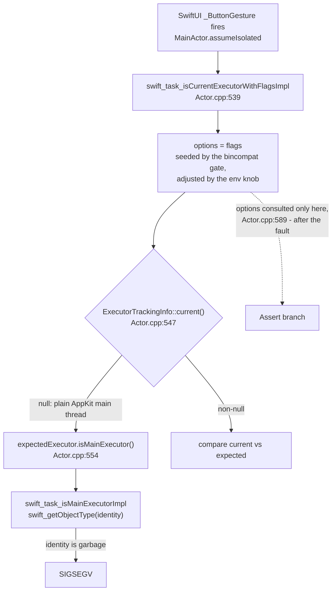

# macOS 26 Executor-Check Crash - Plan

> **SUPERSEDED 2026-07-26 by [`docs/plans/2026-07-26-001-fix-swallowed-exception-executor-corruption-plan.md`](2026-07-26-001-fix-swallowed-exception-executor-corruption-plan.md). Read that plan, not this one.**
>
> **The central premise below is disproven.** This plan is built on "Apple broke SwiftUI on macOS 26.2 — work around it", with early-launch `MainActor` use as the leading hypothesis for what corrupts the executor identity. Stage B′ shipped as [`bfcec4a`](https://github.com/weylandd/NoType/commit/bfcec4a) (v0.1.13-rc1) and was tested on the reporter's machine: **it did not fix the crash.** The proven cause is a swallowed Objective-C exception — an `NSException` raised inside a `Task { @MainActor }` unwinds through `libswift_Concurrency`, whose `ExecutorTrackingInfo` pop is not exception-safe, orphaning the main thread's executor identity; AppKit swallows the exception and execution resumes, so the *next* executor check anywhere in the process SIGSEGVs. The crash **site** is incidental, which is why three per-call-site fixes each relocated the crash instead of ending it. See [`docs/solutions/runtime-errors/macos-26-executor-identity-check-family-2026-07-25.md`](../solutions/runtime-errors/macos-26-executor-identity-check-family-2026-07-25.md) — the source of truth for the mechanism.
>
> **What shipped from this plan and stays:**
> - **Stage B′ (U1–U3) — `bfcec4a`.** Launch work moved out of `NoTypeApp.init()` onto the AppKit launch hooks, pinned by `NoTypeTests/LaunchOrderingTests.swift`. It is not coverage of this crash, but it **stands on its own merits**: scheduling into the pre-`NSApplicationMain` window is a latent ordering bug, and the move incidentally fixed two real shipped defects — Sparkle's update check never ran for menu-bar-only users, and the un-mute-on-quit handler was never wired. Recorded in [`docs/solutions/architecture-patterns/scene-task-is-not-a-launch-hook-2026-07-25.md`](../solutions/architecture-patterns/scene-task-is-not-a-launch-hook-2026-07-25.md) and [`docs/solutions/design-patterns/observation-loop-swallows-initial-state-2026-07-25.md`](../solutions/design-patterns/observation-loop-swallows-initial-state-2026-07-25.md).
> - **U9** — the `dsOnHover` documentation correction and the family solutions entry (since rewritten around the proven cause).
> - **U15** — the README known-issue note. The superseding plan removes it on confirmation.
>
> **What is retired unbuilt:** stage C (U5, pin an older macOS SDK) and stage A (U6–U8, migrate off stock SwiftUI `Button`). Both are workarounds for an Apple-side defect that is not the cause. The `Button` in `_ButtonGesture` is a *reader* of the poisoned identity, not its source, so migrating away from it would have relocated the crash a fourth time.
>
> **Why this file is kept rather than deleted.** It holds **its own KD6** — the check-mode disproof, traced to the Swift runtime source, showing that `SWIFT_IS_CURRENT_EXECUTOR_LEGACY_MODE_OVERRIDE` and the linked-on-or-after bincompat gate both resolve to an options word the runtime reads *after* the faulting `isMainExecutor()` call. That reasoning is correct; it simply answers the wrong question. (Note: KD6 here is unrelated to the superseding plan's KD6.) Losing it is how the next investigation re-runs a dead end.

## Goal Capsule

- **Objective.** Stop NoType crashing on every SwiftUI control tap on macOS 26.2 (build 25C56), by removing what puts the process's main-executor identity into a bad state before patching the call sites that read it.
- **Product authority.** Success is defined by the reporter on the affected machine. No machine available to the maintainer reproduces the crash.
- **Open blockers.** None. Every stage needs the reporter to run a test build.
- **Product Contract preservation.** Changed: R4, R6, R7, R9, R11, R12, KD1, KD4 — planning research read the Swift runtime source and disproved the original stage B, and document review closed the original stage C by the same evidence. The staging discipline, the verification loop, and the definition of "fixed" are unchanged. See KD6.

---

## Product Contract

### Summary

Fix the crash in ordered stages, cheapest first: confirm the fault is ours at all, then stop touching `MainActor` before the app finishes launching, then try the one build-setting lever that survives, and only then replace the SwiftUI controls that trip the check. Each stage ships as a test build to the reporter and is judged solely by whether they can use the app.

### Problem Frame

`GitHub issue #82` reports a SIGSEGV on every SwiftUI `Button` tap. The faulting frame is `swift_getObjectType`, reached from `SerialExecutorRef::isMainExecutor()` inside `swift_task_isCurrentExecutorWithFlagsImpl` — the Swift runtime's "am I on the expected executor?" check, invoked from inside SwiftUI's own `_ButtonGesture` implementation.

This is the third incident with that signature. The prior two were `TimelineView` content closures and `.onHover` modifier closures; a fourth documented incident (Core Audio IOProc) carries a different signature — `EXC_BREAKPOINT` on the HAL thread — and was a genuine actor-isolation violation, correctly fixed.

The three same-signature incidents share more than a stack shape: all three come from one machine and one OS build (Mac15,7 / M3 Pro / macOS 26.2 25C56), and each faults on a *different* small address (`0x1e`, `0x1`, `0x0`). Each was fixed by deleting one call site of the executor check — and each fix was followed by the crash reappearing at the next unrelated site that still performed one. The current incident sits inside Apple's compiled SwiftUI binary, where no app closure exists to annotate, so that strategy has no next move.

The cost is asymmetric. Dictation runs through `CGEventTap` and never touches SwiftUI's button dispatch, so an already-configured user can still dictate. But the onboarding wizard's primary control (`NoType/Onboarding/OnboardingChrome.swift:171`) is a stock `Button`, so a *new* user on the affected OS build cannot complete setup at all. NoType ships no telemetry (ADR-013), so affected users are invisible — they uninstall silently. Complaints beyond the filed issue have already reached the maintainer.

### Key Decisions

- KD1. **Attack what corrupts the executor identity, not the call sites that read it.** (session-settled: user-directed — chosen over replacing controls first: three prior per-call-site fixes each relocated the crash rather than ending it.) Governs R2, R4, R7.
- KD2. **One lever per stage, verified before the next.** (session-settled: user-directed — chosen over shipping several levers together: a combined build may stop the crash while leaving us unable to say which lever did it.) Governs R1, R2.
- KD3. **"Fixed" means the reporter stops crashing, not that the runtime cause is proven.** (session-settled: user-approved.) Governs R1, R3.
- KD4. **The executor check stays enabled under every lever this plan pulls.** No runtime knob and no build setting is used to suppress or downgrade it, so the safety net that caught the Core Audio isolation violation survives intact. Governs R6.
- KD5. **Stages ship as test builds to the reporter, not as public releases.** (session-settled: user-approved.) Governs R1.
- KD6. **The executor-check mode is not reachable as a lever — from either end.** (session-settled: user-directed — chosen over shipping the knob build first, after planning research showed it cannot work.) `swift_task_isCurrentExecutorWithFlagsImpl` calls `expectedExecutor.isMainExecutor()` before it consults its options. The `SWIFT_IS_CURRENT_EXECUTOR_LEGACY_MODE_OVERRIDE` environment variable and the runtime's linked-on-or-after bincompat gate both resolve to that same options word, so neither can prevent a fault that happens earlier. Governs R6, R7.
- KD7. **Confirm the fault is ours before spending a lever on it.** A stock SwiftUI `Button` in an app containing no NoType code is the cheapest possible test, and a crash there retires both app-side stages at once. Governs R2a.

### Requirements

**Staging and verification**

- R1. Each stage ships to the reporter as a test build and is judged solely by whether they can complete onboarding and operate the UI without a crash.
- R2. Stages run in the order 0, B′, C, A. A stage begins only after the previous stage is observed to fail on the reporter's machine.
- R2a. Stage 0 establishes a baseline: a minimal SwiftUI app containing a single stock `Button` and no NoType code. A crash there retires stages B′ and C, because neither lever can affect code NoType does not own.
- R2b. Before stage C begins, the reporter confirms whether the crash still reproduces on a current macOS. Non-reproduction there collapses the remaining work to R13, R14, and a minimum-OS note.
- R3. Every recorded stage result carries the reporter's exact OS build alongside the crash-or-no-crash outcome, and names what changed.
- R3a. The reporter is asked to defer macOS updates for the plan's duration. A result arriving from any build other than 25C56 is not a stage outcome — it collapses the remaining work per R2b.
- R5. A stage build that still crashes counts as a completed stage with a negative result, not as a failed attempt to be retried in variations.

**Stage B′ — stop touching MainActor before the app has launched**

- R4. No `MainActor`-isolated work is scheduled and no `NSApp` state is read or written before `NSApplicationMain` has started the application — by any type `NoTypeApp.init()` constructs, whether directly in an initializer or in a method that initializer calls.
- R6. Neither a Swift runtime environment knob nor a build setting is used to suppress or downgrade the executor check (KD4, KD6).

**Stage C — the one surviving build lever**

- R7. If stage B′ does not clear the crash, ship a build linked against an older macOS SDK, to select an older SwiftUI `_ButtonGesture` implementation. The deployment target stays at macOS 15.
- R7a. A stage-C build that returns a negative result has its SDK change reverted before any other work continues.
- R7b. Raising the minimum macOS above 15 is outside this plan. It would relitigate ADR-001 and requires explicit product approval before it reaches any build.

**Stage A — replace the controls**

- R8. If stages B′ and C both fail, the replacement control shape is confirmed to survive on the reporter's machine before any app-wide migration begins.
- R10. Onboarding's primary controls migrate first, because a new user on the affected OS build cannot otherwise reach dictation.
- R9. After R10 lands, the remaining stock `Button` sites migrate app-wide to a single in-house control only if the reporter still crashes on them.
- R11. Once R9 lands, a source-scan test rejects new raw stock `Button` sites outside the in-house control's own definition, matching the existing guard in `NoTypeTests/DSComponentsHoverTests.swift`. The scan matches both the `Button(` and `Button {` forms.
- R12. `Toggle`, `Picker`, `Menu`, and `TextField` migrate only if the reporter still crashes on them after buttons are migrated. Onboarding's API-key step is a text field, so it is inside this condition rather than excluded from it.

**User-facing communication**

- R15. Before stage B′ ships, a known-issue note naming macOS 26.2 (25C56), the onboarding symptom, and the macOS 26.4+ workaround is published to the README and pinned on issue #82.

**Knowledge capture**

- R13. `NoType/UI/CLAUDE.md` is corrected where it states that `dsOnHover` re-enters the main actor via `MainActor.assumeIsolated`; the shipped helper at `NoType/UI/DSComponents.swift:976` uses an async hop, and the existing solution doc rejects `assumeIsolated` for this crash family.
- R14. The three-incident reframing — one poisoned check rather than three independent dispatch-path bugs — is recorded in `docs/solutions/runtime-errors/`, and the three existing entries are cross-linked to it.

### Key Flows

- F1. Stage verification loop
  - **Trigger:** A stage's build is ready.
  - **Steps:** Maintainer builds and hands the artifact to the reporter; reporter confirms their OS build, launches, completes or attempts onboarding, and taps controls across the main window and popover; reporter reports crash or no crash.
  - **Outcome:** No crash closes the issue at that stage. A crash records the result (R3) and starts the next stage.
  - **Covered by:** R1, R2, R3

### Acceptance Examples

- AE0. The baseline itself crashes
  - **Covers R2a, KD7.**
  - **Given** the reporter runs a minimal SwiftUI app containing one stock `Button` and no NoType code,
  - **When** they tap it and the app crashes,
  - **Then** stages B′ and C are retired, and the remaining scope is stage A plus R13, R14, R15.

- AE1. Stage B′ clears it
  - **Covers R4, R5.**
  - **Given** the reporter is on macOS 26.2 (25C56) and previously crashed on every button tap,
  - **When** they run a build that schedules no `MainActor` work before `NSApplicationMain`,
  - **Then** they complete onboarding and operate the UI without a crash, and stages C and A never run.

- AE2. Stage B′ does not clear it
  - **Covers R2, R3, R5.**
  - **Given** the stage-B′ build still crashes on the reporter's machine, and R4's audit confirmed no early-launch `MainActor` work remained,
  - **When** the result is recorded with its OS build,
  - **Then** stage C begins, and the recorded result stands as evidence that early-launch `MainActor` use was not the corrupting factor.

- AE3. Stage A clears buttons but not everything
  - **Covers R9, R12.**
  - **Given** stages B′ and C failed and buttons have been migrated,
  - **When** the reporter taps a `Toggle` or opens a `Picker` and still crashes,
  - **Then** those controls migrate too; if they do not crash, R12 stays unexercised.

### Scope Boundaries

- Migrating `Toggle`, `Picker`, `Menu`, and `TextField` is out of scope under the condition R12 owns.
- Raising the minimum macOS above 15 is out of scope (R7b). It is an ADR-001 decision, not a lever this plan may pull.
- Proving the exact runtime-level cause of the invalid executor identity is out of scope (KD3).
- Filing an Apple Feedback report is worth doing and is not a code deliverable — it gates no stage.
- Publishing any stage build as a general release before the reporter confirms it is out of scope (KD5).

#### Deferred to Follow-Up Work

- Auditing the remaining `@unchecked Sendable` / `nonisolated(unsafe)` types for isolation correctness. Adjacent to this crash family but not implicated by it.
- Recruiting a second affected user as a confirmer, so stage results are not n=1. Worth doing if the reporter goes quiet; not a gate today.

### Dependencies / Assumptions

- The reporter is available to run a test build per stage. Theirs is the only machine known to reproduce the crash; without them no stage can be judged.
- Confirmed: the reporter remains on macOS 26.2 (25C56), so the staged work is live. The maintainer cannot reproduce on 26.4.1 — but no maintainer machine reproduces the crash at all, so that non-reproduction is confounded and does not by itself support an upstream-fix hypothesis. R2b tests it directly instead.
- **Verified against runtime source:** the fault is `swift_getObjectType(identity)` inside `swift_task_isMainExecutorImpl`, reached when the expected executor carries a serial-executor witness table but a bad identity pointer. `Actor.cpp` calls `expectedExecutor.isMainExecutor()` before it consults the check-mode options, which is why neither the environment knob nor the bincompat gate can prevent it.
- **Unverified, and the reason stage B′ is a test rather than a fix:** that early-launch `MainActor` use is what corrupts the identity. It fits the evidence — a real lazily-created main executor on macOS 26, and NoType touching `MainActor` from the `App` struct's initializer — but it is a hypothesis, and it is not traced to a runtime-source citation the way KD6's disproof is.
- **Unverified:** that SwiftUI's `_ButtonGesture` implementation is gated on the linked SDK version. This is the sole remaining mechanism by which a build setting could affect the crash, and it is what stage C tests. If it is not gated, stage C is dead and the ladder goes straight to stage A.
- **Unverified:** that any replacement control avoids the crash. SwiftUI may perform the same check in other gesture-dispatch paths, which is why R8 gates the migration on evidence.
- Load-bearing for stage A sizing: 43 stock `Button` sites across 23 files — 40 in the `Button(` form plus 3 in the `Button {` trailing-closure form (`NoType/UI/Settings/TokenStatsPanel.swift`, `NoType/UI/MicInputPicker.swift`, `NoType/UI/HomeView.swift`). 7 sit in `NoType/UI/DSComponents.swift` — the six DS button components plus `DSWordChip`'s remove button at line 569 — and 36 across the other 22 files. Any scan or migration that matches only `Button(` misses the three trailing-closure sites.

### Outstanding Questions

**Deferred to Planning** — resolved during this planning pass:

- The stage-B lever. Resolved as unworkable; replaced by stage B′ (KD6).
- Whether stage C is a deployment-target change, an SDK pin, or both. Resolved as an SDK pin only; the deployment target is not a lever, because the bincompat gate it would move is consumed after the fault (KD6).

**Deferred to Implementation**

- Whether an older macOS SDK is available on the maintainer's machine, and which SDK version is the newest one whose SwiftUI predates the fault.
- The shape of the stage-A replacement control, and whether it can preserve the existing DS button variants' appearance and keyboard behavior.

---

## Planning Contract

### Key Technical Decisions

- KTD1. **Move init-time priming to an explicit `prime()` called from the app delegate, not to a lazy side effect.** An explicit method invoked from a guaranteed launch hook keeps the ordering legible and testable, where scattering the work into lazy `var`s would reintroduce the same "whenever something first touches it" timing that this stage is trying to eliminate. Governs R4.
- KTD2. **`AppearanceController` applies its theme from the launch hook, not from `init`.** The hazard is the `NSApp.appearance` *write* during `App.init()` that R4 forbids — not a nil risk, since `apply()` already opens with `guard let app: NSApplication = NSApp`. Governs R4.
- KTD3. **A source-scan test guards R4, mirroring `DSComponentsHoverTests`.** The repo already uses source-text scanning to pin a concurrency convention, so the pattern is established and cheap; a runtime assertion would not fire on the maintainer's machine, where the bug does not reproduce. The scan must follow one call level, because the known offender schedules from a helper rather than from the initializer body. Governs R4.
- KTD4. **Stage B′ ships behind no flag.** The change is correct on its own merits regardless of whether it fixes the crash — scheduling `MainActor` work before the app exists is a latent-ordering bug — so it does not need a toggle or a revert path.
- KTD5. **The `prime` closure is assigned inside `NoTypeApp.init()`, and invoked from `applicationDidFinishLaunching`.** Assigning a closure schedules no `MainActor` work, so it satisfies R4; doing it in `init` guarantees the handler is in place before the delegate callback fires. The existing `wireTerminationHandler()` is a counter-example, not a precedent — it runs from `.task` on `MainWindowView`, which never fires for a returning `LSUIElement` user. Governs R4.

### High-Level Technical Design

Where the executor identity is read, and why no check-mode lever intercepts it:

Both check-mode levers — the environment knob and the linked-on-or-after bincompat gate — feed the same `options` word at C, which is not read until I. The fault is at F. That closes the check-mode path at both ends and is why stage C targets SwiftUI's own implementation via the linked SDK instead.

### Assumptions

- `NoTypeApp.init()` is the only place NoType touches `MainActor` or `NSApp` before `NSApplicationMain`. U3's scan verifies this across every type the initializer constructs; U1 and U2 remediate the known offenders.

---

## Implementation Units

U-IDs are stable and never renumbered; U10 is the newest unit and runs first. Execution order is carried by each unit's Dependencies, not by its number.

### U10. Stage 0 — baseline probe on the reporter's machine

- **Goal:** know whether a stock SwiftUI `Button` crashes there at all, before spending any lever.
- **Requirements:** R2a, R3. Implements KD7.
- **Dependencies:** none. Runs before U1.
- **Files:** a throwaway probe, not committed to the app target.
- **Approach:** build a minimal SwiftUI app with a single stock `Button` and no NoType code, using the same toolchain and deployment target as the shipping app, and have the reporter run it and report their exact OS build with the result. A working harness already exists from the investigation — five variants covering stock `Button`, `Button` with raw `.onHover`, an instance-method `TimelineView`, an early-`MainActor` launch shape, and a bare `MainActor.assumeIsolated` loop.
- **Execution note:** this is the cheapest question in the plan and it can retire two stages. Do not start U1 before its result is recorded.
- **Test expectation:** none — the probe's output is the reporter's result.
- **Verification:** issue #82 carries the baseline result and the OS build it came from.

### U1. Move init-time MainActor work out of every launch-path initializer

- **Goal:** no type constructed by `NoTypeApp.init()` schedules `MainActor` work or touches `NSApp` during construction.
- **Requirements:** R4. Implements KD1 via KTD1 and KTD5.
- **Dependencies:** U10, and only when U10's baseline does not crash.
- **Files:** `NoType/AppState.swift`, `NoType/Permissions/PermissionsViewModel.swift`, `NoType/NoTypeApp.swift`
- **Approach:**
  1. Extract the eight `Task { @MainActor … }` bodies in `AppState.init()` (history refresh, stats snapshot, instructions snapshot, categorizer wiring, dictionary snapshot, permissions observation, launch HUD, Silero pre-load) into a `prime()` method.
  2. Do the same for `PermissionsViewModel`: move `refresh()` and `observeAppActivation()` out of its initializer. This is the first object `NoTypeApp.init()` constructs, and its `refresh()` → `startPollingIfNeeded()` path schedules a `Task` whenever any permission is ungranted — always true for the reporter.
  3. Keep `applyAccessibilityState()` and the `UserDefaults` reads in `AppState.init` — they schedule no `MainActor` work and touch no `NSApp`.
  4. Assign the `prime` closure to the app delegate inside `NoTypeApp.init()`, and invoke it from `applicationDidFinishLaunching(_:)`. Make `prime()` idempotent, the way `UpdateController.start()` guards with `didStart`.
  5. Audit every remaining type the initializer constructs — `HUDController`, `UpdateController`, `OnboardingState`, `LoginItemController`, `GeminiClient`, and the four actor stores — and record the result in this unit's verification before the stage-B′ build ships.
- **Risk — do not attach this to the `Window` scene's `.task`.** NoType is `LSUIElement` and the main window is not necessarily presented at launch once onboarding is complete (`Scene.defaultLaunchBehavior(.automatic)`), so a returning user would never fire it. `wireTerminationHandler()` is the counter-example here, not the precedent: `NoTypeApp.body` calls it from `.task` on `MainWindowView`, which is exactly the hook that does not fire, and which runs after `applicationDidFinishLaunching` when it does.
- **What a missed `prime()` costs:** the history, stats, instructions, and dictionary mirrors stay empty, the Silero pre-load and the launch permission-HUD never run, and the permission observation loop never starts. The hotkey still installs — `applyAccessibilityState()` stays in `init` per step 3.
- **Test scenarios:**
  - Calling `prime()` twice leaves one set of observation tasks registered, not two.
  - `AppState.init()` followed by no `prime()` call leaves `history`, `statsSummary`, and the dictionary mirror at their empty defaults.
  - After `prime()`, the history and stats mirrors reflect what the stores hold.
  - `PermissionsViewModel.init()` starts no polling task; polling starts only after its priming call.
  - Covers AE1. A hotkey press before `prime()` has run does not crash and does not start a session.
  - A launch in which no window is presented still primes state — the `LSUIElement` returning-user path.
- **Verification:** neither `AppState.init()` nor `PermissionsViewModel.init()` schedules a `Task` or references `NSApp`, directly or through a method it calls; the audit of the remaining launch-path types is recorded; and a launch with the main window closed still primes.

### U2. Move AppearanceController's NSApp write out of its initializer

- **Goal:** the theme is applied after the application exists, without losing the "first frame already has the right appearance" property.
- **Requirements:** R4. Implements KTD2.
- **Dependencies:** U1.
- **Files:** `NoType/UI/AppearanceController.swift`, `NoType/NoTypeApp.swift`
- **Approach:** keep reading the persisted mode in `init` (pure `UserDefaults`), and move the `apply()` call to the same launch hook that calls `AppState.prime()`, applying appearance before priming. The existing `didSet` on `mode` keeps later user changes working unchanged.
- **Patterns to follow:** U1's `prime()` call site, including its risk note.
- **Test scenarios:**
  - Initializing with a persisted `.dark` mode leaves `mode == .dark` without touching `NSApp`.
  - Applying after init sets the appearance for the persisted mode.
  - Setting `mode` post-launch still persists and re-applies.
- **Verification:** neither `AppearanceController.init` nor any method it calls references `NSApp` during construction. Manual check: launch with the appearance forced opposite the system setting and confirm no wrong-theme frame is visible.

### U3. Pin the no-MainActor-before-launch rule with a source-scan test

- **Goal:** a new `Task { @MainActor }` or `NSApp` access on the launch path fails a test rather than shipping.
- **Requirements:** R4. Implements KTD3.
- **Dependencies:** U1, U2.
- **Files:** `NoTypeTests/LaunchOrderingTests.swift`
- **Approach:** for each type `NoTypeApp.init()` constructs, scan its initializer **plus every same-file method that initializer calls** — one level is enough to cover the `init` → `refresh()` → `startPollingIfNeeded()` shape that is the known offender — and assert none contains a `Task {` literal or an `NSApp` reference. Keep the scan to the launch path; the rule is not about `Task` usage in general.
- **Patterns to follow:** `NoTypeTests/DSComponentsHoverTests.swift` — same source-text-scan shape, same reason.
- **Test scenarios:**
  - The current tree passes.
  - A fixture whose initializer body contains `Task { @MainActor in` fails the assertion.
  - A fixture whose initializer is clean but whose same-file helper contains `Task { @MainActor in` fails the assertion.
  - A `Task` outside the launch-path types does not trip the scan.
- **Verification:** the test fails when the U1/U2 changes are reverted.

### U4. Hand stage B′ to the reporter and record the outcome

- **Goal:** the stage is judged on the affected machine and the result is written down.
- **Requirements:** R1, R2, R3, R3a, R5.
- **Dependencies:** U1, U2, U3, U15.
- **Files:** none (process unit; the outcome lands in `GitHub issue #82`).
- **Approach:** build a signed artifact the reporter can launch, confirm their OS build is still 25C56, ask them to complete onboarding and exercise buttons across the main window and popover, and record build-plus-outcome in the issue. A crash ends the stage with a negative result and opens U5 — it is not retried in variations.
- **Execution note:** this unit gates every later unit. Do not begin U5 before its result is recorded.
- **Test expectation:** none — the verification is the reporter's report, captured by F1.
- **Verification:** issue #82 carries the stage-B′ outcome and its OS build.

### U5. Stage C — link against an older SDK (conditional)

- **Goal:** a build whose SwiftUI `_ButtonGesture` implementation predates the fault.
- **Requirements:** R2b, R6, R7, R7a, R7b.
- **Dependencies:** U4, and only when U4's outcome is a crash.
- **Files:** `project.yml`
- **Approach:** first have the reporter check whether the crash still reproduces on a current macOS (R2b) — non-reproduction ends the ladder here. Otherwise pin an older macOS SDK while leaving `MACOSX_DEPLOYMENT_TARGET` and every per-target `deploymentTarget` at 15.0, so the support floor does not move. Revert the pin if the result is negative (R7a).
- **Execution note:** the check-mode levers are closed (KD6). If the linked SDK turns out not to select the SwiftUI implementation either, stage C is dead — record that and go to stage A rather than searching for another build knob.
- **Test scenarios:**
  - The existing suite passes against the pinned SDK.
  - Covers AE2. The built artifact's `LC_BUILD_VERSION` shows the intended `sdk` with `minos` unchanged at 15.0.
- **Verification:** the reporter's result on the stage-C build is recorded in issue #82 with its OS build.

### U6. Stage A — confirm a replacement control survives (conditional)

- **Goal:** know that a non-`Button` control avoids the crash before migrating anything.
- **Requirements:** R8.
- **Dependencies:** U5, and only when U5's outcome is a crash.
- **Files:** a throwaway probe, not committed to the app target.
- **Approach:** extend the U10 harness with the candidate shapes — an `onTapGesture`-based control with explicit isolation in the `dsOnHover` shape, and an AppKit `NSButton` bridged through `NSViewRepresentable` — and have the reporter report which survive.
- **Validity gate:** the stock-`Button` arm must crash in that same probe run. If it does not, the probe process never reached the bad executor state and no "candidate survives" result is interpretable — rebuild the probe with NoType's `App.init()` construction shape before reading any candidate result.
- **Test expectation:** none — the probe's output is the reporter's result.
- **Verification:** at least one candidate shape is confirmed crash-free in a run whose stock-`Button` arm crashed, or stage A is abandoned as unworkable.

### U7. Stage A — introduce the in-house control and migrate onboarding (conditional)

- **Goal:** onboarding stops crashing, which unblocks new users on the affected OS build.
- **Requirements:** R10.
- **Dependencies:** U6.
- **Files:** `NoType/UI/DSComponents.swift`, `NoType/Onboarding/OnboardingChrome.swift`, `NoType/Onboarding/Steps/`
- **Approach:** add the confirmed shape as a single control in `DSComponents.swift`, re-point the six DS button components at it, then migrate onboarding's own raw `Button` sites. The DS components are the cheap half — six definitions cover most of the app's surface.
- **Test scenarios:**
  - The control invokes its action once per tap, not twice.
  - Disabled state does not invoke the action.
  - Keyboard activation still works where the stock `Button` supported it.
  - Onboarding advances through every step.
- **Verification:** the reporter completes onboarding on the stage-A build.

### U8. Stage A — migrate the remaining sites and pin the convention (conditional)

- **Goal:** no raw stock `Button` remains where the reporter still crashes, and new ones cannot re-enter.
- **Requirements:** R9, R11, R12.
- **Dependencies:** U7, and only when the reporter still crashes on non-onboarding buttons after U7.
- **Files:** the 22 files outside `NoType/UI/DSComponents.swift` holding the 36 remaining sites, plus `DSWordChip`'s remove button in `NoType/UI/DSComponents.swift`, `NoTypeTests/DSComponentsHoverTests.swift`
- **Approach:** migrate the remaining sites, then extend the existing source-scan test to reject raw stock `Button` outside the control's own definition. The scan must match both `Button(` and `Button {` — matching only the paren form misses three sites. Migrate `Toggle` / `Picker` / `Menu` / `TextField` only under R12's condition.
- **Test scenarios:**
  - The current tree passes the extended scan.
  - A fixture containing a raw `Button(` outside the allowed file fails it.
  - A fixture containing a raw `Button {` outside the allowed file fails it.
  - Covers AE3. When the reporter still crashes on a `Toggle` or `Picker` after buttons are migrated, those controls migrate; otherwise R12 stays unexercised.
- **Verification:** the reporter operates the full UI without a crash.

### U15. Publish the known-issue note

- **Goal:** affected users see that the breakage is known and has a workaround, instead of silently uninstalling.
- **Requirements:** R15.
- **Dependencies:** none — independent of every stage, but must land before U4.
- **Files:** `README.md`
- **Approach:** add a short known-issue entry naming macOS 26.2 (25C56), the onboarding symptom, and updating to macOS 26.4+ as the workaround. Pin the same note on issue #82.
- **Test expectation:** none — documentation only.
- **Verification:** the note is live in the README and pinned on the issue.

### U9. Correct the stale hover documentation and record the reframing

- **Goal:** the next reader of this crash family is not sent toward the rejected fix shape.
- **Requirements:** R13, R14.
- **Dependencies:** none — independent of every stage.
- **Files:** `NoType/UI/CLAUDE.md`, `docs/solutions/runtime-errors/`
- **Approach:** correct the `dsOnHover` sentence to match `NoType/UI/DSComponents.swift:976`, then add a solutions entry recording that the three same-signature incidents are one poisoned check rather than three dispatch-path bugs, with the runtime-source evidence for why neither check-mode lever helps. Cross-link the three existing entries to it.
- **Test expectation:** none — documentation only.
- **Verification:** the three existing runtime-error entries link to the new one.

---

## Verification Contract

| Gate | Command / signal | Applies to |
|---|---|---|
| Build | `xcodebuild -project NoType.xcodeproj -scheme NoType -configuration Debug build` | U1, U2, U3, U5, U7, U8 |
| DerivedData sweep | Delete the freshly built `NoType.app` per the hard rule in `docs/build.md` — `lsregister -u` alone does not work | after every build |
| Install for manual testing | Replace `/Applications/NoType.app` with the DerivedData bundle so Spotlight launches the dev build | before any manual check |
| Regenerate project | `xcodegen generate` — required by `docs/build.md` after any `project.yml` change; the committed `NoType.xcodeproj` wins otherwise | U5 |
| Unit tests | `xcodebuild -project NoType.xcodeproj -scheme NoType test -destination 'platform=macOS'` | U1, U2, U3, U5, U7, U8 |
| Stage gate | The reporter's crash-or-no-crash result **plus their exact OS build**, recorded in issue #82 | U10, U4, U5, U6, U7, U8 |

No unit test can prove this fix. The maintainer's machine does not reproduce the crash, so the local gates prove only that behavior did not regress; the reporter's result is the only evidence that matters.

## Definition of Done

- No type constructed by `NoTypeApp.init()` schedules `MainActor` work or touches `NSApp` during construction, pinned by `NoTypeTests/LaunchOrderingTests.swift` including the one-call-level case.
- A launch in which no window is presented still primes state and applies the theme — the `LSUIElement` returning-user path.
- The baseline probe result and the stage-B′ result are both recorded in issue #82, each with the OS build it came from.
- Either the reporter reports no crash — issue #82 closes — or the negative result is recorded and the next stage's unit is unblocked.
- The known-issue note is live for affected users.
- `NoType/UI/CLAUDE.md` matches the shipped `dsOnHover`, and the crash-family reframing is recorded in `docs/solutions/runtime-errors/` with the three prior entries cross-linked.

---

## Sources & Research

- `GitHub issue weylandd/NoType#82` — the crash report, stack, and the reporter's own reframing.
- `swiftlang/swift`, `stdlib/public/Concurrency/ExecutorImpl.cpp` — `swift_task_isMainExecutorImpl` calls `swift_getObjectType(identity)` when the executor carries a serial-executor witness table. This is the faulting frame.
- `swiftlang/swift`, `stdlib/public/Concurrency/Actor.cpp:539-599` — `swift_task_isCurrentExecutorWithFlagsImpl`. Line 554 calls `expectedExecutor.isMainExecutor()`; the check-mode options are not consulted until line 589. This ordering is why KD6 rules out both check-mode levers.
- `swiftlang/swift`, `stdlib/public/runtime/EnvironmentVariables.def` and `include/swift/Runtime/Bincompat.h` — `SWIFT_IS_CURRENT_EXECUTOR_LEGACY_MODE_OVERRIDE` (`crash|nocrash|swift6|legacy|isIsolatingCurrentContext`) and the linked-on-or-after gate. Both feed the same options word KD6 rules out.
- `docs/solutions/runtime-errors/timelineview-mainactor-instance-method-crash-2026-05-16.md` — first same-signature incident, faulting at `0x1e`.
- `docs/solutions/runtime-errors/onhover-mainactor-inheritance-crash-2026-05-19.md` — second, faulting at `0x1`; source of the `dsOnHover` shape and of the rejection of `MainActor.assumeIsolated` as its bridge.
- `docs/solutions/runtime-errors/audio-ioproc-mainactor-inheritance-crash-2026-05-19.md` — the different-signature incident; the counter-example of a real isolation violation the check caught.
- `NoTypeTests/DSComponentsHoverTests.swift` — the source-scan convention test U3 and U8 mirror.
- Shipped v0.1.12 artifact: universal binary (arm64 + x86_64), `minos 15.0`, SDK 26.5, no embedded Swift runtime dylibs, linking only `/usr/lib/swift/*`. Rules out a split or back-deployed concurrency runtime as the cause.
