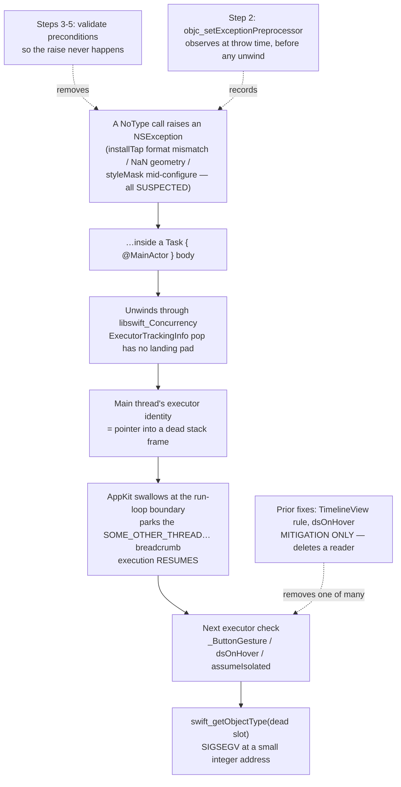

# Swallowed ObjC Exception → Executor Corruption - Plan

## Goal Capsule

- **Objective.** Stop NoType raising Objective-C exceptions inside main-actor Swift-concurrency jobs, and make any future occurrence of this class name itself in a log line instead of costing another two-month investigation.
- **Authority.** `docs/solutions/runtime-errors/macos-26-executor-identity-check-family-2026-07-25.md` is the source of truth for the mechanism. Success is defined by the reporter on issue #82 — the only machine known to reproduce.
- **Confidence boundary, and it must not drift.** The **mechanism is proven** (reproduced locally on Swift 6.3.3 / macOS 26 SDK). **Which of NoType's calls throws is not.** Every thrower named below is a ranked suspect from a static + runtime audit, and none has been observed firing in the wild. There may be more than one.
- **Stop condition.** The reporter completes onboarding and operates the UI without a crash, and the interceptor logs nothing. A round that still crashes is a completed round with a negative result — record it and move on, do not retry it in variations.
- **Open blockers.** None. Both maintainer call-outs are settled: the breadcrumb gets no user-facing surface (KD6) and the fixes ship in a single hand-off round (KTD1).

---

## Product Contract

### Summary

Ask the reporter to run a zero-build diagnostic that makes AppKit stop swallowing the exception, so the next crash report names the thrower outright. Ship a permanent `objc_setExceptionPreprocessor` breadcrumb that catches this class for good. Fix the raise-prone call sites the audit found — they are latent bugs whether or not one of them is *the* thrower. Record the convention that produced them, and close out the three prior write-ups that framed this as a SwiftUI dispatch-path bug.

### Problem Frame

NoType SIGSEGVs inside the Swift runtime's "am I on the main executor?" check. An Objective-C `NSException` raised on the main thread inside a `Task { @MainActor }` body unwinds through `libswift_Concurrency`, whose `ExecutorTrackingInfo` is a stack-allocated thread-local with a non-exception-safe pop. Unwinding orphans the main thread's executor identity. AppKit swallows the exception at the run-loop boundary and resumes; the next executor check reads a dead stack slot and crashes — typically hundreds of milliseconds and one unrelated user action later.

The crash site is therefore arbitrary. `TimelineView`, `.onHover`, and a stock SwiftUI `Button` were three witnesses, not three causes. Each was fixed at its call site, each fix held, and the crash moved to the next site that still performed a check. All three fixes deleted a **reader** of the corrupt state; none touched the **corrupter**.

The cost is asymmetric and invisible. Dictation runs through `CGEventTap` and never reaches SwiftUI's button dispatch, so a configured user still works. But onboarding's primary control is a stock `Button`, so a new user on an affected machine cannot finish setup — and NoType ships no telemetry (ADR-013), so those users uninstall silently.

The process failure cost more than the bug. The answer — a parked background thread carrying `SOME_OTHER_THREAD_SWALLOWED_AT_LEAST_ONE_EXCEPTION` — was in the reporter's May 2026 `.ips` the whole time. Nobody read past thread 0.

### Key Decisions

- KD1. **Attack the corrupter, not the readers.** (session-settled: user-directed — chosen over more per-call-site annotation: three prior call-site fixes each relocated the crash, and the third landed inside Apple's compiled `_ButtonGesture` where no app closure exists to annotate.) Governs R9–R13.
- KD2. **Instrumentation is a deliverable, not a step toward one.** The interceptor ships in the release build and stays. It is the only hook that fires for an exception AppKit swallows, and it converts every future occurrence of this class from a mystery into a log line. Governs R4–R8.
- KD3. **The executor check stays enabled.** No runtime knob, no build setting, no suppression. It has already earned its keep by catching a genuine actor-isolation violation on the Core Audio HAL thread. Suppressing it would trade a loud crash for a silent data race — and it could not work anyway, because the fault happens before the check-mode options word is read. Governs R14.
- KD4. **"Fixed" means the reporter stops crashing.** Proving which exception fired is desirable and is what Step 1 buys, but it is not the completion bar. Governs R17.
- KD5. **No reporter build reaches the appcast.** Hand-off builds go to the reporter directly; publishing an rc to `docs/appcast.xml` would serve it to every installed copy. Governs R21.
- KD6. **The breadcrumb gets no user-facing surface — documentation only.** (session-settled: user-approved — chosen over a Settings → About "Copy diagnostics" button that dumps the last `.fault` lines to the clipboard: the interceptor already writes to the system log, so the README's `log show` recipe, sitting next to the existing `NSApplicationCrashOnExceptions` one, costs zero new UI to design, test and maintain, and the population that files GitHub issues can run a command. Revisitable if a non-technical reporter ever needs it.) Governs R8.

### Requirements

**Diagnosis**

- R1. The zero-build diagnostic runs on the reporter's **existing** install before any new binary is built.
- R2. Every reporter result is recorded on issue #82 with the exact macOS build and the app build it came from. Issue #82 currently has zero comments; no prior stage result was ever recorded there.
- R3. A round that still crashes is a completed round with a negative result, not an attempt to be retried in variations.

**Instrumentation**

- R4. An `objc_setExceptionPreprocessor` interceptor is installed as the first statement of app startup and logs the exception's name, reason, `Thread.isMainThread`, and throwing call stack.
- R5. The interceptor logs at `.fault`. `.info` is not persisted to the log store, so a user could not retrieve it with `log show`.
- R6. The interceptor returns the exception unchanged and alters no control flow. It is an observer.
- R7. Nothing the interceptor captures leaves the device (ADR-013). It writes to `os.Logger` only.
- R8. The interceptor ships in the released app, and the README documents the retrieval command so an affected user can send a breadcrumb without a maintainer round-trip.

**Removing the suspected throwers**

- R9. `MicProbe` never calls `installTap` or `removeTap` with a format that differs from the input node's live hardware format at call time, and never with a zero sample-rate or zero channel-count format.
- R10. `MicProbe.deinit` performs no engine or tap mutation that reads lock-guarded state without the lock.
- R11. `HUDPanel` never passes a non-finite or non-positive size to `setContentSize`, and never a non-finite origin to `setFrameOrigin`.
- R12. `FixedSizeWindowConfigurator.lock` is a no-op when the window already matches the target style mask and size.
- R13. The `SileroVAD` load moves off the main actor **only if** the diagnosis names a CoreML/Espresso exception.

**Prevention**

- R14. A convention is recorded: inside a main-actor Swift-concurrency job, an AppKit / AVFoundation / CoreAudio API that can raise is called only after its preconditions have been validated at the call. The audit of currently-reachable sites is recorded alongside it.
- R15. A guard test pins only what a helper makes mechanically checkable, and carries a presence complement so it cannot stay green while the guarded helper is dead.
- R16. A general source scan for "raise-prone API inside a main-actor `Task`" is rejected, and the rejection reasoning is recorded so the next reader does not re-derive it.

**Verification and closeout**

- R17. The fix is verified by the reporter. No local test is presented as proof — the maintainer's machine does not reproduce the crash.
- R18. On confirmation, the README known-issue note is removed and the solutions entry's "Suspected throwers — NOT confirmed" section is replaced with the named cause.

**Housekeeping**

- R19. `docs/plans/2026-07-25-001-fix-macos-26-executor-crash-plan.md` is marked superseded, pointing here.
- R20. `NoTypeTests/LaunchOrderingTests.swift`'s class doc-comment stops calling the launch-ordering rule "the leading hypothesis" for this crash family.
- R21. Hand-off builds are distinguishable per round, and no rc build is published to `docs/appcast.xml`.

### Key Flows

- F1. Reporter round
  - **Trigger:** a diagnostic instruction or a hand-off build is ready.
  - **Steps:** maintainer states what changed and what to exercise; reporter confirms their macOS build, reproduces or fails to reproduce, and returns the `.ips` and/or the `log show` output.
  - **Outcome:** no crash + empty interceptor log closes the issue. A crash records a negative result (R2, R3) and the interceptor log names the next target.
  - **Covered by:** R1, R2, R3, R17

### Acceptance Examples

- AE1. The zero-build diagnostic names the thrower
  - **Covers R1, R2.**
  - **Given** the reporter runs `defaults write app.notype NSApplicationCrashOnExceptions -bool YES` on their installed build and reproduces,
  - **When** the new `.ips` faults at `objc_exception_throw` instead of `swift_getObjectType`,
  - **Then** the faulting stack is the exception's own stack, the thrower is named, and Steps 3–6 are re-ranked around it.

- AE2. The diagnostic comes back inconclusive
  - **Covers R3, R4.**
  - **Given** the throw is caught by an intermediate `@try` (Sparkle, CoreML internals) and never reaches AppKit's top-level handler,
  - **When** the crash report is unchanged from before,
  - **Then** that is itself informative — it excludes AppKit-swallowed geometry exceptions — and the interceptor build becomes the diagnostic instead.

- AE3. The fixes hold but the interceptor still logs
  - **Covers R4, R6, R14.**
  - **Given** a hand-off build carrying the interceptor and the Step 3–5 fixes,
  - **When** the reporter no longer crashes but `log show` contains an `OBJC THROW` line,
  - **Then** a thrower survives that this plan did not enumerate; it is named, and the convention audit (R14) is extended to cover its shape.

### Scope Boundaries

- Raising the minimum macOS above 15 is out of scope. ADR-001 stands and this family was never a reason to relitigate it — the exception is ours on any build.
- Pinning an older macOS SDK is out of scope. It was the superseded plan's stage C, premised on SwiftUI's `_ButtonGesture` being the defect; that premise is disproven.
- Replacing the 43 stock SwiftUI `Button` sites with an in-house control is out of scope. It was the superseded plan's stage A. It would delete more readers, which is what already failed three times.
- Suppressing or downgrading the executor check is out of scope (KD3).
- Filing an Apple Feedback report on the non-exception-safe `ExecutorTrackingInfo` pop is worth doing and **gates nothing**. It is not a deliverable of this plan.
- Publishing a hand-off build as a general release before the reporter confirms is out of scope (KD5).

#### Deferred to Follow-Up Work

- Moving the `SileroVAD` load off the main actor for its own sake. There is an independent argument — a first-run ANE compile is routinely 1–3 s on the main actor at launch — but it is a launch-hitch concern, not this crash, and it should be decided on its own evidence.
- Recruiting a second affected user so results are not n=1. Worth doing if the reporter goes quiet; not a gate today.
- Auditing the remaining `@unchecked Sendable` / `nonisolated(unsafe)` types for isolation correctness. Adjacent, not implicated.

### Dependencies / Assumptions

- **The reporter is the only known repro.** Every acceptance signal in this plan comes from their machine. Without them, the Step 3–5 fixes still ship (they are latent bugs on their own merits) but nothing is confirmed.
- **The maintainer's machine cannot verify the fix.** Local gates prove only that behaviour did not regress. This is stated plainly rather than papered over.
- **Proven, reproduced locally:** an `NSException` raised inside `Task { @MainActor in … }` unwinds with `libswift_Concurrency.dylib completeTaskWithClosure(…)` in the unwind path; `objc_setExceptionPreprocessor` fires at throw time and `Thread.callStackSymbols` inside it captures the throwing stack; `AVAudioEngine.installTap` with a format mismatching the input node raises `com.apple.coreaudio.avfaudio`.
- **Proven negative:** `NSSetUncaughtExceptionHandler` does not fire here — AppKit catches first. This is why the class went unseen across three incidents.
- **Exonerated, do not re-suspect:** the inlined `AXTrustedCheckOptionPrompt` literal. Measured byte-identical to the real global, and the bridged dictionary carries a genuine `CFBoolean` (CFTypeID 21), not a `_SwiftValue` box. The `HIServices` frame in the report is where the exception was *swallowed*, not where it was thrown.
- **Disproven:** early-launch `MainActor` use as the corrupter. Shipped as `bfcec4a` (v0.1.13-rc1) and tested on the reporter's machine; it did not fix the crash. The reordering stays — it is correct on its own merits and it incidentally fixed two real bugs (Sparkle never started for menu-bar-only users; the audio-unmute termination handler was never wired) — but it is not coverage of this crash.

### Outstanding Questions

**Settled by the maintainer** — both prior call-outs took the plan's own default and are now recorded as decisions:

- Does the diagnostic breadcrumb get a user-facing surface? Resolved as **documentation only** — no Settings → About "Copy diagnostics" button (KD6).
- One hand-off round or two? Resolved as **one**, carrying the interceptor plus every unconditional fix (KTD1).

None open.

---

## Planning Contract

### Key Technical Decisions

- KTD1. **Ship the interceptor and the unconditional fixes in one hand-off round.** (session-settled: user-approved — chosen over interceptor first / fixes second: the interceptor makes a bundled round self-attributing, because its `.fault` log names which raise site actually fired, so the superseded plan's "one lever per stage" discipline is *superseded by better instrumentation*, not abandoned. Secondary: the reporter has already spent one round on a build that did not fix anything and cannot use the app at all, so their patience is a real constraint.) If a throw survives the bundle, it names itself; if it does not, Step 1's zero-build result already said which one it was. R3 still stands — a round that still crashes is a completed round with a negative result. Governs R3, R9–R12.
- KTD2. **Reach `objc_setExceptionPreprocessor` through `dlsym(RTLD_DEFAULT, …)`, not a bridging header.** The repo is pure Swift; adding an Objective-C compilation unit and a bridging header for one symbol is disproportionate, and `@_silgen_name` against a public C API is worse. Validated from Swift on this toolchain. Governs R4.
- KTD3. **Log at `.fault`.** `.info` is not persisted to the unified log store, so a user could not retrieve it after the fact — the repo already learned this (see `reference-log-binary-shadowed`). `.fault` lands in the persistent store and survives until the reporter runs `log show`. Governs R5.
- KTD4. **The interceptor is always on in release, with no flag.** It is a single function-pointer swap costing nothing when nothing throws, it is public API since 10.5, it is process-local (no code injection, no `DYLD_INSERT_LIBRARIES`), and it needs no entitlement — non-sandboxed hardened runtime is irrelevant to it. Gating it behind a debug flag would guarantee it is off on exactly the machines that need it. Governs R5, R7, R8.
- KTD5. **Fix by stopping the throw, not by containing the unwind.** Two containment shapes were considered and rejected as the primary fix. (a) Route raise-prone calls through `DispatchQueue.main.async` instead of `Task { @MainActor }` — a dispatch block is not a Swift-concurrency job, so no `ExecutorTrackingInfo` node is pushed and an unwind orphans nothing. (b) An Objective-C `@try/@catch` shim around the raise site. Both leave the defect in place: the tap still fails to install, the panel still fails to position, and the user sees a dead spectrum meter or a mispositioned HUD instead of a crash. Both are recorded as the **documented escalation** if the Step 3–5 fixes do not hold. Governs R9–R12, R14.
- KTD6. **Reject a general source scan for raise-prone calls inside main-actor `Task` bodies.** There is no closed set of AppKit APIs that can raise, so the needle list would be a guess with an unbounded false-positive rate — and per `docs/solutions/conventions/source-scan-guard-fidelity-2026-07-25.md`, every failure mode of a source scan produces a passing test, so a low-fidelity scan is worse than none. Guard only where a helper creates a closed set (the HUD geometry helper, mirroring `dsOnHover`), and carry the presence complement. Governs R15, R16.
- KTD7. **Keep the version string at `0.1.13-rc1`; bump `CFBundleVersion` per hand-off build.** `v0.1.13-rc1` was never tagged or released — it exists only as a commit on `main` — so the string is free to reuse. Bumping the integer build (15 → 16 → …) keeps rounds distinguishable in the issue log without minting a version for a stage that turned out not to be the fix. Promote to `0.1.13` only when the reporter confirms. Governs R21.
- KTD8. **Drop the "ask the reporter to defer macOS updates" constraint.** The superseded plan froze them on 25C56 because the hypothesis was OS-shaped. The exception is ours and fires on any build, so recording the build stays required (R2) but freezing it does not. Governs R2.

### High-Level Technical Design

Where each intervention sits relative to the proven mechanism:

The three shipped call-site rules act at `R` — the readers. Everything in this plan acts at `T` — the thrower. That is the whole difference from the superseded plan.

### Assumptions

- `ExceptionBreadcrumb.install()` is a static call, not a construction, and it schedules no `MainActor` work and touches no `NSApp`. It therefore does not trip `NoTypeTests/LaunchOrderingTests.swift`'s launch-path scan. Verify this rather than assuming it — the scan walks stored-property defaults and same-file calls transitively.
- The reporter is parked mid-onboarding, which places them on the mic-check step and makes `MicProbe` the best-fitting suspect for their specific report. `OnboardingState` persists `currentStep`, so a relaunch resumes there. Confirm with the free question in Step 1 rather than treating it as established.

---

## Implementation Units

Driven as an **Execution Sequence** — Steps are numbered in execution order, each carries a stable U-ID, and each ends with a `**Done when:**` acceptance line. U-IDs are stable and never renumbered.

### Step 1 — U1. Zero-build diagnosis on the reporter's existing install

- **Goal:** name the thrower without building anything.
- **Requirements:** R1, R2. Implements KD4.
- **Dependencies:** none. Runs first.
- **Files:** none — this is a reporter interaction; the result lands on issue #82.
- **Approach:**
  1. Ask the reporter to run `defaults write app.notype NSApplicationCrashOnExceptions -bool YES` against their **already-installed** build, reproduce the crash, and attach the new `.ips`. The README (`## Known issues`) already carries this instruction verbatim — this step is the direct ask plus the recording.
  2. Ask two free questions in the same message: **which onboarding step they are stuck on** (discriminates `MicProbe` — the mic-check step starts an `AVAudioEngine` on `.onAppear`), and the output of `system_profiler SPAudioDataType` (a device set where the effective input differs from the system default is what makes the `installTap` format race fire).
  3. Record their exact macOS build alongside the result. Issue #82 has zero comments today; this is the first entry.
  4. Read the returned `.ips` from the **non-crashing threads first**. If the faulting stack is now `objc_exception_throw`, the thrower is named and Steps 3–6 re-rank around it.
- **Execution note:** cheapest question in the plan and it can end the hunt. Do not start Step 3 before its result is recorded — but Step 2 is independent and may proceed in parallel.
- **Branch on the result:**
  - **Names a thrower** → that fix leads the Step 3–5 group; the others still ship as latent bugs.
  - **Inconclusive** (report unchanged — the throw was caught by an intermediate `@try`) → informative in itself (it excludes AppKit-swallowed geometry exceptions), and Step 2's interceptor becomes the diagnostic. Covers AE2.
  - **Reporter unavailable** → Steps 2–5 ship anyway; verification waits.
- **Test expectation:** none — the output is the reporter's report.
- **Done when:** issue #82 carries the diagnostic result, the reporter's macOS build, their onboarding step, and their audio device list.

### Step 2 — U2. Permanent Objective-C exception interceptor

- **Goal:** every exception this app raises names itself in the log, including the ones AppKit swallows.
- **Requirements:** R4, R5, R6, R7, R8. Implements KD2, KD6, KTD2, KTD3, KTD4.
- **Dependencies:** none. Independent of U1.
- **Files:** `NoType/Diagnostics/ExceptionBreadcrumb.swift` (new), `NoType/NoTypeApp.swift`, `README.md`, `NoTypeTests/ExceptionBreadcrumbTests.swift` (new), `project.yml` (only if a new folder needs declaring — the target globs `NoType/`, so verify before touching it)
- **Approach:**
  1. New `enum ExceptionBreadcrumb` namespace with a single `static func install()`, made idempotent so a double call cannot chain preprocessors.
  2. Resolve `objc_setExceptionPreprocessor` via `dlsym` against `RTLD_DEFAULT` (KTD2) and install a preprocessor that logs and returns its argument unchanged (R6).
  3. Log `name`, `reason`, `Thread.isMainThread`, and a bounded prefix of `Thread.callStackSymbols` at `.fault` under subsystem `app.notype`, category `exception`, with `privacy: .public` on the fields so they are readable in `log show`. Bound the stack depth — an unbounded symbol join in a preprocessor that may fire repeatedly is its own hazard.
  4. Call `ExceptionBreadcrumb.install()` as the **first statement of `NoTypeApp.init()`**. That is before every type the initializer constructs, and well before the T+3.5 s throw observed in the reporter's report.
  5. Add the retrieval command to the README's `## Known issues` block, next to the existing `NSApplicationCrashOnExceptions` recipe: `/usr/bin/log show --last 30m --predicate 'subsystem == "app.notype" AND category == "exception"' --style compact`. Use the absolute path — `log` is shadowed on at least one dev machine's shell profile, and a user hitting the same is a lost report. **This README recipe is the breadcrumb's entire user-facing surface (KD6)** — no Settings → About affordance ships with it.
- **Patterns to follow:** `AppState.prime()`'s single `.info` breadcrumb (`NoType/AppState.swift`) — the same "one line that distinguishes *never ran* from *ran and found nothing*" reasoning, one level up.
- **Risk — do not let this trip the launch-ordering guard.** `NoTypeTests/LaunchOrderingTests.swift` scans every type reachable by construction from `NoTypeApp.init()`, transitively through same-file calls and stored-property defaults, for `Task {`-family literals and `NSApp` references. `install()` contains neither, and it is a static call rather than a construction, so it should not be discovered at all — confirm by running the suite, not by reading the test.
- **Test scenarios:**
  - Calling `install()` twice leaves one preprocessor installed, not a chain.
  - A synthetic `NSException` raised and caught in-test produces a log record naming the exception, and the raise still propagates to the test's own catch (R6 — the interceptor does not swallow).
  - The interceptor returns the identical exception object it was handed.
  - The formatted message includes name, reason, main-thread flag, and a non-empty bounded stack.
  - `NoTypeApp.swift`'s `init()` calls `ExceptionBreadcrumb.install()` before any other statement — a source assertion in the same shape as `LaunchOrderingTests.test_launchWork_isActuallyWiredUp_fromNoTypeAppInit`, so deleting the call goes red rather than staying silently green.
- **Done when:** a deliberately raised exception in a debug run produces an `OBJC THROW` `.fault` record retrievable by the README's `log show` command, and the full test suite passes including `LaunchOrderingTests`.

### Step 3 — U3. Close the `MicProbe` raise sites

- **Goal:** `MicProbe` cannot raise `com.apple.coreaudio.avfaudio` from inside a main-actor `Task`.
- **Requirements:** R9, R10. Implements KD1, KTD5.
- **Dependencies:** U1 for ranking only — this ships whether or not U1 names it. The format race is a latent bug either way.
- **Files:** `NoType/Onboarding/MicProbe.swift`, `NoTypeTests/MicProbeFormatGateTests.swift` (new)
- **Approach:**
  1. **The race:** `start()` applies the effective device via `AudioDeviceManager.apply(device, to: engine)` → `AudioUnitSetProperty(kAudioOutputUnitProperty_CurrentDevice)`, which is **asynchronous**, then immediately reads `input.outputFormat(forBus: 0)`. The format can still be the previous device's. `installTap` with a format that differs from the input node's live hardware format raises — reproduced on demand.
  2. In `installTapAndStart()`, re-read `input.outputFormat(forBus: 0)` **immediately before** the `installTap` call and pass that value, rather than the one captured at the top of the function. Between the two reads sit the `AVAudioFormat` and `AVAudioConverter` constructions — enough work for a device switch to land.
  3. Extract the validity test as a pure, testable predicate: a format is installable when its sample rate and channel count are both positive and it equals the node's current format. Bail out through the existing `MicProbe.Error` path — a flat spectrum meter is the documented failure mode for this screen and is far better than a crash.
  4. Guard `removeTap` the same way. `removeTap` on a bus with no tap, and tap mutation while the engine is reconfiguring, are separate raise sites — the code already tracks `tapInstalled`, so make that the sole gate and keep it lock-consistent.
  5. `rebuild()` is reached from two Swift-concurrency jobs — the `.AVAudioEngineConfigurationChange` observer (`Task { @MainActor [weak self] in self?.rebuild() }`) and the device-observation loop. Those are exactly the §1 shape; leave the `Task { @MainActor }` bridges in place (`MainActor.assumeIsolated` is banned by `NoType/UI/CLAUDE.md`) and make the body unable to raise instead.
  6. **`deinit` (R10):** it runs nonisolated on whatever thread drops the last reference, reads `tapInstalled` without the `lock` that guards the rest of the class, and calls `removeTap` / `stop()`. Compounding it, `OnboardingMicCheckStep` holds `@State private var probe = MicProbe()`, so SwiftUI allocates and discards throwaway probes on body passes while that step shows. Take the lock for the `tapInstalled` read, or narrow `deinit` to the operations that are unconditionally safe on an unreferenced instance. This hazard was **added after v0.1.8**, so it is not in the crashing build — it is a regression to close, not a suspect.
- **Patterns to follow:** `AudioRecorder`'s `ConverterFeed` and its lock discipline in `NoType/Recording/` — the same `@unchecked Sendable` + `NSLock` shape this class already mirrors.
- **Execution note:** the pure predicate is the unit under test. `AVAudioEngine` behaviour itself is not unit-testable and the repo's hard rule forbids tests against live mic input.
- **Test scenarios:**
  - A format with a positive rate and channel count that equals the node format is installable.
  - A zero sample-rate format is not installable.
  - A zero channel-count format is not installable.
  - A format whose sample rate differs from the node's current format is not installable (the device-switch race).
  - A format whose channel count differs from the node's is not installable (built-in mono → USB stereo).
  - When the predicate rejects, `installTapAndStart()` throws `MicProbe.Error`, leaves `tapInstalled == false`, and does not call `installTap`.
  - `removeTap` is not called when `tapInstalled` is false.
- **Done when:** every `installTap` / `removeTap` call in `MicProbe.swift` sits behind the validity predicate, `deinit` reads no lock-guarded state unguarded, and the predicate's test cases pass.

### Step 4 — U4. Close the `HUDPanel` NaN-geometry raise site

- **Goal:** `HUDPanel` cannot raise `NSInvalidArgumentException` from AppKit geometry.
- **Requirements:** R11. Implements KD1, KTD5.
- **Dependencies:** U1 for ranking only. Ships regardless.
- **Files:** `NoType/UI/HUDPanel.swift`, `NoTypeTests/HUDPanelGeometryTests.swift` (new)
- **Approach:**
  1. **The raise:** measuring an `NSHostingView` before it has a stable window/screen context can yield a NaN or infinite `fittingSize`. `-[NSWindow setFrameOrigin:]` then raises `NSInvalidArgumentException` — *"Invalid parameter not satisfying: !((__x) != (__x))"*. Textbook AppKit-swallowed exception.
  2. Three call sites, all in `NoType/UI/HUDPanel.swift`: the `layoutIfNeeded()` + `setContentSize(host.fittingSize)` pair at the end of `init` (a full SwiftUI layout pass run before the panel is fully configured), and the `setContentSize` / `setFrameOrigin` pair inside `positionTopRight(topInset:rightInset:)`.
  3. Add one small pure helper — a finite-and-positive test for `NSSize` and a finite test for `NSPoint` — and route all three sites through it. On rejection, skip the geometry call and leave the panel at its last good size/position; a slightly stale HUD is not a user-visible defect worth a crash.
  4. **Why this matters beyond the reporter:** `HUDController.repositionPermissionPanels()` runs this loop roughly **once per second** for the life of the process, driven by the permission poll, for any post-onboarding user with a permission still ungranted. That is the profile of issue #82's own incident, where `MicProbe` cannot exist.
- **Patterns to follow:** `FixedSizeWindowConfigurator.adjustedFrame(for:target:)` in `NoType/UI/MainWindow.swift` — already an `internal static` pure geometry helper extracted for direct unit testing. Mirror that shape.
- **Test scenarios:**
  - A finite positive size passes.
  - A NaN width is rejected; a NaN height is rejected.
  - An infinite width is rejected; an infinite height is rejected.
  - A zero size is rejected; a negative size is rejected.
  - A point with a NaN or infinite coordinate is rejected.
  - A normal top-right origin computed from a plausible visible frame passes.
- **Done when:** no `setContentSize`, `setFrameOrigin`, or `setFrame` call in `HUDPanel.swift` receives an unvalidated value, and the helper's test cases pass.

### Step 5 — U5. Make the fixed-size window lock a no-op when already locked

- **Goal:** stop re-asserting window configuration on every SwiftUI body update.
- **Requirements:** R12. Implements KD1.
- **Dependencies:** U1 for ranking only. Ships regardless.
- **Files:** `NoType/UI/MainWindow.swift`, `NoTypeTests/` — extend the existing `FixedSizeWindowConfigurator` test file rather than adding one
- **Approach:**
  1. **The raise:** `lock(window:to:)` removes `.resizable` from `styleMask` and then calls `setFrame(_:display: true)`. Mutating `styleMask` on a window AppKit is still configuring can raise `NSInternalInconsistencyException`, and `display: true` forces a synchronous display pass. It runs from `updateNSView` — every SwiftUI body update, including the ~1 Hz ones the permission poll causes — as well as from `viewDidMoveToWindow`.
  2. Add a pure predicate: the window needs locking when its style mask still contains `.resizable`, or its `minSize`/`maxSize` differ from the target, or its frame size differs from the target. When none holds, return without touching the window.
  3. Keep both call sites. The existing comment explains why `updateNSView` is not redundant — SwiftUI re-asserts `.resizable` on Mission Control / Space switch / display changes and only a body-update re-strip recovers it without a re-attach. **Do not delete `updateNSView` as part of this change**; make it cheap, not absent.
  4. Consider `display: false` on the `setFrame` call. The frame is still set; only the synchronous display pass goes away. Weigh against whether the window visibly settles a frame late.
- **Patterns to follow:** `adjustedFrame(for:target:)` in the same file — same `internal static` pure-helper shape, already unit-tested.
- **Test scenarios:**
  - A window state matching the target on style mask, min/max, and frame size needs no lock.
  - A state still carrying `.resizable` needs a lock.
  - A state whose `minSize` differs from the target needs a lock.
  - A state whose frame size differs from the target needs a lock.
  - The existing `adjustedFrame` cases continue to pass unchanged.
- **Done when:** repeated `updateNSView` calls against an already-locked window mutate nothing, and the predicate's test cases pass alongside the existing `adjustedFrame` cases.

### Step 6 — U6. Move the Silero load off the main actor (conditional)

- **Goal:** remove a throwing CoreML load from a main-actor concurrency job — **only if** the evidence points there.
- **Requirements:** R13.
- **Dependencies:** U1, and **only when** U1's result names a CoreML / Espresso exception.
- **Files:** `NoType/AppState.swift`
- **Approach:** `AppState.prime()` runs `Task { @MainActor in let v = try SileroVAD() }`. `SileroVAD` is an `actor` with a throwing initializer, so `MLModel(contentsOf:configuration:)` with `computeUnits = .all` executes on the **caller** — the main actor — inside a concurrency job. Espresso / ANE is plain Objective-C/C++ and can raise. If U1 names it, move the construction to a detached task and hop back only for the trivial non-throwing assignment.
- **Gating rationale — read this before doing it anyway.** There is **no positive evidence** for this suspect: it does not explain the AudioUnit threads present in the reporter's report, and it is ranked LOW–MEDIUM. There *is* an independent argument for the change (a first-run ANE compile is routinely 1–3 s of main-actor work at launch), but that is a launch-hitch concern and belongs in Deferred to Follow-Up Work, decided on its own evidence. Doing it here without the gate would be exactly the confidence drift this plan exists to avoid.
- **Test scenarios:**
  - `prime()` remains idempotent — a second call does not start a second load.
  - A load failure still logs and leaves `vad` nil, without surfacing an error HUD at launch.
  - A successful load assigns `vad` on the main actor.
- **Done when:** either U1's result named a CoreML/Espresso exception and the load runs off the main actor, or U1's result did not and this step is recorded as intentionally skipped.

### Step 7 — U7. Record the convention and pin what is tractable

- **Goal:** the next raise-prone call inside a main-actor job is caught in review, and the one class of it that a machine can check is checked.
- **Requirements:** R14, R15, R16. Implements KTD5, KTD6.
- **Dependencies:** U3, U4, U5.
- **Files:** `NoType/UI/CLAUDE.md`, `NoTypeTests/HUDPanelGeometryTests.swift`, `docs/solutions/runtime-errors/macos-26-executor-identity-check-family-2026-07-25.md`
- **Approach:**
  1. **The convention (R14).** Add a hard rule to `NoType/UI/CLAUDE.md` beside the existing `TimelineView` and `dsOnHover` rules: inside a `Task { @MainActor }` or `MainActor.run` body, an AppKit / AVFoundation / CoreAudio API that can raise is called only after its preconditions have been validated at the call site, because an ObjC exception escaping that body corrupts the process's main-executor identity. Point at the family entry for the mechanism rather than restating it.
  2. **The audit (R14).** Record the enumeration this plan is built on as the rule's worked list: `MicProbe` tap mutation, `HUDPanel` geometry, `FixedSizeWindowConfigurator` style-mask + frame, and the `SileroVAD` actor init. State that the list is a starting point, not a closed set — and that the interceptor, not the list, is what catches the ones nobody enumerated.
  3. **The guard (R15).** Extend `HUDPanelGeometryTests` with a source scan limited to the closed set the helper creates: every `setContentSize` / `setFrameOrigin` / `setFrame` call inside `NoType/UI/HUDPanel.swift` goes through the validity helper. Mirror `NoTypeTests/DSComponentsHoverTests.swift`.
  4. **The presence complement (R15) — non-optional.** Per `docs/solutions/conventions/source-scan-guard-fidelity-2026-07-25.md`, an absence-only scan stays green while the feature is dead: delete the helper's body and "no unguarded call site exists" is trivially satisfied. Add an assertion that the helper is defined and is actually invoked, and **prove the guard red** by deleting the wiring on purpose and watching the test fail before trusting it.
  5. **The rejection (R16).** Record in the family entry why a general "raise-prone API inside a main-actor `Task`" scan was rejected: there is no closed set of raising AppKit APIs, so the needle list would be a guess, and a source scan's failure mode is a *passing* test. Also record KTD5's containment escalation (`DispatchQueue.main.async` bridge; ObjC `@try/@catch` shim) as the documented next move if the Step 3–5 fixes do not hold, with the reason it is not the first move: it hides the defect rather than removing it.
- **Test scenarios:**
  - The current tree passes the scan.
  - A fixture with an unguarded `setFrameOrigin` in the scanned file fails it.
  - Deleting the helper's invocation fails the presence assertion.
- **Done when:** the convention and its audit list are in `NoType/UI/CLAUDE.md`, the rejection reasoning is in the family entry, and the guard has been observed failing red before being trusted.

### Step 8 — U8. Housekeeping: supersede, correct, version

- **Goal:** no stale document sends the next reader back down a dead path.
- **Requirements:** R19, R20, R21. Implements KTD7.
- **Dependencies:** none. Can run any time.
- **Files:** `docs/plans/2026-07-25-001-fix-macos-26-executor-crash-plan.md`, `NoTypeTests/LaunchOrderingTests.swift`, `NoType/Info.plist`
- **Approach:**
  1. **Supersede (R19).** Add a superseded banner at the top of the old plan pointing here, naming what shipped from it (stage B′ = `bfcec4a`, U9, U15) and what is retired (stage C's SDK pin, stage A's `Button` migration) with the reason: its premise — "Apple broke SwiftUI, work around it" — is disproven. Do not delete it; it holds **that plan's own KD6** check-mode disproof (not this plan's KD6), which is correct reasoning even though it answers the wrong question.
  2. **Correct the test doc-comment (R20).** `NoTypeTests/LaunchOrderingTests.swift`'s class doc-comment calls the launch-ordering rule "the leading hypothesis for the macOS 26.2 executor-identity crash family." It is disproven. Rewrite to match the framing already live in `NoType/UI/CLAUDE.md` "Launch ordering": the rule stands on its own merits as a latent-ordering fix, and it is **not** coverage of this crash. Change only the doc-comment — the scan's depth and needle-list rationale in the same comment is load-bearing and stays.
  3. **Version (R21).** Keep `CFBundleShortVersionString` at `0.1.13-rc1`; bump `CFBundleVersion` from `15` for the hand-off build. `v0.1.13-rc1` was never tagged or released, so the string is free to reuse. Edit `NoType/Info.plist` with the Edit tool — `PlistBuddy` reorders keys and drops the file's XML comments.
- **Test expectation:** none — documentation and metadata only. The `LaunchOrderingTests` suite must still pass after the comment edit.
- **Done when:** the old plan carries a superseded banner pointing here, `LaunchOrderingTests`' doc-comment no longer calls the rule a live hypothesis, and `CFBundleVersion` is incremented for the hand-off build.

### Step 9 — U9. Verification round and closeout

- **Goal:** the reporter's machine says yes, and the record stops pointing at the wrong cause.
- **Requirements:** R2, R3, R17, R18.
- **Dependencies:** U2, U3, U4, U5, U8 (and U6 when it fired).
- **Files:** `README.md`, `docs/solutions/runtime-errors/macos-26-executor-identity-check-family-2026-07-25.md` — plus the issue.
- **Approach:**
  1. Build a signed artifact the reporter can launch — **one** build carrying U2–U5 (and U6 when it fired), per KTD1. `scripts/release.sh` is run by the **human**, not by an agent — it talks to Apple's notary service and ships a real binary.
  2. Ask them to complete onboarding, exercise buttons across the main window and popover, and then run the README's `log show` command **whether or not it crashed**. The log is a result in both directions: silence after a clean run is the strongest confirmation available; an `OBJC THROW` line after a clean run means a thrower survives that this plan did not enumerate (AE3).
  3. Record the outcome on issue #82 with their macOS build and the app build (R2). A crash is a completed round with a negative result and the interceptor's log names the next target (R3).
  4. **On confirmation (R18):** remove the `## Known issues` block from `README.md` — but keep the `log show` retrieval command in the README, since the interceptor is permanent and that command stays its only surface (KD6; do not substitute an in-app affordance on the way out). Rewrite the family entry's "Suspected throwers — NOT confirmed" section into the named cause, keeping the ranked list as history so a future recurrence starts from evidence. Cross-link the closing commit. Close issue #82.
  5. **State the limit plainly in the closing note.** The maintainer's machine does not reproduce the crash. Local gates proved only that behaviour did not regress; the reporter's result is the only evidence that matters, and it is n=1.
- **Test expectation:** none — the verification is the reporter's report, captured by F1.
- **Done when:** issue #82 carries the verification outcome with both build strings, and either the issue is closed with the README note removed and the family entry updated, or the negative result is recorded and the interceptor's log has named the next target.

---

## Verification Contract

| Gate | Command / signal | Applies to |
|---|---|---|
| Build | `xcodebuild -project NoType.xcodeproj -scheme NoType -configuration Debug build` | U2, U3, U4, U5, U6, U7 |
| DerivedData sweep | Delete the freshly built `NoType.app` from DerivedData after **every** build — `lsregister -u` alone does not work, `lsd` re-registers within seconds. Recipe in `docs/build.md`. | after every build |
| Install for manual checking | Replace `/Applications/NoType.app` with the DerivedData bundle so Spotlight launches the dev build | before any manual check |
| Unit tests | `xcodebuild -project NoType.xcodeproj -scheme NoType test -destination 'platform=macOS'` | U2, U3, U4, U5, U6, U7, U8 |
| Launch-ordering regression | `LaunchOrderingTests` and `LaunchPrimingTests` pass after U2 adds a call to `NoTypeApp.init()` | U2 |
| Guard proven red | The U7 scan and its presence assertion each observed **failing** before being trusted | U7 |
| Interceptor smoke | A deliberately raised `NSException` in a debug run appears via `/usr/bin/log show --last 30m --predicate 'subsystem == "app.notype" AND category == "exception"' --style compact` | U2 |
| Round gate | The reporter's crash-or-no-crash result **plus their macOS build and the app build**, recorded on issue #82 | U1, U9 |

**No local test can prove this fix.** The maintainer's machine does not reproduce the crash. Every gate above proves only that behaviour did not regress. The reporter's result is the sole evidence, and it is n=1 — say so in the closing note rather than letting a green suite imply more than it shows.

Do not launch the built app from an agent (it installs a `CGEventTap`, a mic recorder, and menu-bar UI). Never pass `-derivedDataPath`. Both per `docs/build.md`.

---

## Definition of Done

- The zero-build diagnostic result, the reporter's macOS build, their onboarding step, and their audio device list are recorded on issue #82.
- `ExceptionBreadcrumb.install()` is the first statement of `NoTypeApp.init()`, ships in release, logs at `.fault`, returns exceptions unchanged, and is pinned by a presence assertion so deleting the call goes red. Its only user-facing surface is the README's `log show` recipe — no in-app diagnostics affordance ships (KD6).
- Every `installTap` / `removeTap` in `MicProbe.swift`, every geometry call in `HUDPanel.swift`, and `FixedSizeWindowConfigurator.lock` are behind a validated precondition; `MicProbe.deinit` reads no lock-guarded state unguarded.
- U6 either fired on U1's evidence or is recorded as intentionally skipped for lack of it.
- The main-actor-job convention and its audit list are in `NoType/UI/CLAUDE.md`; the rejection of a general source scan and the containment escalation are recorded in the family entry; the U7 guard was observed failing red before being trusted.
- The superseded plan carries a banner pointing here, and `LaunchOrderingTests`' doc-comment no longer calls the launch-ordering rule a live hypothesis for this family.
- `CFBundleVersion` is incremented for the hand-off build, and no rc build reached `docs/appcast.xml`.
- The verification round — a single hand-off build carrying U2–U5, and U6 when it fired (KTD1) — is recorded on issue #82; and on confirmation, the README known-issue note is removed while its `log show` retrieval command stays, the family entry's suspect list is replaced by the named cause, and the issue is closed.
- No dead-end or experimental code from an abandoned approach remains in the diff.

---

## Sources & Research

- `docs/solutions/runtime-errors/macos-26-executor-identity-check-family-2026-07-25.md` — the proven mechanism, the three-incident history, the disproven hypotheses, and the ranked suspect list. Source of truth.
- `docs/solutions/conventions/source-scan-guard-fidelity-2026-07-25.md` — why an absence-only source scan stays green while the feature is dead. Governs U7's presence complement and KTD6's rejection.
- `docs/plans/2026-07-25-001-fix-macos-26-executor-crash-plan.md` — superseded. Its stage B′ shipped and returned a negative result; its KD6 check-mode disproof is correct reasoning about the wrong question.
- `NoType/UI/CLAUDE.md` — the `TimelineView` and `dsOnHover` hard rules (mitigations that stay in force) and the "Launch ordering" section, which already carries the corrected framing U8 propagates to the test doc-comment.
- `docs/solutions/runtime-errors/audio-ioproc-mainactor-inheritance-crash-2026-05-19.md` — the explicit **counter-example**: different thread, different signal, deterministic, no breadcrumb. A genuine isolation violation the runtime was right about. Do not fold it into this family.
- `swiftlang/swift#89197` and `swiftlang/swift#86083` — Apple Swift-runtime engineer Mike Ash describing this exact mechanism, including the `SOME_OTHER_THREAD_SWALLOWED_AT_LEAST_ONE_EXCEPTION` breadcrumb.
- Reproduced locally on Swift 6.3.3 / macOS 26 SDK: an `NSException` from `Task { @MainActor }` unwinds with `libswift_Concurrency.dylib completeTaskWithClosure(…)` in the path; `objc_setExceptionPreprocessor` fires before unwinding and `Thread.callStackSymbols` captures the throwing stack; `AVAudioEngine.installTap` raises `com.apple.coreaudio.avfaudio` on format mismatch.
- Reporter's v0.1.8 `.ips` (macOS 26.2 build 25C56, Mac15,7 / M3 Pro): launch `10:57:45.7231` → exception swallowed `10:57:49.189` → SIGSEGV `10:57:49.8639`. Live threads include `com.apple.audio.toolbox.AUScheduledParameterRefresher`, which requires an instantiated AudioUnit — and `MicProbe` is the app's only `AVAudioEngine` user.
- `GitHub issue weylandd/NoType#82` — the third incident. **Zero comments today**; R2 makes it the result ledger it should have been.
