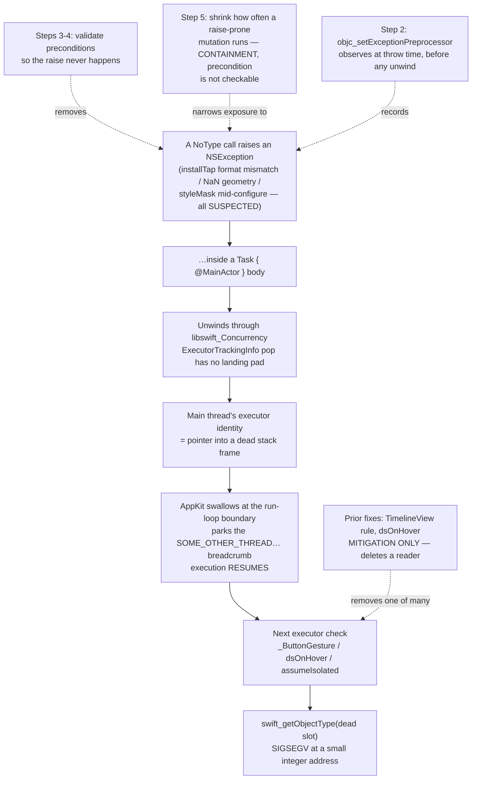

# Swallowed ObjC Exception → Executor Corruption - Plan

## Goal Capsule

- **Objective.** Stop NoType raising Objective-C exceptions inside main-actor Swift-concurrency jobs, and make any future occurrence of this class name itself in a log line instead of costing another two-month investigation.
- **Authority.** `docs/solutions/runtime-errors/macos-26-executor-identity-check-family-2026-07-25.md` is the source of truth for the mechanism. Success is defined by the **two affected users** — the issue #82 reporter and a second person whose build did not work (KD8). Two independent machines, where every conclusion so far rested on one.
- **Confidence boundary, and it must not drift.** The **mechanism is proven end-to-end** — a local probe raises an `NSException` inside a `Task { @MainActor }` started from an AppKit event callback, the process survives, and the *next* executor check SIGSEGVs at `0x1e` with the `HIServices SOME_OTHER_THREAD_SWALLOWED_AT_LEAST_ONE_EXCEPTION` thread parked (see Step 1 and Sources). **Which of NoType's calls throws is not proven.** Every thrower named below is a ranked suspect from a static + runtime audit, and none has been observed firing in the wild. There may be more than one.
- **Stop condition.** A tester completes onboarding and operates the UI, in **one sitting**, without a crash. That is the bar (KD4, KD7) — a surviving `OBJC THROW` line after a clean run does **not** hold the issue open; it is a follow-up, handled by AE3. A round that still crashes is a completed round with a negative result — record it and move on, do not retry it in variations.
- **Falsifier — the tripwire the superseded plan did not have.** Four outcomes are possible after the hand-off round, and only three of them are this plan being right:

  | | interceptor **silent** | interceptor **logged a throw** |
  |---|---|---|
  | **no crash** | plan confirmed → close | AE3 — issue still closes (KD4), but a thrower survives that this plan did not enumerate; name it and extend R14's audit |
  | **crash** | **THIS PLAN IS WRONG** — see below | AE4 — negative result; the log names the next target (R3) |

  Crash **plus a silent interceptor** falsifies the plan's central premise. First check the armed-line (R4a) to separate "the interceptor never installed" from "it installed and nothing threw". If it was armed and silent, then **no ObjC exception is being raised in that process**, and a swallowed-exception corrupter does not explain the reporter's crash. At that point stop enumerating throwers: reopen diagnosis from the reporter's `.ips`, and treat KTD5's containment shapes as inapplicable rather than as the next move. Do not respond by adding a fifth suspect — that is the failure mode that cost the superseded plan three months.
- **Open blockers.** **None.** All four prior call-outs are settled: the breadcrumb's user-facing surface (KD6), one hand-off round or two (KTD1), the acceptance bar (KD7 — one session), and whether shipping waits on a tester (KD8 — it does not). Nothing in Outstanding Questions is open.

---

## Product Contract

### Summary

Ask the reporter to run a zero-build diagnostic that makes AppKit stop swallowing the exception, so the next crash report names the thrower outright. Ship a permanent `objc_setExceptionPreprocessor` breadcrumb that catches this class for good. Fix the raise-prone call sites the audit found — they are latent bugs whether or not one of them is *the* thrower. Record the convention that produced them, and close out the three prior write-ups that framed this as a SwiftUI dispatch-path bug.

### Problem Frame

NoType SIGSEGVs inside the Swift runtime's "am I on the main executor?" check. An Objective-C `NSException` raised on the main thread inside a `Task { @MainActor }` body unwinds through `libswift_Concurrency`, whose `ExecutorTrackingInfo` is a stack-allocated thread-local with a non-exception-safe pop. Unwinding orphans the main thread's executor identity. AppKit swallows the exception at the run-loop boundary and resumes; the next executor check reads a dead stack slot and crashes — typically hundreds of milliseconds and one unrelated user action later.

The crash site is therefore arbitrary. `TimelineView`, `.onHover`, and a stock SwiftUI `Button` were three witnesses, not three causes. Each was fixed at its call site, each fix held, and the crash moved to the next site that still performed a check. All three fixes deleted a **reader** of the corrupt state; none touched the **corrupter**.

The cost is asymmetric and invisible. Dictation runs through `CGEventTap` and never reaches SwiftUI's button dispatch, so a configured user still works. But onboarding's primary control is a stock `Button`, so a new user on an affected machine cannot finish setup — and NoType ships no telemetry (ADR-013), so those users uninstall silently.

The process failure cost more than the bug. The answer — a parked background thread carrying `SOME_OTHER_THREAD_SWALLOWED_AT_LEAST_ONE_EXCEPTION` — was in the reporter's May 2026 `.ips` the whole time. Nobody read past thread 0.

### Key Decisions

- KD1. **Attack the corrupter, not the readers.** (session-settled: user-directed — chosen over more per-call-site annotation: three prior call-site fixes each relocated the crash, and the third landed inside Apple's compiled `_ButtonGesture` where no app closure exists to annotate.) Governs R9–R13.
- KD2. **Instrumentation is a deliverable, not a step toward one.** The interceptor ships in the release build and stays. It is the only hook that fires for an exception AppKit swallows, and it converts every future occurrence of this class from a mystery into a log line. Governs R4–R8.
- KD3. **The executor check stays enabled.** No runtime knob, no build setting, no suppression. It has already earned its keep by catching a genuine actor-isolation violation on the Core Audio HAL thread. Suppressing it would trade a loud crash for a silent data race — and it could not work anyway, because the fault happens before the check-mode options word is read. Carried by the Scope Boundaries bullet rather than by a requirement — the superseded plan expressed it as its R6; this plan demotes it to a boundary, so it governs no R-ID here.
- KD4. **"Fixed" means a tester stops crashing.** Proving which exception fired is desirable and is what Step 1 buys, but it is not the completion bar. Governs R17.
- KD5. **No hand-off build reaches the appcast.** Hand-off builds go to the two testers directly; publishing an rc to `docs/appcast.xml` would serve an unfinished diagnostic build to every installed copy. This constrains the *hand-off artefact only* — it is **not** a gate on merging the work to `main` (KD8), and it is not a gate on the next ordinary release. Governs R21.
- KD6. **The breadcrumb gets no user-facing surface — documentation only.** (session-settled: user-approved — chosen over a Settings → About "Copy diagnostics" button that dumps the last `.fault` lines to the clipboard: the interceptor already writes to the system log, so the README's `log show` recipe, sitting next to the existing `NSApplicationCrashOnExceptions` one, costs zero new UI to design, test and maintain, and the population that files GitHub issues can run a command. Revisitable if a non-technical reporter ever needs it.) Governs R8.
- KD7. **The acceptance bar is ONE session.** A tester completes onboarding and exercises the UI in one sitting; that counts as confirmation. (session-settled: user-approved — chosen over a multi-day soak window before the README note comes off.) **The maintainer accepts the known risk explicitly, so nobody has to rediscover it:** this is the same evidentiary bar that pronounced each of the three prior call-site fixes successful, each time before the crash reappeared at the next reader — and this crash is latent by construction, arbitrary in where it lands, and device-set dependent. **What makes it defensible this time, and did not exist before, is the interceptor.** The `.fault` log is requested in **both** outcomes (R17a), so the two failure modes a short window used to hide are now detectable inside the same single session: a build that is silently still broken shows an `OBJC THROW` line beside the clean run (AE3), and a thrower that only fires later still leaves a log line the user can send afterwards without reproducing anything. A one-session bar over a blind build was a guess; a one-session bar over an instrumented build is a measurement. Governs R17, R17a.
- KD8. **Shipping is not gated on either tester.** (session-settled: user-approved — maintainer's words: ship the fixes to `main` regardless; the repo is small and low-traffic, and the fixes are worth having on their own merits.) Steps 2–5 merge to `main` without waiting for any confirmation — they are latent-bug fixes and permanent instrumentation, each justified without this crash. The hand-off build still goes out, now to **two** affected people: the issue #82 reporter and a second user whose build did not work. That second tester is a real asset, not a contingency — every conclusion in this family so far has rested on n=1, and the superseded plan's deferred "recruit a second confirmer" item is hereby **satisfied**. Verification's job is to *confirm the fix*, not to *gate the release*. Governs R17, R22.

### Requirements

**Diagnosis**

- R1. The zero-build diagnostic runs on the reporter's **existing** install before any new binary is built.
- R2. Every tester result — from **either** affected user (KD8) — is recorded on issue #82 with the exact macOS build and the app build it came from, one entry per tester. Issue #82 currently has zero comments; no prior stage result was ever recorded there.
- R3. A round that still crashes is a completed round with a negative result, not an attempt to be retried in variations.

**Instrumentation**

- R4. An `objc_setExceptionPreprocessor` interceptor is installed as the first statement of app startup and logs the exception's name, reason, `Thread.isMainThread`, and throwing call stack.
- R4a. The interceptor emits one **armed** line at install time, at a persisted level under the same subsystem and category, and a distinct line when the `dlsym` lookup returns nil. Without them "the log is empty" is unreadable — it cannot be told from "the interceptor never installed", and that distinction is exactly what the Goal Capsule's falsifier turns on. This is the same *never ran* vs *ran and found nothing* breadcrumb `AppState.prime()` already carries, one level up.
- R4b. **The `reason` string is scrubbed through `SecureFieldMasker.scrubContent` and length-capped before it is logged.** `objc_setExceptionPreprocessor` is process-wide, so it observes exceptions raised by Foundation, AppKit, URLSession and Sparkle — including at the boundaries where NoType hands Objective-C its most sensitive values (the full transcript into `NSPasteboard.setString`, the Gemini key into the `x-goog-api-key` header). `reason` is authored by the raising framework with interpolated arguments this app does not control, so `privacy: .public` on it is an unbacked assertion of safety. `NoType/Keychain/CLAUDE.md` forbids the key reaching a log at **any** level, and `NoType/Context/CLAUDE.md` already mandates the masker for every other path carrying user-visible content. `name`, `Thread.isMainThread` and the bounded symbol list stay `.public` unscrubbed — none is attacker- or content-controlled.
- R5. The interceptor logs at `.fault`. `.info` is not persisted to the log store, so a user could not retrieve it with `log show`. It emits **at most 20 exception records per launch**, then one final "further exceptions not logged" line: the unified log's persistent store is a system-wide size-bounded ring, and an always-on preprocessor that may fire repeatedly must not evict other processes' records.
- R6. The interceptor returns the exception unchanged and alters no control flow. It is an observer.
- R7. The interceptor performs **no network I/O** — it writes to `os.Logger` only, and nothing it captures leaves the device on its own (ADR-013). Records leave the device only when the *user* chooses to attach them to issue #82, which is what R8 exists to enable. Stating it this way rather than as a flat "nothing leaves the device" is deliberate: the latter describes the write target and invites a reader to conclude the data-handling question is closed, when the plan's own workflow (R8, Step 9) is a publication path into a permanently world-readable issue.
- R7a. The README retrieval recipe tells the user to read the output before posting it, and names a private channel for any record they would rather not publish.
- R8. The interceptor ships in the released app, and the README documents the retrieval command so an affected user can send a breadcrumb without a maintainer round-trip.

**Removing the suspected throwers**

- R9. `MicProbe` never calls `installTap` with a format that differs from the input node's live hardware format at call time, nor with a zero sample-rate or zero channel-count format, and the tap's format is the same one the session's `AVAudioConverter` was built from. `removeTap` (which takes no format) is called only behind the `tapInstalled` gate.
- R10. `MicProbe.deinit` performs no engine or tap mutation that reads lock-guarded state without the lock.
- R11. `HUDPanel` never passes a non-finite or non-positive size to `setContentSize`, and never a non-finite origin to `setFrameOrigin`.
- R13. The `SileroVAD` load moves off the main actor **only if** the diagnosis — U1's `.ips` **or** the interceptor's `OBJC THROW` record — names a CoreML/Espresso exception. Both loads move, not just the `prime()` one (see Step 6).

**Reducing exposure where the raise cannot be removed** *(deliberately a separate group — see Step 5's containment note; do not read these as removing a thrower)*

- R12. `FixedSizeWindowConfigurator.lock` is a no-op when the window already matches the target style mask and size. This narrows how often a raise-prone mutation runs; it does not stop it running, and the first `lock()` — the one most likely to raise — is unaffected.

**Prevention**

- R14. A convention is recorded: inside a main-actor Swift-concurrency job, an AppKit / AVFoundation / CoreAudio API that can raise is called only after its preconditions have been validated at the call. The audit of currently-reachable sites is recorded alongside it, **and it distinguishes sites where the precondition is checkable (`MicProbe` format, `HUDPanel` geometry) from sites where it is not** — `FixedSizeWindowConfigurator` cannot ask AppKit whether it is mid-configure, so the convention's escape hatch there is KTD5's containment, not a better guard.
- R15. A guard test pins only what a helper makes mechanically checkable, and carries a presence complement so it cannot stay green while the guarded helper is dead.
- R16. A general source scan for "raise-prone API inside a main-actor `Task`" is rejected, and the rejection reasoning is recorded so the next reader does not re-derive it.

**Verification and closeout**

- R17. The fix is confirmed by the affected users — **two of them** (KD8): the issue #82 reporter and the second user whose build did not work. **One bounded session per tester is the acceptance bar** (KD7); no soak window is required and none is implied. No local test is presented as proof — the maintainer's machine does not reproduce the crash.
- R17a. The interceptor's `log show` output is collected in **both** outcomes — crash and clean run alike. This is what makes KD7's one-session bar a measurement rather than a guess: a silent-but-still-broken build is detectable without a second session, and a thrower that fires after the session still leaves a retrievable log line. A clean session reported **without** the log is an incomplete round.
- R18. On confirmation, the README known-issue note is removed and the solutions entry's "Suspected throwers — NOT confirmed" section is **rewritten into** the named cause, with the ranked suspect list kept as history. Deleting it is how the next investigation re-runs it — the same reason the family entry keeps its disproven hypotheses verbatim.

**Housekeeping**

- R19. `docs/plans/2026-07-25-001-fix-macos-26-executor-crash-plan.md` is marked superseded, pointing here.
- R20. **Both** places that still call the launch-ordering rule "the leading hypothesis" for this crash family are corrected: `NoTypeTests/LaunchOrderingTests.swift`'s class doc-comment **and** `NoType/AppState.swift:359` (the `prime()` doc-comment — shipping source, and the more visible of the two).
- R21. Hand-off builds are distinguishable per round, and no rc build is published to `docs/appcast.xml`.
- R22. Steps 2–5 merge to `main` without waiting for any tester result (KD8). No requirement in this plan makes a merge, a version bump, or a subsequent ordinary release conditional on a confirmation.

### Key Flows

- F1. Tester round — run independently with **each** of the two affected users (KD8)
  - **Trigger:** a diagnostic instruction or a hand-off build is ready.
  - **Steps:** maintainer states what changed and what to exercise; tester confirms their macOS build, reproduces or fails to reproduce in **one sitting** (KD7), and returns the `.ips` and/or the `log show` output — **the log in both outcomes** (R17a).
  - **Outcome:** no crash + empty interceptor log closes the issue. A crash records a negative result (R2, R3) and the interceptor log names the next target. Either tester's round stands on its own; neither blocks the merge (R22).
  - **Covered by:** R1, R2, R3, R17, R17a

### Acceptance Examples

- AE1. The zero-build diagnostic names the thrower
  - **Covers R1, R2.**
  - **Given** the reporter runs `defaults write app.notype NSApplicationCrashOnExceptions -bool YES` on their installed build and reproduces,
  - **When** the new `.ips` faults at `objc_exception_throw` instead of `swift_getObjectType`,
  - **Then** the faulting stack is the exception's own stack, the thrower is named, and Steps 3–6 are re-ranked around it.

- AE2. The diagnostic comes back inconclusive
  - **Covers R3, R4.**
  - **Given** the crash report is unchanged from before,
  - **When** the cause is read off,
  - **Then** it admits **two** explanations and the plan must not pick one: an intermediate `@try` caught the throw (Sparkle, CoreML internals), or the default was never applied. A third explanation — that `NSApplicationCrashOnExceptions` does not cover the HIToolbox/Carbon swallow path the `HIServices` breadcrumb names — **has been eliminated by local probe** (see Step 1, item 1). Do not re-list it.
  - **And** an unchanged report therefore **excludes nothing** — in particular it does *not* rule out AppKit-swallowed geometry exceptions. An exception caught by an intermediate `@try` sitting below the Swift frames never unwinds through `libswift_Concurrency`, so by construction it cannot be the corrupter and its invisibility is not evidence about anything else. The only conclusion available is that Step 2's interceptor is promoted to primary diagnostic.
  - **And** "unchanged" must be judged on the right field. The probe shows a covered throw produces a **`SIGTRAP` in `+[NSApplication _crashOnException:]` with the throwing stack in `asiBacktraces`**, not a `SIGSEGV` in `swift_getObjectType` with the exception's stack on thread 0. A report still faulting at `swift_getObjectType` *with* the `SOME_OTHER_THREAD_SWALLOWED…` thread present means the default did not take effect at all — check that before concluding an intermediate `@try` swallowed it.

- AE3. The fixes hold but the interceptor still logs
  - **Covers R4, R6, R14.**
  - **Given** a hand-off build carrying the interceptor and the Step 3–5 fixes,
  - **When** a tester no longer crashes but `log show` contains an `OBJC THROW` line,
  - **Then** a thrower survives that this plan did not enumerate; it is named, and the convention audit (R14) is extended to cover its shape.

- AE4. The crash survives and the interceptor is silent — the falsifier
  - **Covers R3, R4a.**
  - **Given** a hand-off build carrying the interceptor and the Step 3–5 fixes, and a tester still crashes,
  - **When** `log show` contains the R4a armed line but **no** `OBJC THROW` line,
  - **Then** no ObjC exception was raised in that process, so a swallowed exception is not what corrupts the executor identity on that machine — **this plan's premise is wrong**. Record it as such on issue #82, stop enumerating throwers, and reopen diagnosis from the `.ips` rather than shipping a fifth suspect.
  - **And** if the armed line is *also* absent, the result is void, not negative: the interceptor never installed, and the round must be re-run before any conclusion is drawn from it.

### Scope Boundaries

- Raising the minimum macOS above 15 is out of scope. ADR-001 stands and this family was never a reason to relitigate it — the exception is ours on any build.
- Pinning an older macOS SDK is out of scope. It was the superseded plan's stage C, premised on SwiftUI's `_ButtonGesture` being the defect; that premise is disproven.
- Replacing the 43 stock SwiftUI `Button` sites with an in-house control is out of scope. It was the superseded plan's stage A. It would delete more readers, which is what already failed three times.
- Suppressing or downgrading the executor check is out of scope (KD3).
- Filing an Apple Feedback report on the non-exception-safe `ExecutorTrackingInfo` pop is worth doing and **gates nothing**. It is not a deliverable of this plan.
- Publishing a **hand-off** build to `docs/appcast.xml` is out of scope (KD5) — that would serve an unfinished diagnostic build to every installed copy. Merging Steps 2–5 to `main` is explicitly **in** scope and waits on nobody (KD8, R22); so does the next ordinary release cut from `main` on its own cadence.

#### Deferred to Follow-Up Work

- Moving the `SileroVAD` load off the main actor for its own sake. There is an independent argument — a first-run ANE compile is routinely 1–3 s on the main actor at launch — but it is a launch-hitch concern, not this crash, and it should be decided on its own evidence.
- `display: false` on `FixedSizeWindowConfigurator`'s `setFrame` call, to drop the synchronous display pass. A latency question, not a crash question; weigh it against the window visibly settling a frame late.
- ~~Recruiting a second affected user so results are not n=1.~~ **Satisfied, no longer deferred** — the maintainer has identified a second user whose build did not work, and the hand-off build goes to both (KD8). This was the superseded plan's open contingency; it is now an asset the plan is built on.
- Auditing the remaining `@unchecked Sendable` / `nonisolated(unsafe)` types for isolation correctness. Adjacent, not implicated.

### Dependencies / Assumptions

- **Two affected users are the known repros** (KD8) — the issue #82 reporter and a second user whose build did not work. Every acceptance signal comes from their machines. Because Steps 2–5 merge regardless (R22), a tester going quiet costs the plan a *confirmation*, not a *ship*.
- **The maintainer's machine cannot verify the fix.** Local gates prove only that behaviour did not regress. This is stated plainly rather than papered over.
- **Proven, reproduced locally:** an `NSException` raised inside `Task { @MainActor in … }` unwinds with `libswift_Concurrency.dylib completeTaskWithClosure(…)` in the unwind path; `objc_setExceptionPreprocessor` fires at throw time and `Thread.callStackSymbols` inside it captures the throwing stack; `AVAudioEngine.installTap` with a format mismatching the input node raises `com.apple.coreaudio.avfaudio`.
- **Proven, the whole family in one binary (2026-07-26 swallow probe, macOS 26.4.1 / 25E253, Swift 6.3.3).** An `NSException` raised inside a `Task { @MainActor }` started from `-[NSApplication sendEvent:]` is swallowed, the process **survives**, and the next executor check (`MainActor.assumeIsolated`) SIGSEGVs — `EXC_BAD_ACCESS / KERN_INVALID_ADDRESS at 0x1e`, faulting `objc_opt_class` ← `swift_getObjectType` ← `swift_task_isMainExecutorImpl` ← `SerialExecutorRef::isMainExecutor()` ← `swift_task_isCurrentExecutorWithFlagsImpl`, with a parked `HIServices SOME_OTHER_THREAD_SWALLOWED_AT_LEAST_ONE_EXCEPTION` thread. This is the reporter's crash signature, address included, produced on demand. The mechanism is no longer inferred from the `.ips` — it is reproduced.
- **Proven, and it settles Step 1's open question:** `NSApplicationCrashOnExceptions` **does** cover this path. See Step 1, item 1 for the two arms and the two limits on how the returned report must be read.
- **Proven the hard way — discarding the prior exception preprocessor is not a no-op.** The probe's first run replaced Foundation's preprocessor without chaining; `callStackReturnAddresses` then went unpopulated and HIToolbox aborted the process outright at `Assertion failed: (callStackReturnAddresses), -[NSException(HIServices) hashString], HIExceptions.mm:45`. Step 2's chaining requirement is not a stylistic nicety — omitting it converts a swallowed exception into an immediate `SIGABRT`.
- **Proven negative:** `NSSetUncaughtExceptionHandler` does not fire here — AppKit catches first. This is why the class went unseen across three incidents.
- **Exonerated, do not re-suspect:** the inlined `AXTrustedCheckOptionPrompt` literal. Measured byte-identical to the real global, and the bridged dictionary carries a genuine `CFBoolean` (CFTypeID 21), not a `_SwiftValue` box. The `HIServices` frame in the report is where the exception was *swallowed*, not where it was thrown.
- **Disproven:** early-launch `MainActor` use as the corrupter. Shipped as `bfcec4a` (v0.1.13-rc1) and tested on the reporter's machine; it did not fix the crash. The reordering stays — it is correct on its own merits and it incidentally fixed two real bugs (Sparkle never started for menu-bar-only users; the audio-unmute termination handler was never wired) — but it is not coverage of this crash.

### Outstanding Questions

**None open.** All four call-outs are settled by the maintainer and recorded as decisions:

- Does the diagnostic breadcrumb get a user-facing surface? Resolved as **documentation only** — no Settings → About "Copy diagnostics" button (KD6).
- One hand-off round or two? Resolved as **one**, carrying the interceptor plus every unconditional fix (KTD1).
- **How long does a tester run the hand-off build before the README note comes off and #82 closes?** Resolved as **one session** — complete onboarding, exercise the UI, in one sitting (KD7). The known risk is accepted explicitly, and the interceptor's log-in-both-outcomes requirement (R17a) is the mitigation that makes the short bar a measurement rather than the repeat of a mistake.
- **What happens if a tester goes quiet?** Resolved: **it does not gate anything** (KD8, R22). Steps 2–5 merge to `main` regardless — small, low-traffic repo, and the fixes stand on their own merits. A silent tester costs a confirmation, not a ship. And the premise behind the question has weakened anyway: there are now two testers, not one.

One further question was **technical rather than a maintainer call, and it is settled by measurement** — recorded here so the answer is not re-derived, and so nobody spends an affected user's round re-asking it:

- **Does `NSApplicationCrashOnExceptions` intercept the HIToolbox/Carbon swallow path the `HIServices` breadcrumb names, or only exceptions reaching `NSApplication`'s own handler?** Resolved as **yes, it covers it** — the two are the same path, not two paths. Probe, arms and the two caveats on reading the resulting `.ips` are in Step 1, item 1.

---

## Planning Contract

### Key Technical Decisions

- KTD1. **Ship the interceptor and the unconditional fixes in one hand-off round.** (session-settled: user-approved — chosen over interceptor first / fixes second: the interceptor makes a bundled round self-attributing, because its `.fault` log names which raise site actually fired, so the superseded plan's "one lever per stage" discipline is *superseded by better instrumentation*, not abandoned. Secondary: the reporter has already spent one round on a build that did not fix anything and cannot use the app at all, so their patience is a real constraint.) If a throw survives the bundle, it names itself; if it does not, Step 1's zero-build result already said which one it was. R3 still stands — a round that still crashes is a completed round with a negative result. Governs R3, R9–R12.
- KTD2. **Reach `objc_setExceptionPreprocessor` through `dlsym(RTLD_DEFAULT, …)`, not a bridging header.** The repo is pure Swift; adding an Objective-C compilation unit and a bridging header for one symbol is disproportionate, and `@_silgen_name` against a public C API is worse. Validated from Swift on this toolchain. Governs R4.
- KTD3. **Log at `.fault`.** `.info` is not persisted to the unified log store, so a user could not retrieve it after the fact. `.fault` lands in the persistent store and survives until the reporter runs `log show`. (The related lesson — that a bare `log` can be shadowed by a shell profile, so the recipe must use the absolute path — is restated inline in Step 2, item 5.) Governs R5, R4a.
- KTD4. **The interceptor is always on in release, with no flag.** It is a single function-pointer swap costing nothing when nothing throws, it is public API since 10.5, it is process-local (no code injection, no `DYLD_INSERT_LIBRARIES`), and it needs no entitlement — non-sandboxed hardened runtime is irrelevant to it. Gating it behind a debug flag would guarantee it is off on exactly the machines that need it. Governs R7, R8.
- KTD5. **Fix by stopping the throw, not by containing the unwind.** Two containment shapes were considered and rejected as the primary fix. (a) Route raise-prone calls through `DispatchQueue.main.async` instead of `Task { @MainActor }` — a dispatch block is not a Swift-concurrency job, so no `ExecutorTrackingInfo` node is pushed and an unwind orphans nothing. (b) An Objective-C `@try/@catch` shim around the raise site. Both leave the defect in place: the tap still fails to install, the panel still fails to position, and the user sees a dead spectrum meter or a mispositioned HUD instead of a crash. Both are recorded as the **documented escalation** if the Step 3–5 fixes do not hold. Governs R9–R12, R14.
- KTD6. **Reject a general source scan for raise-prone calls inside main-actor `Task` bodies.** There is no closed set of AppKit APIs that can raise, so the needle list would be a guess — and per `docs/solutions/conventions/source-scan-guard-fidelity-2026-07-25.md` the failure mode of a guessed needle list is a **false negative**, not noise: every way a source scan fails produces a *passing* test. The risk is not that a broad scan would cry wolf; it is that it would sit green over an unbounded set of raise sites it never learned to look for, while the team stopped reviewing for them by hand because "a test pins this." That is strictly worse than no scan. Guard only where a helper creates a genuinely closed set — U7's HUD geometry helper — and carry the presence complement. Governs R15, R16.
- KTD7. **Keep the version string at `0.1.13-rc1`; bump `CFBundleVersion` per hand-off build.** `v0.1.13-rc1` was never tagged or released — it exists only as a commit on `main` — so the string is free to reuse. Bumping the integer build (15 → 16 → …) keeps rounds distinguishable in the issue log without minting a version for a stage that turned out not to be the fix. **Promotion to `0.1.13` is NOT gated on a tester** (KD8, R22) — it follows the project's ordinary release cadence, on the merits of what is on `main`. The one thing that stays gated is KD5's narrow rule: a *hand-off* rc artefact is never the thing published to the appcast. Governs R21, R22.
- KTD8. **Drop the "ask the reporter to defer macOS updates" constraint, but replace it with a baseline arm.** The superseded plan froze them on 25C56 because the hypothesis was OS-shaped. The exception is ours and fires on any build, so recording the build stays required (R2) but freezing it does not. **However**, dropping the freeze *and* the superseded plan's baseline re-check together would leave the verification confounded: Apple is actively tracking the non-exception-safe `ExecutorTrackingInfo` pop, so if a tester's macOS moves between Step 1 and Step 9, an OS-side change looks identical to this plan's fix — and a tester's round is the only kind of evidence this plan has. So Step 9 runs **two arms in one session, per tester**: the tester first re-launches their currently-installed pre-fix build and confirms it still crashes, then runs the hand-off build. If the pre-fix build no longer crashes, that tester's round is **void as fix evidence** and is recorded as a suspected OS-side change. This costs one extra launch — they already have the old build installed. Note this arm is also what keeps KD7's one-session bar honest: both arms land inside the same sitting, so the "it stopped crashing" claim is attributable within it. With two testers (KD8) the OS-side confound would have to hit both machines identically to survive. Governs R2, R17.

### High-Level Technical Design

Where each intervention sits relative to the proven mechanism:

The three shipped call-site rules act at `R` — the readers. Steps 3 and 4 act at `T` and remove it; Step 5 acts at `T` but only narrows it. That split is the whole difference from the superseded plan, and it is why Step 5 carries a containment label rather than being counted as a fix.

### Assumptions

- `ExceptionBreadcrumb.install()` is a static call, not a construction, and it schedules no `MainActor` work and touches no `NSApp`. It therefore does not trip `NoTypeTests/LaunchOrderingTests.swift`'s launch-path scan. Verify this rather than assuming it — the scan walks stored-property defaults and same-file calls transitively.
- The reporter is parked mid-onboarding, which places them on the mic-check step and makes `MicProbe` the best-fitting suspect for their specific report. `OnboardingState` persists `currentStep`, so a relaunch resumes there. Confirm with the free question in Step 1 rather than treating it as established.

---

## Implementation Units

Driven as an **Execution Sequence** — Steps are numbered in execution order, each carries a stable U-ID, and each ends with a `**Done when:**` acceptance line. U-IDs are stable and never renumbered.

### Step 1 — U1. Zero-build diagnosis on the reporter's existing install

- **Goal:** name the thrower without building anything.
- **Requirements:** R1, R2. Implements KD4.
- **Dependencies:** none. Runs first.
- **Files:** none — this is a reporter interaction; the result lands on issue #82.
- **Approach:**
  0. **Before contacting anyone — re-read the `.ips` already attached to issue #82 for a `SOME_OTHER_THREAD_SWALLOWED_AT_LEAST_ONE_EXCEPTION` thread.** This is cheaper than everything below (zero reporter interaction) and it is the premise check the plan never makes on its own verification target: the breadcrumb has been observed **only** in the May 2026 `.onHover` report, and the whole plan is verified against #82. Record present / absent / no-report-attached on the issue. **Absence is a premise-level negative** — it would mean #82 may not be in this family at all, matched only by stack shape — and it re-opens the framing before the hand-off build is cut. This is the plan's own stated lesson ("nobody read past thread 0") applied to itself.
  1. Ask the reporter to run `defaults write app.notype NSApplicationCrashOnExceptions -bool YES` against their **already-installed** build, reproduce the crash, and attach the new `.ips`. The README (`## Known issues`) already carries this instruction verbatim — this step is the direct ask plus the recording.

     **SETTLED BY LOCAL PROBE — the default DOES cover this path. This step's value stands.** The open question was whether `NSApplicationCrashOnExceptions` intercepts the HIToolbox/Carbon swallow the evidence names via its `HIServices` frame, or only exceptions reaching `NSApplication`'s own top-level handler. Measured on macOS 26.4.1 (25E253) / Swift 6.3.3 with a minimal AppKit bundle that raises an `NSException` inside a `Task { @MainActor }` started from `-[NSApplication sendEvent:]` — the shape of the real crash:

     | | default OFF | default ON |
     |---|---|---|
     | outcome | swallowed; **process survives**; next executor check SIGSEGVs | **dies at the throw**, `SIGTRAP` |
     | faulting frame | `objc_opt_class` ← `swift_getObjectType` ← `swift_task_isCurrentExecutorWithFlagsImpl` ← `assumeIsolated`, `KERN_INVALID_ADDRESS at 0x1e` | `+[NSApplication _crashOnException:]` ← `-[NSApplication reportException:]` ← `-[NSApplication run]` |
     | `SOME_OTHER_THREAD_SWALLOWED…` thread | **present**, parked in `HIServices` via `thread_suspend` | **absent** — nothing was swallowed |

     The `HIServices` frame therefore does **not** mean Carbon caught the exception somewhere `NSApplication` cannot see. `-[NSApplication reportException:]` is the catcher in both arms; `NSApplicationCrashOnExceptions` selects which branch it takes, and the parked `SOME_OTHER_THREAD_SWALLOWED_AT_LEAST_ONE_EXCEPTION` thread is HIToolbox's bookkeeping *for the swallow branch* — the marker of the same path, not evidence of a different one.

     **Two limits on how the returned `.ips` must be read — both verified with no interceptor installed, i.e. exactly the reporter's existing build:**
     - **The exception's own stack is in the report's `asiBacktraces` field, not on thread 0.** Thread 0 shows only AppKit's reporter frames; the throw site (`objc_exception_throw` and the app frames beneath it) is in `asiBacktraces`. Read that field first. A reader who checks only the faulting thread will call a successful diagnostic a failure.
     - **The report carries no exception name and no reason** — `asi` is null. Those live in the unified log instead, at persisted levels: `[com.apple.AppKit:General] <reason>` at error level (both arms), and `[com.apple.hiservices:HIExceptions] FAULT: <name>: <private>` at fault level (**swallow arm only** — its presence is itself a swallow detector, and its `reason` is redacted while AppKit's is not). So ask for the `.ips` **and** `/usr/bin/log show --last 30m --predicate 'process == "NoType"' --style compact`. The name alone discriminates the shortlist: `com.apple.coreaudio.avfaudio` → Step 3, `NSInvalidArgumentException` from AppKit geometry → Step 4, `NSInternalInconsistencyException` → Step 5.
  2. Ask two free questions in the same message. **Which onboarding step they are stuck on** — this is the highest-value question in the plan, because it discriminates Steps 3 and 4, which are mutually exclusive for one user: the mic-check step starts an `AVAudioEngine` on `.onAppear` (so `MicProbe` is live and permission HUDs are suppressed), while a post-onboarding user is the reverse. And **their audio input topology** — whether the effective input device differs from the system default, and its transport type, which is what makes the `installTap` format race fire. Ask for that rather than raw `system_profiler SPAudioDataType` output, or tell them to redact before posting: macOS names Bluetooth audio devices `<Owner's first name>'s AirPods`, and issue #82 is a permanently public, search-indexed page that this plan is simultaneously turning into the project's result ledger. Same instruction for the `.ips` attachment in item 1.
  3. Record their exact macOS build alongside the result. Issue #82 has zero comments today; this is the first entry.
  4. Read the returned `.ips` from the **non-crashing threads first**. If the faulting stack is now `objc_exception_throw`, the thrower is named and Steps 3–6 re-rank around it.
- **Execution note:** cheapest question in the plan and it can end the hunt. Ask it first and record the answer when it arrives — but **do not block on it.** U3, U4 and U5 name U1 a *ranking* dependency only and ship regardless; Step 2 is fully independent. Nothing in Steps 2–5 waits on a reporter round-trip of unbounded latency.
- **Branch on the result:**
  - **Names a thrower** → that fix leads the Step 3–5 group; the others still ship as latent bugs.
  - **Inconclusive** (report unchanged — the throw was caught by an intermediate `@try`) → informative in itself (it excludes AppKit-swallowed geometry exceptions), and Step 2's interceptor becomes the diagnostic. Covers AE2. Step 6 is recorded as skipped.
  - **Reporter's macOS build has moved** → not a problem and not a re-run: per KTD8 the exception is ours and fires on any build, so record the new build (R2) and read the result normally. The one case that *does* change things is the crash no longer reproducing at all on that machine — record it as a suspected OS-side change per KTD8, not as a fix, and read the other tester's round (KD8) on its own. If it stops reproducing on **both** machines the plan has lost its verifiers — but not its ship: Steps 2–5 still merge (R22), and what parks is the closeout, with the README note left up until something can confirm.
  - **Reporter unavailable, or goes quiet mid-flight** → **not a blocker** (KD8, R22). Steps 2–5 merge to `main` regardless and Step 6 is recorded as skipped; only the *confirmation* parks. The second tester (KD8) is an independent path to the same answer, so a single silent participant no longer strands the plan the way it would have when this rested on n=1. Record the non-response on #82 and carry on; there is nothing here to escalate.
- **Test expectation:** none — the output is the reporter's report.
- **Done when:** issue #82 carries the diagnostic result read from `asiBacktraces` (not thread 0), the accompanying `log show` output, the reporter's macOS build, their onboarding step, and their audio device list.

### Step 2 — U2. Permanent Objective-C exception interceptor

- **Goal:** every exception this app raises names itself in the log, including the ones AppKit swallows.
- **Requirements:** R4, R4a, R4b, R5, R6, R7, R7a, R8. Implements KD2, KD6, KTD2, KTD3, KTD4.
- **Dependencies:** none. Independent of U1.
- **Files:** `NoType/Diagnostics/ExceptionBreadcrumb.swift` (new), `NoType/NoTypeApp.swift`, `README.md`, `NoTypeTests/ExceptionBreadcrumbTests.swift` (new). **No `project.yml` edit is needed** — the target globs `NoType/` with only `**/*.md` excluded, so a new subfolder is picked up automatically. `xcodegen generate` is still **required**: the tracked `NoType.xcodeproj/project.pbxproj` does not learn about the new files until it is regenerated.
- **Approach:**
  1. New `enum ExceptionBreadcrumb` namespace with a single `static func install()`, made idempotent so a double call cannot chain our own preprocessor to itself.
  2. Resolve `objc_setExceptionPreprocessor` via `dlsym` against `RTLD_DEFAULT` (KTD2) and install a preprocessor that logs and returns its argument unchanged (R6). **Capture the preprocessor the setter returns and call it on the return path.** The setter hands back whatever it replaced; discarding it silently disables any other in-process installer in an app that links Sparkle and CoreML, which quietly exceeds R6's "alters no control flow" beyond our own hook. Chaining outward is the contract; the idempotence guard in item 1 is about not chaining to *ourselves*.
     **This is now measured, not argued.** The 2026-07-26 swallow probe's first run replaced the prior preprocessor without chaining. **Foundation's is what populates `NSException.callStackReturnAddresses`**, so with it gone HIToolbox aborted the process on the spot — `Assertion failed: (callStackReturnAddresses), function -[NSException(HIServices) hashString], file HIExceptions.mm, line 45` → `SIGABRT`. Chaining restored normal behaviour immediately. Getting this wrong does not merely lose a breadcrumb: **it turns every swallowed exception in NoType into an instant crash**, on every machine, which is a strictly worse product than the bug this plan is fixing. Treat it as a correctness requirement of R6, and let the "install twice → one preprocessor" test also assert the prior pointer was retained.
  2a. Scrub `reason` through `SecureFieldMasker.scrubContent` and cap its length before logging (R4b); cap total exception records per launch (R5).
  3. Log, at `.fault` under subsystem `app.notype`, category `exception`: the **literal marker `OBJC THROW`** followed by `name`, `reason`, `Thread.isMainThread`, and a bounded prefix of `Thread.callStackSymbols`, with `privacy: .public` on the fields so they are readable in `log show`. The marker is not cosmetic — Step 2's acceptance, AE3, AE4 and Step 9 all key on that exact literal, so specify it here rather than leaving it to the implementer. Bound the stack depth — an unbounded symbol join in a preprocessor that may fire repeatedly is its own hazard.
  3a. **Emit one `.fault` armed line from `install()` itself (R4a)**, same subsystem and category — e.g. `EXC BREADCRUMB armed`. It costs one log record per launch and it is what makes an empty log a *result* instead of an ambiguity: without it, "no `OBJC THROW` line" cannot be told from "the interceptor never installed", and the Goal Capsule's falsifier is unreadable. This is `AppState.prime()`'s breadcrumb reasoning applied one level up — the plan already cites that pattern below, so this makes it binding rather than aspirational.
  4. Call `ExceptionBreadcrumb.install()` as the **first statement of `NoTypeApp.init()`**. That is before every type the initializer constructs, and well before the T+3.5 s throw observed in the reporter's report.
  5. Add the retrieval command to the README's `## Known issues` block, next to the existing `NSApplicationCrashOnExceptions` recipe: `/usr/bin/log show --last 30m --predicate 'subsystem == "app.notype" AND category == "exception"' --style compact`. Use the absolute path — `log` is shadowed on at least one dev machine's shell profile, and a user hitting the same is a lost report. Add the R7a line beside it: read the output before posting, and here is a private address for anything you would rather not publish. **This README recipe is the breadcrumb's entire user-facing surface (KD6)** — no Settings → About affordance ships with it.
- **Patterns to follow:** `AppState.prime()`'s single `.info` breadcrumb (`NoType/AppState.swift`) — the same "one line that distinguishes *never ran* from *ran and found nothing*" reasoning, one level up.
- **Risk — do not let this trip the launch-ordering guard.** `NoTypeTests/LaunchOrderingTests.swift` scans every type reachable by construction from `NoTypeApp.init()`, transitively through same-file calls and stored-property defaults, for `Task {`-family literals and `NSApp` references. `install()` contains neither, and it is a static call rather than a construction, so it should not be discovered at all — confirm by running the suite, not by reading the test.
- **Test scenarios:**
  - Calling `install()` twice leaves one preprocessor installed, not a chain.
  - Invoking the installed preprocessor **directly** with a synthetic `NSException` produces a log record naming it, and returns the identical object it was handed (R6). **Do not write this as "raise and catch in-test":** Swift has no `@try`/`@catch`, so a real `NSException` raised in a Swift test aborts the process rather than propagating to a `catch`, and the ObjC shim that would fix it is what KTD2 rules out. `install()` therefore needs to expose the function pointer it set for test invocation.
  - The formatted message includes name, reason, main-thread flag, and a non-empty bounded stack.
  - `install()` emits the R4a armed record.
  - `NoTypeApp.swift`'s `init()` calls `ExceptionBreadcrumb.install()` before any other statement — a source assertion in the same shape as `LaunchOrderingTests.test_launchWork_isActuallyWiredUp_fromNoTypeAppInit`, so deleting the call goes red rather than staying silently green.
- **Done when:** the test suite passes including `LaunchOrderingTests` and the presence assertion above; and the maintainer's debug launch produces both the R4a armed record and, for a deliberately raised exception, an `OBJC THROW` `.fault` record retrievable by the README's `log show` command. The launch half is **maintainer-run** — agents must not launch the app (`docs/build.md`).

### Step 3 — U3. Close the `MicProbe` raise sites

- **Goal:** close `MicProbe`'s `com.apple.coreaudio.avfaudio` raise sites — the format mismatch and the ungated tap mutation — so a raise from inside a main-actor `Task` requires a race far narrower than the one that exists today.
- **Residual window, stated so a post-fix crash is read correctly.** The device switch is asynchronous, so a format validated immediately before `installTap` can in principle still be stale by the time the call lands: the guard shrinks the window from "several object constructions wide" to "one call wide", it does not close it to zero, and it validates format only — not every condition under which `installTap` can raise. **MicProbe is therefore exonerated by an absent `com.apple.coreaudio.avfaudio` record in the Step 9 interceptor log, not by the absence of a crash.**
- **Requirements:** R9, R10. Implements KD1, KTD5.
- **Dependencies:** U1 for ranking only — this ships whether or not U1 names it. The format race is a latent bug either way.
- **Files:** `NoType/Onboarding/MicProbe.swift`, `NoTypeTests/MicProbeFormatGateTests.swift` (new)
- **Approach:**
  1. **The race:** `start()` applies the effective device via `AudioDeviceManager.apply(device, to: engine)` → `AudioUnitSetProperty(kAudioOutputUnitProperty_CurrentDevice)`, which is **asynchronous**, then immediately reads `input.outputFormat(forBus: 0)`. The format can still be the previous device's. `installTap` with a format that differs from the input node's live hardware format raises — reproduced on demand.
  2. **Read the node format once, as late as possible, and derive *everything* from that one read.** Today `inFmt` is read at `MicProbe.swift:177` and `installTap` runs at `:200`; between them sit the `AVAudioFormat` and `AVAudioConverter` constructions — enough work for a device switch to land. The fix is to move those constructions *below* a single late read, so the converter and the tap are built from the same value. **Do not** simply re-read and pass the newer format to `installTap` alone: `handleTap` feeds every buffer through the stored `converter`, so a tap in format B against a converter built for format A trades the crash for a permanently dead spectrum meter.
  3. Extract the validity test as a pure, testable predicate over that single read: a format is installable when its sample rate and channel count are both positive **and** it still equals `input.outputFormat(forBus: 0)` at call time. Bail out through the existing `MicProbe.Error` path — a flat spectrum meter is the documented failure mode for this screen and is far better than a crash. Note `installTapAndStart()` already guards positive rate and channel count at `MicProbe.swift:178`; extend that guard into the predicate rather than adding a second one beside it.
  4. Guard `removeTap` the same way. `removeTap` on a bus with no tap, and tap mutation while the engine is reconfiguring, are separate raise sites — the code already tracks `tapInstalled`, so make that the sole gate and keep it lock-consistent. Three call sites today: `:121` (`stop()`) and `:197` are gated; **`:209`, in the `engine.start()` catch, is not** — it is safe only by local reasoning about the two lines above it. Route it through the same gate so the invariant is structural rather than incidental.
  5. `rebuild()` is reached from two Swift-concurrency jobs — the `.AVAudioEngineConfigurationChange` observer (`Task { @MainActor [weak self] in self?.rebuild() }`) and the device-observation loop. Those are exactly the §1 shape; leave the `Task { @MainActor }` bridges in place (`MainActor.assumeIsolated` is banned by `NoType/UI/CLAUDE.md`) and make the body unable to raise instead.
  6. **`deinit` (R10):** it runs nonisolated on whatever thread drops the last reference, reads `tapInstalled` without the `lock` that guards the rest of the class, and calls `removeTap` / `stop()`. Compounding it, `OnboardingMicCheckStep` holds `@State private var probe = MicProbe()`, so SwiftUI allocates and discards throwaway probes on body passes while that step shows. Take the lock for the `tapInstalled` read, or narrow `deinit` to the operations that are unconditionally safe on an unreferenced instance. This hazard was **added after v0.1.8**, so it is not in the crashing build — it is a regression to close, not a suspect.
- **Patterns to follow:** `AudioRecorder`'s `ConverterFeed` and its lock discipline in `NoType/Recording/` — the same `@unchecked Sendable` + `NSLock` shape this class already mirrors.
- **Execution note:** the pure predicate is the unit under test. `AVAudioEngine` behaviour itself is not unit-testable and the repo's hard rule forbids tests against live mic input.
- **Test scenarios:**
  - A format with a positive rate and channel count that equals the node format is installable.
  - A zero sample-rate format is not installable.
  - A zero channel-count format is not installable.
  - A format whose sample rate differs from the node's current format is not installable (the device-switch race).
  - A format whose channel count differs from the node's is not installable (built-in mono → USB stereo).
  - The predicate's rejection cases are exhaustive over the shapes `installTapAndStart()` can meet: zero rate, zero channels, rate mismatch, channel mismatch.
- **Testability note — keep the scenarios on the predicate.** `installTapAndStart()` and `tapInstalled` are both `private`, and `@testable import` exposes `internal`, not `private`; exercising them would also mean driving a live `AVAudioEngine`, which `NoType/Recording/CLAUDE.md` forbids in unit tests. Assert the predicate directly, and let the "every call site is gated" half be carried by source inspection (U7's scan) and the manual smoke — do not widen access purely to make a test reach.
- **Done when:** every `installTap` / `removeTap` call in `MicProbe.swift` sits behind the validity predicate (including `:209`), the converter and the tap are built from a single format read, `deinit` reads no lock-guarded state unguarded, and the predicate's test cases pass.

### Step 4 — U4. Close the `HUDPanel` NaN-geometry raise site

- **Goal:** `HUDPanel` cannot raise `NSInvalidArgumentException` from AppKit geometry.
- **Requirements:** R11. Implements KD1, KTD5.
- **Dependencies:** U1 for ranking only. Ships regardless.
- **Files:** `NoType/UI/HUDPanel.swift`, `NoTypeTests/HUDPanelGeometryTests.swift` (new)
- **Approach:**
  1. **The raise:** measuring an `NSHostingView` before it has a stable window/screen context can yield a NaN or infinite `fittingSize`. `-[NSWindow setFrameOrigin:]` then raises `NSInvalidArgumentException` — *"Invalid parameter not satisfying: !((__x) != (__x))"*. Textbook AppKit-swallowed exception.
  2. Three call sites, all in `NoType/UI/HUDPanel.swift`: the `layoutIfNeeded()` + `setContentSize(host.fittingSize)` pair at the end of `init` (a full SwiftUI layout pass run before the panel is fully configured), and the `setContentSize` / `setFrameOrigin` pair inside `positionTopRight(topInset:rightInset:)`.
  3. Add one small pure helper — a finite-and-positive test for `NSSize` and a finite test for `NSPoint` — and route all three sites through it. On rejection, **log at a persisted level** and skip the geometry call.
     **"Leave it at its last good size/position" does not work for the `init` site** — there is no last-good one. `HUDPanel.init` seeds `contentRect` at `NSRect(x: 0, y: 0, width: 300, height: 100)`, and the NaN case arises precisely on that first pre-stable-context measurement, so a bare skip parks the panel in the bottom-left corner of the screen for the rest of the session, silently. For the origin, fall back to a screen-derived top-right computed from `NSScreen.main.visibleFrame` and the panel's current frame size; for the size, the `contentRect` default is a sane floor. A stale-but-placed HUD is not a user-visible defect worth a crash; a HUD in the wrong corner with no log line is the exact silent-failure shape this plan's Problem Frame blames for two months.
  4. **Why this matters beyond the reporter — with the frequency stated accurately.** `HUDController.repositionPermissionPanels()` fires on every permission-state *change* and on every explicit show/dismiss (launch, menu-bar click, card X). It is **not** a 1 Hz loop: `AppState.observePermissions()` gates `reconcilePermissionHUD` behind `if ax != lastAx || mic != lastMic` (`NoType/AppState.swift:542`), so the 1 s poll tick alone does not reach it. An earlier draft of this plan, and the family entry's suspect list, both say "roughly once per second" — that is wrong and should not be used to rank this suspect.
  5. **This step is a latent-bug fix, not a ranked suspect for *this* reporter.** The plan's own Assumptions place the reporter mid-onboarding, and `HUDController.presentMissing` is gated on `onboarding.isComplete`, so their `permissionPanels` dictionary is empty and `repositionPermissionPanels()` is a no-op over zero panels. Step 3 and Step 4 are therefore **mutually exclusive** as the thrower for a single user: mid-onboarding makes `MicProbe` live and this path dead, post-onboarding makes this path live and `MicProbe` impossible. Step 1's second free question is exactly what discriminates them — do not assert either profile for issue #82 before that answer lands.
- **Patterns to follow:** `FixedSizeWindowConfigurator.adjustedFrame(for:target:)` in `NoType/UI/MainWindow.swift` — already an `internal static` pure geometry helper extracted for direct unit testing. Mirror that shape.
- **Test scenarios:**
  - A finite positive size passes.
  - A NaN width is rejected; a NaN height is rejected.
  - An infinite width is rejected; an infinite height is rejected.
  - A zero size is rejected; a negative size is rejected.
  - A point with a NaN or infinite coordinate is rejected.
  - A normal top-right origin computed from a plausible visible frame passes.
  - The no-prior-position case: a rejection on the very first positioning pass yields the screen-derived fallback origin, not `(0, 0)`.
- **Done when:** no `setContentSize`, `setFrameOrigin`, or `setFrame` call in `HUDPanel.swift` receives an unvalidated value, and the helper's test cases pass.

### Step 5 — U5. Make the fixed-size window lock a no-op when already locked — CONTAINMENT, not a fix

- **Goal:** shrink the window in which a raise-prone `styleMask` mutation can run. **This step does not remove a raise, and must not be counted as one.**
- **Requirements:** R12. **Does *not* implement KD1** — see the containment note below. It is the one Step 3–5 intervention that leaves the raise reachable.
- **Dependencies:** U1 for ranking only. Ships regardless.
- **Containment note — read before writing the predicate.** Steps 3 and 4 remove their raises: a format that would raise is never passed to `installTap`, a NaN that would raise is never passed to `setFrameOrigin`. Step 5 cannot do the equivalent, for three separate reasons, and all three must be understood before this step is counted as coverage of anything.
  1. **The raise's precondition is not checkable.** It is *"AppKit is not currently reconfiguring this window"*, and no API answers that. The predicate below decides only whether the mutation is *needed*.
  2. **The predicate skips the safe calls and never the dangerous one.** The first `lock()` comes from `WindowAwareView.viewDidMoveToWindow` — i.e. while AppKit is attaching the window, which is precisely the mid-configure moment the raise needs. At that instant the style mask still carries `.resizable` and min/max/frame all differ from the target, so the predicate **passes** and the mutation runs unchanged. What it skips is the steady-state repeats, which are the calls least likely to raise. Same for the genuine re-lock events (Mission Control, Space switch, display add/remove): those are re-configurations, so they both re-assert `.resizable` and satisfy the predicate.
  3. **Neither caller is established as a Swift-concurrency job.** `updateNSView` and `viewDidMoveToWindow` are synchronous SwiftUI/AppKit callbacks. The mechanism requires the raise to unwind through `libswift_Concurrency`; if these are not reached from inside a `Task { @MainActor }`, a raise here **cannot** orphan the executor identity at all and this site is not in the family. That has not been checked. Check it before treating U5 as mechanism coverage — and note that Step 4's site *does* satisfy it (`AppState` presents permission HUDs from inside a `Task { @MainActor }`), which is a real asymmetry between the two steps.

  So U5 is exposure reduction plus a genuine latent-performance fix, and it is **not** a removal of the corrupter. If the evidence ever names `NSInternalInconsistencyException` from this site, the actual fix is KTD5's containment escalation (a `DispatchQueue.main.async` bridge, so no `ExecutorTrackingInfo` node is pushed to unwind through), not a better predicate.
- **Files:** `NoType/UI/MainWindow.swift`, `NoTypeTests/FixedSizeWindowConfiguratorTests.swift` (extend it — it already covers `adjustedFrame` and `lock(window:to:)` against a synthetic `NSWindow`; do not add a new file)
- **Approach:**
  1. **The raise:** `lock(window:to:)` removes `.resizable` from `styleMask` and then calls `setFrame(_:display: true)`. Mutating `styleMask` on a window AppKit is still configuring can raise `NSInternalInconsistencyException`, and `display: true` forces a synchronous display pass. It runs from `updateNSView` — every SwiftUI body update — as well as from `viewDidMoveToWindow`. (An earlier draft added "including the ~1 Hz ones the permission poll causes"; that is unsupported — `MainWindowView.body` reads no `PermissionsViewModel` property, so `@Observable` tracking never subscribes it to the poll.)
  2. Add a pure predicate: the window needs locking when its style mask still contains `.resizable`, or its `minSize`/`maxSize` differ from the target, or its frame size differs from the target. When none holds, return without touching the window.
  3. Keep both call sites. The existing comment explains why `updateNSView` is not redundant — SwiftUI re-asserts `.resizable` on Mission Control / Space switch / display changes and only a body-update re-strip recovers it without a re-attach. **Do not delete `updateNSView` as part of this change**; make it cheap, not absent.
  4. Leave `display: true` alone. Switching it to `display: false` was considered and is **deferred** — it is a separate latency question with no requirement behind it, no acceptance criterion, and a visible failure mode (the window settling a frame late) that would ship in the one build the testers get. R12 asks only that `lock` be a no-op when already locked; deliver exactly that.
- **Patterns to follow:** `adjustedFrame(for:target:)` in the same file — same `internal static` pure-helper shape, already unit-tested.
- **Test scenarios:**
  - A window state matching the target on style mask, min/max, and frame size needs no lock.
  - A state still carrying `.resizable` needs a lock.
  - A state whose `minSize` differs from the target needs a lock.
  - A state whose frame size differs from the target needs a lock.
  - The existing `adjustedFrame` cases continue to pass unchanged.
- **Done when:** repeated `updateNSView` calls against an already-locked window mutate nothing, and the predicate's test cases pass alongside the existing `adjustedFrame` cases.

### Step 6 — U6. Move the Silero load off the main actor (conditional)

- **Goal:** remove a throwing CoreML load from a main-actor concurrency job — **only if** the evidence points there.
- **Requirements:** R13.
- **Dependencies:** **the diagnosis** — U1's `.ips` **or** the interceptor's `OBJC THROW` record from a Step 9 round — naming a CoreML / Espresso exception. Keyed on the evidence, not on one source of it: Step 1 has an explicit inconclusive branch in which the interceptor *becomes* the diagnostic, and keying U6 on U1 alone would leave a later Espresso name with no step to re-open.
- **Files:** `NoType/AppState.swift`
- **Approach:** `AppState.prime()` runs `Task { @MainActor in let v = try SileroVAD() }`. `SileroVAD` is an `actor` with a throwing initializer, so `MLModel(contentsOf:configuration:)` with `computeUnits = .all` executes on the **caller** — the main actor — inside a concurrency job. Espresso / ANE is plain Objective-C/C++ and can raise. If the diagnosis names it, move the construction to a detached task and hop back only for the trivial non-throwing assignment. **Both load sites move, not just this one:** `AppState.swift:927` is a second `try SileroVAD()` — the lazy retry when the pre-load failed — reached from the hotkey-press path, which `HotkeyMonitor` dispatches through `Task { @MainActor in … }`. It is the same shape on a hotter path, and leaving it behind would defeat the step.
- **Gating rationale — read this before doing it anyway.** There is **no positive evidence** for this suspect: it does not explain the AudioUnit threads present in the reporter's report, and it is ranked LOW–MEDIUM. There *is* an independent argument for the change (a first-run ANE compile is routinely 1–3 s of main-actor work at launch), but that is a launch-hitch concern and belongs in Deferred to Follow-Up Work, decided on its own evidence. Doing it here without the gate would be exactly the confidence drift this plan exists to avoid.
- **Test scenarios:**
  - `prime()` remains idempotent — a second call does not start a second load.
  - A load failure still logs and leaves `vad` nil, without surfacing an error HUD at launch.
  - A successful load assigns `vad` on the main actor.
- **Done when:** either the diagnosis named a CoreML/Espresso exception and **both** loads run off the main actor, or this step is recorded as intentionally skipped for lack of that evidence — which explicitly includes U1 returning inconclusive, or returning no result at all because the reporter never replied.

### Step 7 — U7. Record the convention and pin what is tractable

- **Goal:** the next raise-prone call inside a main-actor job is caught in review, and the one class of it that a machine can check is checked.
- **Requirements:** R14, R15, R16. Implements KTD5, KTD6.
- **Dependencies:** U3, U4, U5.
- **Files:** `NoType/UI/CLAUDE.md`, `NoTypeTests/HUDPanelGeometryTests.swift`, `docs/solutions/runtime-errors/macos-26-executor-identity-check-family-2026-07-25.md`
- **Approach:**
  1. **The convention (R14).** Add a hard rule to `NoType/UI/CLAUDE.md` beside the existing `TimelineView` and `dsOnHover` rules: inside a `Task { @MainActor }` or `MainActor.run` body, an AppKit / AVFoundation / CoreAudio API that can raise is called only after its preconditions have been validated at the call site, because an ObjC exception escaping that body corrupts the process's main-executor identity. Point at the family entry for the mechanism rather than restating it.
  2. **The audit (R14).** Record the enumeration this plan is built on as the rule's worked list, **split by whether the precondition is checkable**: `MicProbe` tap mutation and `HUDPanel` geometry are (Steps 3 and 4 remove those raises); `FixedSizeWindowConfigurator` style-mask + frame is **not** (Step 5 only narrows exposure — see its containment note), and the `SileroVAD` actor init is untouched unless Step 6 fires. State that the list is a starting point, not a closed set — and that the interceptor, not the list, is what catches the ones nobody enumerated.
  3. **The guard (R15).** Extend `HUDPanelGeometryTests` with a source scan limited to the closed set the helper creates: every `setContentSize` / `setFrameOrigin` / `setFrame` occurrence in `NoType/UI/HUDPanel.swift` must sit inside the named validity wrapper; a bare occurrence anywhere else is a violation. **State the predicate that way explicitly** — a *guarded* call still contains the literal `setContentSize(`, so a plain absence needle cannot express this rule at all.
     **Mirror `NoTypeTests/LaunchOrderingTests.swift`, not `DSComponentsHoverTests.swift`.** The convention entry holds up `LaunchOrderingTests` as the complemented exemplar and explicitly qualifies `DSComponentsHoverTests` as the unfixed one — and inspection confirms it: `DSComponentsHoverTests` is a single 64-line absence-only test with no presence complement, a bare `".onHover {"` needle that misses `.onHover{` and `.onHover(perform:)`, a basename-equality exemption, and no self-check against the enumerator resolving to zero files. It has no extractable scanner function, so it cannot carry the fixture cases or the red-proof below. Copy `LaunchOrderingTests`' shape — a pure scanner over source text plus fixture cases.
  4. **The presence complement (R15) — non-optional.** Per `docs/solutions/conventions/source-scan-guard-fidelity-2026-07-25.md`, an absence-only scan stays green while the feature is dead: delete the helper's body and "no unguarded call site exists" is trivially satisfied. Add an assertion that the helper is defined and is actually invoked, and **prove the guard red** by deleting the wiring on purpose and watching the test fail before trusting it.
  4a. **Walk the convention's fidelity checklist on the new scan, not just the presence item.** All four apply here: enumerate every idiom that reaches the *rule* rather than the spelling in hand (`setFrame(_:display:)` as well as `setFrame(_:)`, whitespace variants); make matching identifier-boundary-aware so `setFrameOrigin` does not silently satisfy a `setFrame` needle or vice versa; anchor the file filter rather than substring-matching a path (the repo root is itself named `NoType`); and assert the scan actually found `HUDPanel.swift` before asserting anything about violations, so a scan that resolves to zero files fails loudly instead of passing perfectly. **False-positive risk is the mild direction here and is accepted:** the scanned set is one file, so a spurious hit is a one-line fix, whereas a missed idiom is invisible.
  5. **The rejection (R16).** Record in the family entry why a general "raise-prone API inside a main-actor `Task`" scan was rejected: there is no closed set of raising AppKit APIs, so the needle list would be a guess, and a source scan's failure mode is a *passing* test. Also record KTD5's containment escalation (`DispatchQueue.main.async` bridge; ObjC `@try/@catch` shim) as the documented next move if the Step 3–5 fixes do not hold, with the reason it is not the first move: it hides the defect rather than removing it.
- **Known limit of the guard — record it rather than discovering it later.** The scan covers `NoType/UI/HUDPanel.swift` only, but `HUDController.swift` also calls `layoutIfNeeded()` and reads `panel.frame`; a geometry call added there in future is outside the closed set and would not be caught. That is the price of KTD6's narrow scope, and it is the right trade — but it belongs in the rule's text so the next reader does not over-trust the green.
- **Test scenarios:**
  - The current tree passes the scan.
  - A fixture with an unguarded `setFrameOrigin` fails it. **This requires the scanner to accept an injected source string** rather than only reading `HUDPanel.swift` from disk — the shape `LaunchPathScanner` already uses, and another reason to mirror it rather than `DSComponentsHoverTests`.
  - Deleting the helper's invocation fails the presence assertion.
  - The scan asserts it actually found `HUDPanel.swift` before asserting anything about violations.
- **Done when:** the convention and its audit list are in `NoType/UI/CLAUDE.md`, the rejection reasoning is in the family entry, and the guard has been observed failing red before being trusted.

### Step 8 — U8. Housekeeping: supersede, correct, version

- **Goal:** no stale document sends the next reader back down a dead path.
- **Requirements:** R19, R20, R21. Implements KTD7.
- **Dependencies:** none for the two documentation items. **The `CFBundleVersion` bump must land before U9 cuts the hand-off build** — a build carrying the old integer is indistinguishable from the previous round in the issue log, which is exactly what R21 exists to prevent.
- **Files:** `docs/plans/2026-07-25-001-fix-macos-26-executor-crash-plan.md`, `NoTypeTests/LaunchOrderingTests.swift`, `NoType/AppState.swift`, `NoType/Info.plist`
- **Approach:**
  1. **Supersede (R19).** Add a superseded banner at the top of the old plan pointing here, naming what shipped from it (stage B′ = `bfcec4a`, U9, U15) and what is retired (stage C's SDK pin, stage A's `Button` migration) with the reason: its premise — "Apple broke SwiftUI, work around it" — is disproven. Do not delete it; it holds **that plan's own KD6** check-mode disproof (not this plan's KD6), which is correct reasoning even though it answers the wrong question.
  2. **Correct the stale hypothesis in BOTH places (R20).** `NoTypeTests/LaunchOrderingTests.swift`'s class doc-comment calls the launch-ordering rule "the leading hypothesis for the macOS 26.2 executor-identity crash family", and `NoType/AppState.swift:359` — `prime()`'s doc-comment — says the same thing in shipping source. Both are disproven. Rewrite each to match the framing already live in `NoType/UI/CLAUDE.md` "Launch ordering": the rule stands on its own merits as a latent-ordering fix, and it is **not** coverage of this crash. Change only the doc-comments — the scan's depth and needle-list rationale in `LaunchOrderingTests`' comment is load-bearing and stays.
  3. **Version (R21).** Keep `CFBundleShortVersionString` at `0.1.13-rc1`; bump `CFBundleVersion` from `15` for the hand-off build. `v0.1.13-rc1` was never tagged or released, so the string is free to reuse. Edit `NoType/Info.plist` with the Edit tool — `PlistBuddy` reorders keys and drops the file's XML comments.
- **Test expectation:** none — documentation and metadata only. The `LaunchOrderingTests` suite must still pass after the comment edits.
- **Done when:** the old plan carries a superseded banner pointing here; neither `LaunchOrderingTests`' doc-comment nor `AppState.prime()`'s calls the rule a live hypothesis (`grep -rn "leading hypothesis"` returns no hit outside the superseded plan and the family entry's history section); `CFBundleVersion` is incremented ahead of U9's build; and `docs/appcast.xml` carries no `0.1.13-rc1` item.

### Step 9 — U9. Verification round and closeout

- **Goal:** the affected machines say yes, and the record stops pointing at the wrong cause.
- **Requirements:** R2, R3, R17, R17a, R18. Implements KD7, KD8.
- **Dependencies:** U2, U3, U4, U5, U8 (and U6 when it fired). **This step does not gate the merge** — Steps 2–5 land on `main` on their own merits (KD8, R22); U9 confirms them, it does not authorise them.
- **Files:** `README.md`, `docs/solutions/runtime-errors/macos-26-executor-identity-check-family-2026-07-25.md` — plus the issue.
- **Approach:**
  1. Build a signed artifact the testers can launch — **one** build carrying U2–U5 (and U6 when it fired), per KTD1. `scripts/release.sh` is run by the **human**, not by an agent — it talks to Apple's notary service and ships a real binary.
  2. **Hand it to BOTH affected users (KD8):** the issue #82 reporter and the second user whose build did not work. Run F1 with each independently and record both. Two machines is the first time this family has had more than one data point — do not collapse them into a single "the reporter said it works", and do not treat the second tester as a fallback to be used only if the first goes quiet.
  3. **Run each tester's round as two arms in one session (KTD8).** First have them re-launch their currently-installed **pre-fix** build and confirm it still crashes on their current macOS. Only then the hand-off build. Without this arm a "no crash" is not attributable — an OS-side change to the `ExecutorTrackingInfo` pop would look identical to this plan's fix. If the pre-fix build no longer crashes, **that tester's** round is void as fix evidence; record it as a suspected OS-side change. The other tester's round is unaffected.
  4. Ask them to complete onboarding, exercise buttons across the main window and popover, and then run the README's `log show` command **whether or not it crashed (R17a — this is not optional, and a clean session reported without it is an incomplete round)**. Two things to tell them up front: (a) **if the mic-check spectrum meter stays flat, that is the new format guard declining an unsafe tap, not a broken microphone** — continue through onboarding and send the log either way; without this warning the most likely success case reads to them as a failure. (b) Read the log output before posting it (R7a).
  5. Record the outcome on issue #82 with their macOS build and the app build (R2), one entry per tester. A crash **with** an `OBJC THROW` line is a completed round with a negative result and the log names the next target (R3). A crash with **no** `OBJC THROW` line is the falsifier — check the R4a armed line first, then follow AE4; do not add a fifth suspect. A CoreML/Espresso name in the log re-opens U6 for a follow-up round.
  6. **Closing bar: ONE session, and the risk is accepted on the record (KD7).** A tester completing onboarding and exercising the UI in one sitting **is** the confirmation. Close on it; do not hold #82 open for a soak window. State in the closing note what this bar costs and why it is defensible anyway: it is the same bar that declared each of the three prior call-site fixes successful, each time before the crash reappeared at the next reader — and this crash is latent, arbitrary in where it lands, and device-set dependent. **What is different now is that the build is instrumented.** Because the log is collected in both outcomes (R17a), a silent-but-still-broken result is visible inside the same session (an `OBJC THROW` line beside a clean run → AE3), and a thrower that fires days later still leaves a `.fault` record the user can send without reproducing anything. That is the mitigation the three prior rounds did not have, and it is the whole reason a one-session bar is a measurement here rather than a repeat.
  7. **On confirmation (R18):** remove the `## Known issues` block from `README.md`, and **move** the `log show` retrieval command plus its R7a read-before-posting note into a short standing `## Reporting a crash` section — the interceptor is permanent and that command stays its only surface (KD6; do not substitute an in-app affordance on the way out). Naming the destination matters: Step 2 places the recipe *inside* the block this step deletes. Rewrite the family entry's "Suspected throwers — NOT confirmed" section into the named cause, **keeping the ranked list as history** so a future recurrence starts from evidence. While there, correct that entry's "roughly once per second by the permission poll" claim about the HUD reposition loop — it repeats the same error Step 4 corrects. Cross-link the closing commit. Close issue #82.
  8. **State the limits plainly in the closing note.** The maintainer's machine does not reproduce the crash; local gates proved only that behaviour did not regress. The testers' results are the only evidence that matters, and there are at most two of them, each from a single session (KD7) — better than the n=1 every prior conclusion rested on, and still small. Say so rather than letting a green suite imply more than it shows.
- **Test expectation:** none — the verification is the testers' reports, captured by F1.
- **Done when:** issue #82 carries a verification entry **per tester** — each with both build strings, both arms of the KTD8 baseline, and the R17a log regardless of outcome — and each entry resolves to exactly one of: clean session, so the issue closes with the README note removed and the family entry updated; clean session but the interceptor named a surviving thrower, in which case the issue still closes under KD4/KD7 and the thrower is folded into R14's audit (AE3); a crash with the interceptor naming the next target (R3); or a crash with a silent-but-armed interceptor, which is the premise-level negative of AE4. A tester who never replies is recorded as such and blocks nothing (KD8, R22).

---

## Verification Contract

| Gate | Command / signal | Applies to |
|---|---|---|
| **Project regeneration** | `xcodegen generate` — **required before the build gate.** U2, U3, U4 and U7 add new files, `NoType.xcodeproj/project.pbxproj` is tracked in git and is not gitignored, so until it is regenerated `xcodebuild test` compiles the *old* test set and every "the predicate's test cases pass" acceptance below is vacuously satisfied. Per `docs/build.md`. | U2, U3, U4, U7 |
| Build | `xcodebuild -project NoType.xcodeproj -scheme NoType -configuration Debug build` | U2, U3, U4, U5, U6, U7 |
| DerivedData sweep | Delete the freshly built `NoType.app` from DerivedData after **every** build — `lsregister -u` alone does not work, `lsd` re-registers within seconds. Recipe in `docs/build.md`. | after every build |
| Install for manual checking | Replace `/Applications/NoType.app` with the DerivedData bundle so Spotlight launches the dev build | before any manual check |
| Unit tests | `xcodebuild -project NoType.xcodeproj -scheme NoType test -destination 'platform=macOS'` | U2, U3, U4, U5, U6, U7, U8 |
| Launch-ordering regression | `LaunchOrderingTests` and `LaunchPrimingTests` pass after U2 adds a call to `NoTypeApp.init()` | U2 |
| Guard proven red | The U2 install-presence assertion, and the U7 scan plus its presence assertion, each observed **failing** before being trusted. Both are source scans, the instrument `source-scan-guard-fidelity-2026-07-25.md` says fails silently green. | U2, U7 |
| Interceptor smoke — **maintainer-run** | The R4a armed record, plus a deliberately raised `NSException`, appear via `/usr/bin/log show --last 30m --predicate 'subsystem == "app.notype" AND category == "exception"' --style compact`. Agents must not launch the app; the agent-checkable half is `ExceptionBreadcrumbTests`. | U2 |
| Round signal — **not a merge gate** | Each tester's crash-or-no-crash result **plus their macOS build, the app build, and the R17a `log show` output in either outcome**, recorded on issue #82. One entry per tester (KD8). This is a *signal*, not a gate: Steps 2–5 merge without it (R22). | U1, U9 |

**No local test can prove this fix.** The maintainer's machine does not reproduce the crash. Every gate above proves only that behaviour did not regress. The evidence that matters comes from the two affected users (KD8), one bounded session each (KD7) — n=2, not the n=1 every prior conclusion in this family rested on, and still small. Say so in the closing note rather than letting a green suite imply more than it shows.

Do not launch the built app from an agent (it installs a `CGEventTap`, a mic recorder, and menu-bar UI). Never pass `-derivedDataPath`. Both per `docs/build.md`.

---

## Definition of Done

- Issue #82 records whether its own attached `.ips` carries the `SOME_OTHER_THREAD_SWALLOWED_AT_LEAST_ONE_EXCEPTION` breadcrumb — the premise check that costs no reporter round-trip — alongside the zero-build diagnostic result **read from `asiBacktraces` rather than thread 0**, the accompanying `log show` output, the reporter's macOS build, their onboarding step, and their audio device list.
- `ExceptionBreadcrumb.install()` is the first statement of `NoTypeApp.init()`, ships in release, logs at `.fault` behind a per-launch record cap, emits the R4a armed line and a distinct `dlsym`-failed line, scrubs `reason` through `SecureFieldMasker.scrubContent` before logging it, returns exceptions unchanged, **chains to any preprocessor it replaced — measured, not assumed: dropping the chain aborts the process at `HIExceptions.mm:45`** — and is pinned by a presence assertion that was observed red. Its only user-facing surface is the README recipe — no in-app diagnostics affordance ships (KD6).
- **Raises removed:** every `installTap` / `removeTap` in `MicProbe.swift` sits behind the validity predicate with the converter built from the same format read, and every geometry call in `HUDPanel.swift` is validated with a screen-derived fallback rather than a silent skip; `MicProbe.deinit` reads no lock-guarded state unguarded.
- **Exposure narrowed, raise NOT removed:** `FixedSizeWindowConfigurator.lock` is a no-op when the window already matches. This is recorded as containment in `NoType/UI/CLAUDE.md`'s audit, not as a corrupter fix — the first `lock()` still performs the mutation, and whether its callers are even Swift-concurrency jobs is unestablished.
- U6 either fired on the diagnosis (U1's `.ips` or the interceptor's record) and moved **both** `SileroVAD` load sites off the main actor, or is recorded as intentionally skipped for lack of that evidence.
- The main-actor-job convention and its audit list — split by whether the precondition is checkable — are in `NoType/UI/CLAUDE.md`; the rejection of a general source scan and the containment escalation are recorded in the family entry; the U7 guard was observed failing red before being trusted.
- The superseded plan carries a banner pointing here, and neither `LaunchOrderingTests`' doc-comment nor `AppState.prime()`'s calls the launch-ordering rule a live hypothesis for this family.
- `CFBundleVersion` is incremented **before** the hand-off build is cut, and no rc build reached `docs/appcast.xml`.
- **Steps 2–5 are on `main` without having waited for any tester result** (KD8, R22), and no requirement, decision or step text makes a merge or a subsequent ordinary release conditional on a confirmation.
- The verification round — a single hand-off build carrying U2–U5, and U6 when it fired (KTD1), run with KTD8's pre-fix baseline arm — is delivered to **both** affected users and recorded on issue #82 **per tester** against all four falsifier quadrants, each entry carrying the R17a `log show` output whether or not it crashed; and on a clean session (KD7's one-sitting bar, with its accepted risk stated in the closing note), the README known-issue note is removed while its `log show` recipe moves to a standing `## Reporting a crash` section, the family entry's suspect list is rewritten into the named cause with the ranked list kept as history, and the issue is closed.
- No dead-end or experimental code from an abandoned approach remains in the diff.

---

## Sources & Research

- `docs/solutions/runtime-errors/macos-26-executor-identity-check-family-2026-07-25.md` — the proven mechanism, the three-incident history, the disproven hypotheses, and the ranked suspect list. Source of truth.
- `docs/solutions/conventions/source-scan-guard-fidelity-2026-07-25.md` — why an absence-only source scan stays green while the feature is dead. Governs U7's presence complement and KTD6's rejection.
- `docs/plans/2026-07-25-001-fix-macos-26-executor-crash-plan.md` — superseded. Its stage B′ shipped and returned a negative result; its KD6 check-mode disproof is correct reasoning about the wrong question.
- `NoType/UI/CLAUDE.md` — the `TimelineView` and `dsOnHover` hard rules (mitigations that stay in force) and the "Launch ordering" section, which already carries the corrected framing U8 propagates to the test doc-comment.
- `docs/solutions/runtime-errors/audio-ioproc-mainactor-inheritance-crash-2026-05-19.md` — the explicit **counter-example**: different thread, different signal, deterministic, no breadcrumb. A genuine isolation violation the runtime was right about. Do not fold it into this family.
- `swiftlang/swift#89197` and `swiftlang/swift#86083` — Apple Swift-runtime engineer Mike Ash describing this exact mechanism, including the `SOME_OTHER_THREAD_SWALLOWED_AT_LEAST_ONE_EXCEPTION` breadcrumb.
- Reproduced locally on Swift 6.3.3 / macOS 26 SDK: an `NSException` from `Task { @MainActor }` unwinds with `libswift_Concurrency.dylib completeTaskWithClosure(…)` in the path; `objc_setExceptionPreprocessor` fires before unwinding and `Thread.callStackSymbols` captures the throwing stack; `AVAudioEngine.installTap` raises `com.apple.coreaudio.avfaudio` on format mismatch.
- **Swallow-path probe, 2026-07-26** — a throwaway `swiftc`-built AppKit bundle (`app.notype.excswallowprobe`, scratchpad only, its `defaults` domain deleted afterwards) raising an `NSException` inside a `Task { @MainActor }` started from `-[NSApplication sendEvent:]`, on macOS 26.4.1 (25E253) / Swift 6.3.3. It reproduces the **entire family in one binary** — swallow → survive → `SIGSEGV` at `0x1e` in `swift_getObjectType` under `swift_task_isCurrentExecutorWithFlagsImpl`, with the `HIServices SOME_OTHER_THREAD_SWALLOWED_AT_LEAST_ONE_EXCEPTION` thread parked. It settles three things this plan previously carried as assumptions: **(1)** `NSApplicationCrashOnExceptions` **does** cover the HIToolbox/Carbon swallow path — same catcher (`-[NSApplication reportException:]`), two branches, and the `HIServices` breadcrumb is the swallow branch's bookkeeping (Step 1, item 1); **(2)** under that default the exception's own stack lands in the report's **`asiBacktraces`** field, not on thread 0, and the report carries **no name and no reason** — those are in the unified log (`com.apple.AppKit:General` at error, `com.apple.hiservices:HIExceptions` at fault, swallow arm only); **(3)** discarding the prior exception preprocessor instead of chaining to it aborts the process at `Assertion failed: (callStackReturnAddresses), -[NSException(HIServices) hashString], HIExceptions.mm:45`, which promotes Step 2's chaining item from hygiene to correctness.
- Reporter's v0.1.8 `.ips` (macOS 26.2 build 25C56, Mac15,7 / M3 Pro): launch `10:57:45.7231` → exception swallowed `10:57:49.189` → SIGSEGV `10:57:49.8639`. Live threads include `com.apple.audio.toolbox.AUScheduledParameterRefresher`, which requires an instantiated AudioUnit — and `MicProbe` is the app's only `AVAudioEngine` user.
- `GitHub issue weylandd/NoType#82` — the third incident. **Zero comments today**; R2 makes it the result ledger it should have been.
