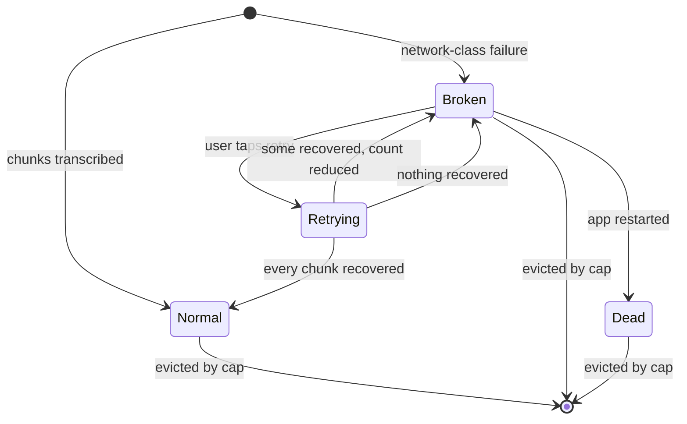
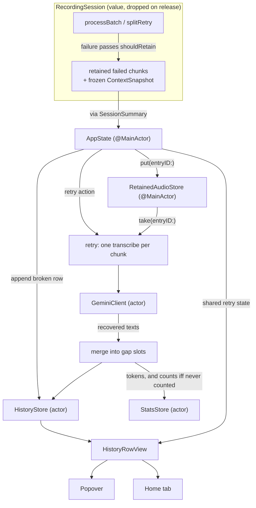

# Failed Recording Retry - Plan

## Goal Capsule

- **Objective.** Stop discarding a dictation when the network drops. Audio of chunks that failed for network reasons stays in memory, the session appears in history as a broken row, and one action re-sends it.
- **Product authority.** The maintainer, acting as product owner, approved retaining audio beyond a session — a posture the project previously ruled out. The approval is bounded to in-memory retention on network-class failures; it does not extend to disk persistence or to failures that abort a session today.
- **Authority hierarchy.** Requirements (R-IDs) win on product behavior. Key Technical Decisions (KTD-IDs) win on mechanism within their cited R constraints. Implementation Units override neither. Where this plan and a module `CLAUDE.md` disagree on an existing invariant, the module doc wins and the conflict is a blocker.
- **Execution profile.** Additive feature work across `NoType/Recording/`, `NoType/History/`, `NoType/UI/`, and `AppState`. No change to the terminal/recoverable classification, the Gemini cache-prefix shape, or any on-disk audio posture.
- **Stop conditions.** Stop and surface a blocker if: implementing R4 would require changing `RecordingSession.isTerminal(_:)`; retaining the context snapshot would require widening any `Redacted*` type's accessors; or the retry path would need a second concurrent Gemini request.
- **Tail ownership.** This plan does not own branch, commit, or PR mechanics. Work starts from a branch off `origin/main` — the plan file currently sits on an unrelated branch.
- **Open blockers.** None.

**Product Contract preservation:** changed — R9 (aligned to the drawn design's placeholder bars, with animation rather than a different element carrying the not-loading signal); R15 (original wording would double-count a partially-failed session, and did not say when a never-counted session lands); R16 (originally discarded chunks that recovered before a later one failed); R18 added (cross-surface state sharing, required after planning surfaced that two views render the same row); R19 added (a failed retry needs a user-visible outcome, which no requirement carried).

---

## Product Contract

### Summary

Retain the audio of chunks whose Gemini call failed for network reasons, in memory, alongside the session's frozen context snapshot. Surface the failed session as a broken row in the last-10 history with a retry action that re-sends those chunks and fills the row with recovered text. The user copies that text manually; nothing is pasted at the cursor.

### Problem Frame

A session whose Gemini calls all fail is discarded whole. `RecordingSession.stop()` throws once every dispatched response came back empty (`NoType/Recording/RecordingSession.swift:634`), and `AppState.finalizeRecording`'s catch arm (`NoType/AppState.swift:1154`) drops the session and shows an eight-second Error HUD. No history entry is written, so nothing survives the toast.

The cost scales with how long the user spoke. A ten-second thought is cheap to repeat. Three or five minutes is not: by the time the error appears the user can no longer reconstruct what they said, and the app offers no trace of it. Partial failures already degrade gracefully — surviving chunks paste with `[…]` markers in the gaps — so the pain concentrates in the total-failure case, which is exactly what a dead or unreachable network produces.

The audio is still in hand at the moment of failure. Encoded AAC blobs live in `processBatch`'s local `encoded` array and stay alive through the retry and split-retry attempts; they are released only when the function returns. PCM for dispatched non-final chunks is freed by `discardProcessedPCM` after each call resolves. Nothing about the loss is forced by data availability — it is a retention choice made when the project decided audio must not outlive a session.

### Key Decisions

- KD1. **Retained audio lives in memory only, until the app process exits.** (session-settled: user-directed — chosen over on-disk persistence: keeps the architecture's nothing-on-disk posture and needs no new store.) Governs R1, R5, R8.
- KD2. **Only chunks whose call failed are retained.** (session-settled: user-approved — chosen over whole-session retention: chunks that returned text need no audio.) Governs R2.
- KD3. **The session's frozen context snapshot is retained alongside the audio.** (session-settled: user-approved — chosen over audio-only retention: without it a retry returns systematically worse text than the original attempt would have, because on-screen context is what makes names, terms and code transcribe correctly.) Governs R3, R11.
- KD4. **Retention triggers only on the failure class that already produces a gap marker.** (session-settled: user-directed — chosen over extending to terminal failures such as a rejected API key: leaves the existing terminal/recoverable classification and session-abort behavior untouched, at the cost of leaving the expired-key loss unsolved.) Governs R4.
- KD5. **A recovered transcript is shown in its history row and never pasted.** (session-settled: user-directed — the cursor has moved on since the session ended.) Governs R12.
- KD6. **Broken rows survive restart rather than being cleaned up.** (session-settled: user-directed — chosen over deleting rows whose audio is gone: the record of the loss is worth a history slot.) Governs R8.
- KD7. **An in-flight retry cannot be cancelled.** (session-settled: user-directed — chosen over converting retry into a stop button: matches the drawn design; delete stays the escape hatch.) Governs R13.
- KD8. **Both history surfaces render the identical row and share one retry state.** (session-settled: user-directed — chosen over treating the Home tab's recent list as a read-only mirror: a retry started in one surface must show as in-flight in the other.) Governs R18.

### Requirements

**Retention**

- R1. Audio of failed chunks is held in memory for the lifetime of the app process and is never written to disk.
- R2. Only chunks whose Gemini call failed are retained. Audio for chunks that returned text is released on the existing schedule.
- R3. The `ContextSnapshot` frozen at session start is retained alongside the audio, for the same lifetime.
- R4. Retention triggers only when the failure falls in the class that today produces a gap marker — network failure, 5xx, 429, empty response, decoding failure, truncated response. Terminal failures — missing or rejected API key, content block, user cancellation, encode failure — retain nothing and abort the session exactly as they do today.
- R5. Retained audio and context are released when a retry succeeds, when the user deletes the row, when the row is evicted by the ten-entry history cap, or when the app exits.

**History surface**

- R6. A session with at least one chunk that failed in the class named by R4 produces a broken history row, whether or not any text was recovered. A session whose chunks all failed writes such a row instead of being discarded.
- R7. A broken row is visually distinct from a normal row: the app-icon slot is replaced by an error slot, and the row's actions are visible without hovering. The row does not name the failure reason — the Error HUD already carries it at the moment of failure.
- R8. A broken row survives app restart. Its retry action is then absent, because the audio is gone; the row is not deleted, whether or not it carries partial text.
- R9. ~~A broken row carrying no recovered text renders the design's placeholder bars in place of the transcript. They animate only while a retry is in flight — on a row that is merely broken, or whose audio is gone, they sit still so the row does not read as loading.~~ **Superseded 2026-08-09 by maintainer directive during U7:** a broken row renders its transcript the way it was pasted, with `RecordingSession.failureMarker` (`[…]`) sitting where each failed chunk's text should be; a row that recovered nothing renders only those markers. No placeholder bars.
- R10. A row's action set is: retry when retained audio exists, copy when the row carries text, delete always.
- R18. The menu-bar popover and the Home tab's recent list render the identical row and read one shared retry state, so a retry started in either surface shows as in flight in both.

**Retry behavior**

- R11. Retry re-sends the retained chunks to Gemini with the retained context snapshot, reproducing the original request.
- R12. A successful retry fills the row's text. In a partially-failed row the recovered text replaces the gap markers within the row; text already pasted into the target app is not modified.
- R13. While a retry is in flight the row shows a busy state and offers no cancel. Delete stays available.
- R14. Retry is unavailable while a recording session is active.
- R15. A retry records its token usage into lifetime stats every time. Word, duration, and session counts are written at most once per history entry — on the first retry that recovers any text, and never for a session lifetime stats already counted when it pasted.
- R16. A retry stops at the first chunk that fails and keeps whatever recovered before it — recovered text lands in the row, those chunks are released, and the failure count drops to what remains — leaving the row broken with the unrecovered audio intact.
- R19. A retry that recovers nothing surfaces a failure to the user rather than silently restoring the row's previous appearance.

**Documentation**

- R17. The project's no-audio-retention statements are amended to describe what ships: `README.md:110`, the non-goal in `AGENTS.md:81`, invariant 4 in `NoType/History/CLAUDE.md`, and the partial-recovery section in `NoType/Recording/CLAUDE.md`. Invariant I4 in `docs/architecture/overview.md` promises nothing on disk and stays true as written.

### Row lifecycle

`Dead` is a broken row whose retained audio is gone. It renders as `Broken` minus the retry action (R8, R10).

### Key Flows

- F1. Total failure and recovery
  - **Trigger:** The user dictates with no working network; every dispatched chunk's call fails in the class named by R4.
  - **Steps:** Audio and context are retained; a broken row is written to history instead of the session being discarded; the user restores connectivity, opens the popover, and taps retry; the chunks are re-sent with the retained context; the row fills with text.
  - **Outcome:** The user copies the recovered text and pastes it where they intended. Nothing was pasted automatically.
  - **Covered by:** R1, R2, R3, R4, R6, R7, R11, R12, R15

- F2. Partial failure and gap recovery
  - **Trigger:** Some chunks transcribe and some fail; the stitched text pastes into the target app with `[…]` in the gaps.
  - **Steps:** Only the failed chunks' audio is retained; the history row is marked broken while carrying its partial text; retry re-sends those chunks and their recovered text replaces the markers in the row.
  - **Outcome:** On a full recovery the history row holds the complete transcript; on a partial one it carries fewer markers than before and stays broken. Either way the target app still holds the version it was originally given.
  - **Covered by:** R2, R7, R10, R11, R12

- F3. Restart with retained audio gone
  - **Trigger:** The app exits or is relaunched while broken rows are in history.
  - **Steps:** History rows reload from disk; retained audio does not exist; broken rows render without a retry action.
  - **Outcome:** A row carrying partial text can still be copied. A row with no text remains as a record that a dictation was lost.
  - **Covered by:** R1, R8, R9, R10

### Acceptance Examples

- AE1. Expired key is not a retention trigger
  - **Covers R4, R6.**
  - **Given** the user's Gemini key is rejected with 401 and the user dictates for three minutes.
  - **When** the first chunk's call returns the rejection.
  - **Then** the session aborts and surfaces the existing key error, no history row is written, and no audio is retained.

- AE2. Cancellation is not a retention trigger
  - **Covers R4.**
  - **Given** an active recording session.
  - **When** the user presses the cancel binding.
  - **Then** nothing is pasted, no history row is written, and no audio is retained.

- AE3. Partial recovery leaves the pasted text alone
  - **Covers R12.**
  - **Given** a session pasted into Slack as `Ship it by […] and review after.`
  - **When** the user taps retry on that row and it succeeds.
  - **Then** the history row reads the full sentence, and the Slack message still contains the marker.

- AE4. Restart removes retry but not the row
  - **Covers R8, R9, R10.**
  - **Given** two broken rows, one with partial text and one with none.
  - **When** the app is quit and relaunched.
  - **Then** both rows are still listed, neither offers retry, the row with partial text offers copy, and the row without text offers only delete.

- AE5. Eviction releases retained audio
  - **Covers R5.**
  - **Given** a broken row holding retained audio, and nine subsequent successful sessions.
  - **When** a tenth successful session pushes the broken row out of the history cap.
  - **Then** the row is gone from history and its retained audio and context are released.

- AE6. Retry is refused during a session
  - **Covers R14.**
  - **Given** a broken row with retained audio.
  - **When** the user holds the hotkey and a recording session is active.
  - **Then** the row's retry action does not start a request.

- AE7. Retry state is shared across surfaces
  - **Covers R18.**
  - **Given** the popover and the Home tab both showing the same broken row.
  - **When** the user starts a retry from the popover.
  - **Then** the Home tab's copy of that row shows the same in-flight state, and both settle to the recovered text together.

- AE8. Partial retry does not re-count the session
  - **Covers R15.**
  - **Given** a partially-failed session already counted in lifetime stats when it pasted.
  - **When** the user retries it and the retry succeeds.
  - **Then** the session count and word total gain nothing from the retry, and the retry's tokens are added to the usage totals.

- AE9. A recovered session is counted once
  - **Covers R15.**
  - **Given** a fully-failed session that lifetime stats never counted, recovered across two retries.
  - **When** the first retry recovers four of six chunks and the second recovers the remaining two.
  - **Then** the session count rises by one at the first retry and not again at the second, and both retries add their tokens.

### Scope Boundaries

- Automatic retry when connectivity returns. The manual action is a prerequisite for it, and automation that spends the user's Gemini budget unprompted needs its own decision about attempt counts and backoff.
- Recovery from a missing or rejected API key. That loss stays exactly as it is today — the session aborts silently and the dictation is gone. Accepted so that the terminal/recoverable classification is not disturbed.
- Cancelling an in-flight retry. On a network that is present but unreachable, one request can occupy the row for up to the client's 30-second request timeout with only delete available.
- Writing retained audio to disk, in any form, including a crash-survivable cache.
- A batch "retry all" affordance for several broken rows at once.
- Pasting a recovered transcript at the cursor.
- Changing which errors abort a session versus continue with a gap marker.

#### Deferred to Follow-Up Work

- The in-memory AAC encoding debt (`docs/solutions/documentation-gaps/in-memory-aac-encoding-2026-05-15.md`). This work holds encoded blobs longer than before, which makes the temp-file round-trip slightly more conspicuous, but does not depend on fixing it.

### Dependencies / Assumptions

- How often network-class failures occur was never measured. Memory-only retention is chosen with that unmeasured, and it accepts total loss on restart or crash.
- NoType is an `LSUIElement` menu-bar app that typically runs for days, so "until the process exits" is long in practice — but that premise is weaker here than it looks. `docs/solutions/runtime-errors/macos-26-executor-identity-check-family-2026-07-25.md` records four same-signature crashes on macOS 26 with no proven fix, and the README carries the known-issue note. Memory-only retention is chosen anyway, because a crash loses one pending recovery rather than corrupting anything. If crash frequency turns out to make retention useless in practice, the disk decision reopens.
- Retained audio is small. AAC at 32 kbps is roughly 4 KB per second, so five minutes is about 1.2 MB and ten fully-retained sessions are about 12 MB. The retained context snapshots add to that: an AX walk can render up to 5000 lines, so a worst-case snapshot is a few hundred kilobytes and ten of them a few megabytes. The combined worst case is under twenty megabytes, which is not expected to constrain the design.
- The retained context snapshot is already masked at capture — `AccessibilityTree.snapshot()` returns `RedactedAXSnapshot` and there is no accessor for raw text — so retaining it introduces no new unmasked surface.
- A retry is billed to the user's own Gemini key like any other request.
- Failed rows compete for the same ten history slots as successful ones. A long offline stretch can push real transcripts out of the window.

### Sources / Research

- `NoType/Recording/RecordingSession.swift:634` — the throw that discards an all-failed session; `:1052` and `:1075` — where PCM is released after a call resolves; `:1156` — `recordRecoverableFailure`, which records the failure but receives only the error and chunk indices; the audio is released later, when `processBatch` returns and its local `encoded` array goes out of scope.
- `NoType/AppState.swift:1065` — `finalizeRecording`, whose success arm writes history and stats and whose catch arm currently drops the session.
- `NoType/Recording/ChunkBuilder.swift:45` — the only place in the app that writes audio to disk, a temp file deleted in the same function.
- `NoType/History/HistoryStore.swift` — the ten-entry FIFO cap and the JSON schema a broken row must fit.
- `NoType/UI/HistoryRowView.swift` — the row this feature extends; consumed by `NoType/UI/HistoryPopover.swift:212` and `NoType/UI/HomeView.swift:899`.
- `NoType/Gemini/GeminiClient.swift:406` — `transcribe`'s parameter list, which the retry path reuses; `retryDecision` and the 30-second request timeout bound a retry's worst case.
- `docs/solutions/architecture-patterns/partial-recovery-with-markers-2026-05-16.md` — why gap markers exist and how the recoverable class was drawn, which R4 adopts unchanged.
- `docs/solutions/conventions/swift-6-concurrency-and-async-2026-05-15.md` — `actor` is reserved for genuinely shared mutable state; `@MainActor` classes are the pattern for UI-owned state.
- The drawn design for the broken and retrying row states lives in the maintainer's Claude Design project `NoType`, file `app/menu-bar.html` — error slot, always-visible actions, and the retry-to-spinner transition.

---

## Planning Contract

### Key Technical Decisions

- KTD1. **Retained payload lives in a dedicated `@MainActor` holder owned by `AppState`, not in `AppState` itself and not in an `actor`.** Only main-actor code produces and consumes it, and the project reserves `actor` for genuinely shared mutable state; a separate type also keeps eviction testable without constructing `AppState`. Governs R1, R3, R5.
- KTD2. **The holder lives in `NoType/History/` because its lifetime contract is the history window, even though the payload type it stores is defined in `NoType/Recording/`.** Eviction mirrors the ten-entry cap, and putting it beside `HistoryStore` keeps the cap and its mirror in one place. Governs R5.
- KTD3. **`RecordingSession.stop()` keeps its throwing contract; `AppState.finalizeRecording`'s catch arm writes the broken row.** The throw carries the error the Error HUD needs, and the catch arm can branch on whether the session retained anything — which is exactly the recoverable-versus-terminal split R4 requires. Governs R4, R6.
- KTD4. **`HistoryEntry` gains one tolerantly-decoded `failedChunkCount`; a row is broken when it is greater than zero.** Mirrors the `durationSeconds` precedent for schema growth, and keeps the retained audio out of the persisted entry, which R1 forbids. Governs R6, R8, R9.
- KTD5. **Retry issues one single-chunk request per retained chunk, sequentially, rather than one batched request.** (session-settled: user-approved — chosen over a single batched call: a batched response returns one contiguous text that cannot be split back into per-gap slots.) R16's stop-at-first-failure bound trades recovery breadth for a bounded wait: when the earliest retained chunk fails persistently, later chunks that would have succeeded are never attempted, so each retry re-hits the same wall. Accepted because an unbounded uncancellable wait is the worse failure. Governs R11, R12, R16.
- KTD6. **Retry passes the session's surviving transcripts as priors, with gap markers filtered out.** Mirrors `currentPriors()` so the model never sees its own failure placeholders. Governs R11.
- KTD7. **Stats on retry split: token usage recorded every time, session and word counts written once, on the first retry that recovers text.** (session-settled: user-directed — chosen over waiting for full recovery: a user who gets their text back should see the session counted, and a session that never fully recovers would otherwise never appear. `StatsStore.record` is documented as non-idempotent, so a once-per-entry write is the only safe shape. Accepted cost: a session recovered across two retries keeps the word count from the first.) Governs R15.
- KTD8. **The retention decision is a pure function over the Gemini error, colocated with `RecordingSession.isTerminal(_:)`.** Adjacency is the point: a future error case added to one classifier is visible next to the other. Governs R4.
- KTD9. **Retry state is a single value on `AppState` that both row consumers observe.** (session-settled: user-directed — chosen over per-view local state: the user requires a retry started in one surface to read as in-flight in the other.) Governs R18.

### High-Level Technical Design

Retention path (on failure) and retry path (on user action), showing which component owns each hop:

Two things this makes explicit. The session hands its retained payload up through `SessionSummary` and is then dropped as usual — no session outlives its release. And both view surfaces consume one row component reading one `AppState` value, which is what R18 buys.

### Assumptions

- `SessionSummary` carries the retained payload. `finalizeRecording`'s catch arm closes over `session` strongly, so `session.summary` is reachable there after `stop()` throws — this is verified, not assumed.
- Gap-slot merging can be done on the stored text by replacing marker occurrences left-to-right in chunk order, because markers are one-to-one with retained chunks. The reason is not simply dispatch ordering: a batched call covering several chunks returns one contiguous text, which would break the mapping. It holds because a batch of two or more chunks always splits into single-chunk calls before any marker is recorded, so every marker traces to exactly one chunk. If a user-authored `[…]` could appear in transcript text, the merge would need index-carrying state on the entry instead.

### Risks

- **U7 adds an animated state to a view that already carries the project's most dangerous SwiftUI pattern.** `HistoryRowView` contains a `TimelineView` for the relative timestamp, and the repo has a documented macOS 26 crash family around executor-identity checks in exactly that neighbourhood. Drive the retrying spinner with a repeating `.rotationEffect` animation, not a second `TimelineView`, and route any new hover state through `dsOnHover`. The governing rules are the two hard rules in `NoType/UI/CLAUDE.md`; treat a violation as a blocker, not a style note.
- **`StatsStore.record` is documented as non-idempotent, and KTD7 depends on that being true in both directions.** If the never-counted branch is ever reached twice for one entry — a double-tap on retry, or a retry racing a slow first write — the session is counted twice. Guard the retry entry point on the shared in-flight state rather than assuming the UI prevents a second tap.
- **Three individually reasonable decisions compose into a long wait.** One request per chunk (KTD5), no cancel (KTD7), and a 30-second client timeout would together let a dozen retained chunks hold the row for minutes with only delete as an exit — and delete destroys the audio being recovered. R16's stop-at-first-failure rule is what bounds this to a single request timeout; a future change that resumes iterating past a failure reintroduces the composition and must reinstate cancel alongside it.
- **New code paths carry audio and other applications' window text, so their logging posture is not optional.** The retained `ContextSnapshot` holds masked but real content from other apps, and this repo logs exceptions at `.fault`. A log line added during U5 or U6 that renders the payload, its context, or a transcript would put that content in the system log.
- **Retention makes the memory-only promise load-bearing in a new way.** Any future change that serializes `HistoryEntry` alongside its retained payload, or that adds a crash-recovery cache, silently breaks R1 and the amended README claim. The store's doc-comment (U3) is the guard; a reviewer should treat a serialization of `RetainedRecording` as a scope violation.

### Sequencing

U1 and U4 are independent and can land first. U2 and U3 depend on U1. U5 depends on U2, U3, and U4. U6 depends on U5. U7 depends on U4 and U6. U8 is independent of all of them.

Each unit is sized to land as one commit: implement it, satisfy its test scenarios, pass its verification line, commit, move on. A linear order that respects every dependency is U1 → U4 → U2 → U3 → U5 → U6 → U7 → U8. U8 rides in the same change as the behavior it documents rather than trailing as separate work — the Definition of Done requires it.

---

## Implementation Units

### U1. Retention classifier and retained-payload type

- **Goal:** A pure `shouldRetain(_:)` decision over a Gemini error, plus the value type that carries a retained chunk set.
- **Requirements:** R4 (KTD8), R1, R3
- **Dependencies:** none
- **Files:**
  - `NoType/Recording/RecordingSession.swift` (add the classifier beside `isTerminal(_:)`)
  - `NoType/Recording/RetainedRecording.swift` (new)
  - `NoTypeTests/RetainedRecordingTests.swift` (new)
- **Approach:**
  1. Add a `nonisolated static func shouldRetain(_ error: Error) -> Bool` immediately after `isTerminal(_:)`, returning true for exactly the class R4 names and false otherwise.
  2. Define `RetainedRecording` as a `Sendable` value holding the failed chunks (index, encoded audio, sample count), the frozen `ContextSnapshot`, and the session's frozen `GeminiModel`.
  3. Add a doc-comment on the classifier naming its sibling, so a future error case is added to both.
- **Patterns to follow:** `RecordingSession.isTerminal(_:)` for the classifier shape; `EncodedChunk` for the per-chunk field set.
- **Test scenarios:**
  - Covers AE1. A rejected-key error (`http` 401 and 403) does not retain.
  - Covers AE2. `CancellationError` does not retain.
  - A content-block error does not retain.
  - Network failure (`http` status 0), 5xx, and 429 each retain.
  - Empty, decoding, and truncated responses each retain.
  - Every case `isTerminal` calls terminal is a case `shouldRetain` declines, asserted over the same fixture list so the two classifiers cannot drift apart silently.
- **Verification:** The classification matrix matches the partial-recovery table in `NoType/Recording/CLAUDE.md` case for case.

### U2. Session retains failed chunks instead of releasing them

- **Goal:** A failed chunk's encoded audio survives its dispatch and reaches `AppState` through the session summary.
- **Requirements:** R2, R3
- **Dependencies:** U1
- **Files:**
  - `NoType/Recording/RecordingSession.swift`
  - `NoTypeTests/RetainedRecordingTests.swift`
- **Approach:**
  1. Accumulate retained chunks at the two sites that hold the encoded blob when a failure is classified — `processBatch`'s single-chunk failure arm and `splitRetry`'s per-chunk failure arm. Not inside `recordRecoverableFailure`: it receives only the error and the chunk indices, so the audio is not in scope there. `splitRetry` is where per-chunk failures land after a multi-chunk batch splits, which is the common case for a long offline session.
  2. Extract the retain-set derivation as a pure function over the batch's encoded chunks and the failed index set, so it is testable without driving a session.
  3. Expose the accumulated payload on `SessionSummary` alongside the existing counts.
  4. Leave `discardProcessedPCM` untouched — PCM is not the retained form.
- **Execution note:** The session is not unit-drivable end to end; prove this unit through the extracted pure function and leave the wiring to the smoke protocol.
- **Patterns to follow:** `RecordingSessionShortPathTests` pins a pure discriminator extracted from the same file — mirror that seam shape.
- **Test scenarios:**
  - A batch where one of three chunks failed retains exactly that chunk's audio, at its original chunk index.
  - A batch where every chunk failed retains all of them, in chunk order.
  - A batch where none failed retains nothing.
  - A chunk dropped by the hallucination gate (empty text, not a failure) retains nothing.
  - The retained set carries the frozen context snapshot and model, not a freshly-read one.
- **Verification:** A session that fails every chunk exposes a non-empty retained payload on its summary; a fully successful session exposes an empty one.

### U3. Retained-audio store with history-mirrored eviction

- **Goal:** A main-actor holder keyed by history entry id, whose contents track the ten-entry history window.
- **Requirements:** R1, R5
- **Dependencies:** U1
- **Files:**
  - `NoType/History/RetainedAudioStore.swift` (new)
  - `NoTypeTests/RetainedAudioStoreTests.swift` (new)
- **Approach:**
  1. Define a `@MainActor final class` with `put`, `peek`, `take`, `remove`, and `retain(only:)` over a `[UUID: RetainedRecording]` map.
  2. `retain(only:)` takes the set of live history entry ids and drops everything else — one call point, so eviction cannot drift from the cap.
  3. Add a doc-comment stating the memory-only contract and that nothing here is ever serialized.
- **Patterns to follow:** `HistoryStore`'s idempotent-`remove` contract; the `@MainActor final class` shape used by `HUDController`.
- **Test scenarios:**
  - Put then peek returns the payload; put then take returns it and leaves the store empty for that id.
  - Remove for an absent id is a no-op.
  - `retain(only:)` with a set that excludes a held id drops it and keeps the rest.
  - `retain(only:)` with an empty set empties the store.
  - Putting twice for the same id replaces rather than accumulates.
- **Verification:** After `retain(only:)` with the ids of a ten-row history, the store holds no id outside that set.

### U4. History entry carries the failure count

- **Goal:** A persisted row can say it is broken, and older `history.json` files still decode.
- **Requirements:** R6, R8, R9
- **Dependencies:** none
- **Files:**
  - `NoType/History/HistoryEntry.swift`
  - `NoTypeTests/HistoryStoreTests.swift`
- **Approach:**
  1. Add `failedChunkCount: Int`, defaulted in the memberwise initializer and read with `decodeIfPresent ?? 0` in the custom decoder.
  2. Add a computed `isBroken` reading `failedChunkCount > 0`, so no call site re-derives the predicate.
- **Patterns to follow:** the `durationSeconds` field in the same file — same default-and-tolerant-decode shape, same doc-comment style explaining what a legacy row means.
- **Test scenarios:**
  - A legacy JSON row with no `failedChunkCount` decodes with zero and `isBroken` false.
  - A row encoded with a non-zero count round-trips and reads back broken.
  - A row with count zero and non-empty text is not broken.
  - The store's existing FIFO and corruption-recovery tests still pass against the widened schema.
- **Verification:** Decoding a checked-in pre-change `history.json` fixture produces rows with `isBroken` false and unchanged text.

### U5. AppState writes the broken row and owns retained state

- **Goal:** A failed session lands in history with its audio retained, and every history mutation keeps the store in step.
- **Requirements:** R5, R6, R14, R18
- **Dependencies:** U2, U3, U4
- **Files:**
  - `NoType/AppState.swift`
  - `NoTypeTests/AppStateRetentionTests.swift` (new)
- **Approach:**
  1. Hold a `RetainedAudioStore` and a retry-state value on `AppState`; both are `@ObservationIgnored` except the retry state, which views observe.
  2. In `finalizeRecording`'s success arm, set the entry's failure count from the summary and put any retained payload into the store.
  3. In the catch arm, branch on whether the session retained anything: retained means build and append a broken entry, then surface the existing error HUD; nothing retained means today's behavior, unchanged.
  4. After every history mutation — append with trim, `deleteHistoryEntry`, `deleteAllHistory` — call `retain(only:)` with the surviving ids.
  5. Extract the "is retry allowed right now" predicate as a pure function over recording state and payload presence.
- **Patterns to follow:** the existing `currentSession === session` identity guard in `finalizeRecording`; the optimistic-update-then-fire-and-forget shape of `deleteHistoryEntry`.
- **Test scenarios:**
  - Covers AE5. Appending past the cap evicts the oldest row and drops its retained payload.
  - Covers AE6. The retry predicate is false while recording and while sending, true when idle with a payload present.
  - The retry predicate is false for a broken row with no payload.
  - Deleting a broken row drops its retained payload.
  - Deleting all history empties the store.
  - Covers AE1. A terminal failure writes no row and stores nothing.
- **Verification:** After a simulated all-failed session the history holds one broken row and the store holds one payload under that row's id.

### U6. Retry orchestration

- **Goal:** One action re-sends a row's retained chunks and settles the row into its recovered or still-broken state.
- **Requirements:** R11, R12, R13, R15, R16, R19
- **Dependencies:** U5
- **Files:**
  - `NoType/AppState.swift`
  - `NoType/History/RetryMerge.swift` (new — the pure gap-slot merge)
  - `NoTypeTests/RetryMergeTests.swift` (new)
- **Approach:**
  1. Guard on the U5 predicate, then mark the row in flight in the shared retry state.
  2. Issue one `transcribeWithUsage` call per retained chunk in chunk order, stopping at the first chunk that fails so the worst-case wait is one request timeout rather than the sum of them.
  3. Merge recovered texts into the stored text by replacing gap markers left-to-right in chunk order; when the row had no text, join the recovered chunks with the existing stitching rule.
  4. On full success, write the updated row, clear the failure count, release the payload, and record stats per KTD7.
  5. On a partial run, write the recovered text and re-put a payload holding only the chunks that did not recover, with the failure count reduced to match — the row stays broken and can be retried again without re-paying for the recovered chunks. Re-putting rather than releasing per chunk is what keeps `RetainedAudioStore`'s whole-entry API (U3) unchanged.
  6. When nothing recovered, leave the payload and failure count untouched and surface the failure through the existing error path.
- **Execution note:** Write the merge function and its tests before wiring the orchestration — it is the only part with real branching and the only part provable without the network.
- **Patterns to follow:** `RecordingSession.splitRetry` for the per-chunk re-issue shape; `TextInjector.stitchChunks` for joining recovered pieces.
- **Test scenarios:**
  - Covers AE3. Text with two markers and two recovered chunks merges in order, leaving no marker behind.
  - A row with no text and three recovered chunks joins them with the stitching rule.
  - Fewer recovered chunks than markers leaves the trailing markers in place.
  - A recovered chunk that is empty leaves its marker in place rather than deleting it.
  - Covers AE8. A retry on a row whose session was already counted adds tokens only.
  - Covers AE9. The first retry that recovers text on a never-counted row adds session, words, and duration; a second retry on the same row adds tokens only.
  - Covers AE7. Starting a retry publishes the in-flight state before the first request is issued.
  - Covers R16. A run where the first two chunks recover and the third fails writes the recovered text, releases those two chunks, and leaves the failure count at one.
  - Covers R16. Iteration stops at the first failure — a run with a failure at chunk two issues no request for chunk three.
  - Covers R19. A run where nothing recovered leaves the failure count and payload untouched and raises a surfaceable failure.
- **Verification:** A merge over a marker-bearing fixture reproduces the expected full sentence; a partial-failure merge leaves exactly the unrecovered markers.

### U7. Broken, retrying, and dead row states

- **Goal:** The row renders its three states and offers the right actions in both surfaces.
- **Requirements:** R7, R9, R10, R13, R18, R19
- **Dependencies:** U4, U6
- **Files:**
  - `NoType/UI/HistoryRowView.swift`
  - `NoType/UI/HistoryPopover.swift`
  - `NoType/UI/HomeView.swift`
  - `NoType/UI/DesignTokens.swift` (only if a soft/border token is missing)
  - `NoTypeTests/HistoryRowActionsTests.swift` (new)
- **Approach:**
  1. Replace the app-icon slot with an error slot when the row is broken, and with a spinner slot while it is retrying.
  2. Force the action row visible when broken or retrying, instead of gating on hover.
  3. Render a broken row's transcript the way it was pasted, with `RecordingSession.failureMarker` (`[…]`) where each failed chunk's text should be; a row that recovered nothing renders only those markers. (Was: the design's placeholder bars — superseded by the maintainer directive recorded at R9.)
  4. Extract the action-set derivation as a pure function over broken state, payload presence, text presence, and retry-in-flight.
  5. Pass the retry handler and shared retry state from both call sites so neither surface holds its own copy.
  6. Give a retry that recovered nothing a visible outcome through the existing Error HUD catalog, so the row does not simply revert to how it looked before the user tapped.
- **Patterns to follow:** `DSIconButton` with `DSIconName.refresh` / `.warning` / `.loader`; `dsOnHover` for any new hover state — raw `.onHover` is banned project-wide.
- **Test scenarios:**
  - Covers AE4. Broken with payload and text yields retry, copy, delete; broken without payload but with text yields copy, delete; broken without payload or text yields delete only.
  - Retrying yields delete only, with no retry and no cancel.
  - A normal row is unchanged: copy and delete, hover-gated.
  - Covers AE7. Both call sites derive their state from the same shared value rather than local state.
  - Covers R19. A retry that recovered nothing leaves a visible failure signal rather than restoring the pre-tap appearance.
- **Verification:** Visual check in both surfaces against the drawn design; the action-set function's truth table matches R10 exactly.

### U8. Documentation amendments

- **Goal:** The project's stated audio posture matches what ships.
- **Requirements:** R17
- **Dependencies:** none
- **Files:**
  - `README.md`
  - `AGENTS.md`
  - `NoType/History/CLAUDE.md`
  - `NoType/Recording/CLAUDE.md`
- **Approach:**
  1. Amend the README's retention sentence to name the failed-chunk exception and its memory-only lifetime.
  2. Amend the `AGENTS.md` non-goal the same way, keeping it a non-goal for disk retention.
  3. Update invariant 4 in the History module doc, and extend the Recording module's partial-recovery section with the retention contract and its classifier.
  4. Leave invariant I4 in `docs/architecture/overview.md` as written — it promises nothing on disk and stays true.
- **Test expectation:** none — documentation only.
- **Verification:** No remaining statement in the repo claims audio never outlives a session.

---

## Verification Contract

| Gate | Command | Applies to |
|---|---|---|
| Compile | `xcodebuild -project NoType.xcodeproj -scheme NoType -configuration Debug build` | U1-U7 |
| Unit tests | `xcodebuild -project NoType.xcodeproj -scheme NoType test -destination 'platform=macOS'` | U1-U7 |
| DerivedData sweep | The `find … -prune -exec rm -rf {} +` recipe in `docs/build.md` | after every build or test run |
| Install for visual check | Replace `/Applications/NoType.app` with the DerivedData bundle | U7 |

Run `xcodegen generate` before the first build — U1, U3, and U6 add files, and the Xcode project is generated from `project.yml`.

**Manual smoke protocol** (U7 and the wiring U2 and U5 cannot unit-prove):

1. Turn Wi-Fi off. Dictate roughly thirty seconds. Confirm a broken row appears with the error slot and a visible retry action, and that no Error HUD claims the session was merely lost.
2. Turn Wi-Fi on. Tap retry. Confirm the spinner slot appears, then the row fills with text and the row returns to normal styling.
3. Open the Home tab and the popover side by side. Start a retry from one and confirm the other shows the in-flight state.
4. Quit and relaunch. Confirm broken rows are still listed and offer no retry.
5. With a valid key, dictate normally and confirm nothing about the ordinary path changed.

Live-API and live-mic tests stay out of the unit suite, per the standing rules in the Recording and Gemini module docs.

---

## Definition of Done

**Global**

- Every requirement R1-R19 is either implemented or explicitly traced to a scope-boundary entry.
- The build is warning-free under `SWIFT_STRICT_CONCURRENCY: complete`.
- No `@unchecked Sendable` was added without a doc-comment explaining the confinement.
- No log statement added by this work renders retained audio, a retained `ContextSnapshot`, or transcript text; every new `os.Logger` call carries the privacy annotation the project's conventions require.
- The manual smoke protocol passed in full, including step 5.
- No audio path writes to disk; `NoType/Recording/ChunkBuilder.swift` remains the only file that touches an audio file, and it still deletes it in the same function.
- Documentation amendments (U8) landed in the same change as the behavior, not deferred.
- Abandoned or experimental code from approaches that did not pan out is removed from the diff.
- The freshly-built `NoType.app` was deleted from DerivedData after the final build.

**Per unit**

- U1: the classifier matrix test passes, including the no-drift assertion against `isTerminal`.
- U2: the pure retain-set function passes its scenarios; the session exposes the payload on its summary.
- U3: store tests pass, including `retain(only:)` eviction.
- U4: a pre-change `history.json` fixture decodes unchanged.
- U5: retention survives a simulated failed session and is dropped by every history mutation path.
- U6: the merge function passes its scenarios; stats accounting matches R15 in both the counted and never-counted cases.
- U7: the action-set truth table matches R10; both surfaces render from the shared state.
- U8: no repo statement contradicts the shipped behavior.
