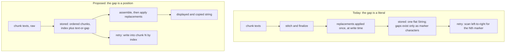

# Structural Gap Tracking - Plan

## Goal Capsule

- **Objective.** Make a history row store where its lost chunks were, instead of leaving that fact encoded in bracket characters inside the transcript. The row holds the session's chunk sequence; the displayed string is assembled from it; a retry writes recovered text into a chunk by index.
- **Product authority.** The maintainer, acting as product owner, settled the storage shape, the raw-text posture, the display-time replacement pass, the migration reading, and the sequencing relative to the shipped retry feature. Nothing about which errors abort a session, and nothing about audio retention, is reopened.
- **Authority hierarchy.** Requirements (R-IDs) win on product behavior. Key Decisions (KD-IDs) constrain them and carry provenance. Where this plan and a module `CLAUDE.md` disagree on an existing invariant, the module doc wins and the conflict is a blocker — except for the statements R16 names, which this work amends deliberately.
- **Execution profile.** Refactor of the persisted history shape and its readers, across `NoType/History/`, `NoType/Recording/`, `NoType/UI/`, and `AppState`. One in-scope tidy-up rides along (R17). Roughly 110 existing tests change; see Dependencies / Assumptions.
- **Stop conditions.** Stop and surface a blocker if: satisfying R1 would require serializing anything audio-shaped into `history.json`; satisfying R5 would require storing a copy of the dictionary on the entry; or R12's marker parse would run on a row this build wrote — it exists to read legacy data once and must never become the working model.
- **Tail ownership.** This plan does not own branch, commit, or PR mechanics. Work starts after the retry branch merges (KD4), from a branch off `origin/main`.
- **Open blockers.** None. Two questions are deferred to planning. See Outstanding Questions.

---

## Product Contract

### Summary

Store a history row as the session's ordered chunk sequence — each chunk carrying its index and either the text the model returned or a gap — and assemble the displayed string from it. Chunk text is stored raw; the user's dictionary replacements run on the assembled string at display and copy time. A retry writes recovered text into chunk N by index rather than scanning for the Nth bracket.

### Problem Frame

Where a lost chunk sat exists today only as the marker literal in the row's text. `HistoryEntry` has no index, offset, or segment field — `text` is one flat `String` (`NoType/History/HistoryEntry.swift:3-37`), and the only structural fact stored beside it is `failedChunkCount` (`:31`), a count with no positions.

Three consequences follow from that one root cause.

The first is a live defect. `TextReplacementEngine.apply(...)` runs over the stitched transcript at `NoType/Recording/RecordingSession.swift:1124`, before `makeHistoryEntry(text: final)` at `:1148`, and its Unicode boundary is `(?<![\p{L}\p{N}])…(?![\p{L}\p{N}])` (`NoType/Dictionary/TextReplacementEngine.swift:109`). Brackets are neither letters nor numbers, so the `…` inside `[…]` sits at real boundaries and a pair as ordinary as `…` → `...` erases every marker in the row. The row is still broken and still holds audio, but `RetryMerge`'s left-to-right marker scan (`NoType/History/RetryMerge.swift:192-205`) has nowhere to substitute into. The shipped mitigation hides the retry action in that case — `canAcceptRecovery` at `:103-105`, read as the retry gate at `NoType/UI/HistoryRowView.swift:238` — which drops the user's ability to recover rather than fixing the model.

The second is a split representation. A session that lost every chunk stores `text: ""` (`RecordingSession.swift:976-978`) and the view synthesizes markers from the count (`HistoryRowView.swift:280-285`); a session that lost some chunks stores the markers as characters. The same fact — this row has gaps here — has two encodings depending on how the session failed, and every reader has to know both.

The third is inferred position. After a partial recovery, `settleRetry` decrements by `max(0, row.failedChunkCount - placedCount)` (`NoType/AppState.swift:1096`) — derived from how many recoveries landed, not from which indices recovered. That is correct only because the retry loop stops at the first failure and chunks are ascending. It is a property of today's loop, not of the data, and `RetryMerge`'s own header says so.

The index needed to place a recovery already exists on the audio side: `RetainedRecording.Chunk` carries its original `idx` (`NoType/Recording/RetainedRecording.swift:54-58`) and the store is keyed by entry id (`RetainedAudioStore.swift:85,99`). It is missing only on the persisted-entry side.

### Key Decisions

- KD1. **The entry stores an ordered chunk list; each chunk carries its index and either text or a gap flag.** (session-settled: user-approved — chosen over a text-plus-offset map, whose offsets shift on substitution and reproduce today's failure class, and over storing both a chunk list and a frozen pasted string, which puts two sources of truth in one row and leaves "what does copy copy?" unanswerable.) Governs R1, R3, R7.
- KD2. **Chunk text is stored raw as the model returned it; the user's dictionary replacements are applied to the assembled string at display and copy time.** (session-settled: user-approved — chosen over applying replacements per chunk at write time, where a pair whose phrase spans a chunk seam would stop matching, and over freezing the session's dictionary into the row, which puts a copy of the dictionary in every history row.) Governs R2, R5, R9, R10.
- KD3. **A gap renders as `[…]` on screen, unchanged.** (session-settled: user-directed — chosen over changing the marker while the storage model was already changing: users recognise it and the retry feature just shipped it.) Governs R4.
- KD4. **This work is a follow-on PR, after the retry branch merges.** (session-settled: user-directed — chosen over folding it into that branch: the branch is tested and works; the accepted cost is that the history format changes twice and some just-written code is rewritten.)
- KD5. **A row already on disk migrates into whatever chunk shape reproduces what it looks like today**: a row carrying markers is split on them into text and gap chunks, an all-failed row's stored failure count becomes that many gap chunks, and an ordinary row becomes one un-gapped chunk. (session-settled: user-directed — chosen over migrating every row as a single un-gapped chunk, which was settled first and then withdrawn once it became clear it strips the error slot and the always-visible actions from broken rows the user already has. The user should not be able to tell the storage format changed. Parsing markers is a one-time read of legacy data, not a working model — it never runs on a row this build wrote.) Governs R12.
- KD6. **Lifetime word counts continue to be taken from the assembled, post-replacement string.** (session-settled: user-approved — chosen over counting raw chunk text: a replacement pair that expands or collapses words would otherwise shift lifetime totals against their current meaning.) Governs R14.

### What changes shape

The paste string is unaffected: it is computed and sent at `NoType/Recording/RecordingSession.swift:1145`, before the entry is built at `:1148`.

### Requirements

**Entry model**

- R1. A history entry stores the session's chunk sequence. Each chunk carries its position in the session and either the text the model returned for it or a gap.
- R2. A chunk's text is stored exactly as the model returned it, before any dictionary replacement pair is applied.
- R3. A row is broken when its chunk sequence contains at least one gap. The predicate is derived from the sequence, so a row's brokenness and its rendered gaps can no longer disagree.

**Display and copy**

- R4. A row's chunk sequence assembles into one string, with each gap rendered as `[…]` and the chunks joined by the existing stitching rule. This assembled string is the input to R5, not yet what the user sees.
- R5. The user's current dictionary replacement pairs are applied to the assembled string at display and copy time, which means editing a pair changes how already-stored rows read.
- R6. Display and copy produce the same string, so a row copies what it shows.

**Retry and recovery**

- R7. A recovered chunk's text is written into the gap at that chunk's own index, with no scan over the row's text.
- R8. A retry is offered whenever the row has a gap and retained audio for it, and is no longer withheld because a replacement pair rewrote the row's markers.
- R9. Recovered chunk text is stored raw and therefore receives the user's replacements at display and copy time — which it does not today.
- R10. The priors a retry sends to Gemini are the row's text-carrying chunks, raw; a gap contributes nothing.
- R11. A row's remaining gaps after a retry are exactly the chunks that did not recover, read from the per-chunk results rather than from a count.

**Migration and compatibility**

- R12. Every row already in `history.json` migrates into the chunk shape without changing how it renders. A row whose text carries markers is split on them into alternating text and gap chunks; a row with empty text and a non-zero failure count becomes that many gap chunks; every other row becomes one un-gapped chunk holding its text verbatim. A migrated broken row therefore stays broken and keeps its error slot. Its chunk indices are positional rather than recovered — a legacy row never recorded which chunk failed — and nothing may depend on them, because no migrated row can be retried: its audio did not survive the restart that produced the migration.

**Accounting and derived consumers**

- R13. `NoType/History/StatsStore.swift:523` and every other reader that needs a row as one string reads the assembled, post-replacement string, so no reader has to know the chunk shape unless it acts on gaps.
- R14. Lifetime word counts are taken from the assembled, post-replacement string, so the numbers keep their current meaning.
- R15. The post-session dictionary harvester (`NoType/AppState.swift:1656`) receives the assembled, post-replacement string — the same string it receives today. Raw storage does not change what it harvests.

**Documentation**

- R16. The statements describing the old model are amended: the `History stores post-replacement text` hard rule in `NoType/Dictionary/CLAUDE.md` and the paragraph in the same file explaining why a replacement pair reaching `[…]` is contained at the retry's release gate; the positional-scan rationale in `NoType/History/RetryMerge.swift` and the "Broken rows and retry" section of `NoType/History/CLAUDE.md`; invariant 7 and the row-state hard rule in `NoType/UI/CLAUDE.md`, both of which cite `RetryMerge.canAcceptRecovery` as the retry gate.

**Tidy-up riding along**

- R17. The unrecognised-network error message stops showing the user a raw `URLError code=…` diagnostic string. The `default:` arm of the URLError payload builder in `NoType/AppState.swift` currently passes the wrapped body straight through as the HUD description.

### Key Flows

- F1. A replacement pair that used to erase the gaps
  - **Trigger:** The user has a replacement pair on the ellipsis, and a session loses one chunk.
  - **Steps:** The chunk sequence is stored with a gap at that index; the row assembles to text plus one `[…]`; the user's pair rewrites the ellipsis in the assembled string as the user asked.
  - **Outcome:** The row reads the way the user's dictionary dictates, and the retry action is still offered because the gap is a position, not a bracket the pair could delete.
  - **Covered by:** R1, R4, R5, R8

- F2. Recovery lands by index
  - **Trigger:** The user taps retry on a row with gaps.
  - **Steps:** Each retained chunk is re-sent and its result is written into the gap at that chunk's index; the row's remaining gaps are the chunks that did not recover; recovered text is stored raw.
  - **Outcome:** Placement is correct regardless of which chunks recovered and in what order, and the recovered text picks up the user's replacements when the row is next displayed or copied.
  - **Covered by:** R7, R9, R11

- F3. First launch after the upgrade
  - **Trigger:** A user with existing rows — some normal, some broken with markers, some broken with no text — launches the new build.
  - **Steps:** Each stored row is read into the chunk shape per R12; no retained audio exists for any of them.
  - **Outcome:** Every row's text survives verbatim and none of them offers a retry, which is already true today. What the broken ones look like is the open question below.
  - **Covered by:** R3, R12

### Acceptance Examples

- AE1. An ellipsis pair no longer costs the user their recovery
  - **Covers R1, R5, R8.**
  - **Given** a replacement pair `…` → `...` and a session that lost one of three chunks.
  - **When** the row is written and displayed.
  - **Then** the row shows the pair applied to the marker, and the retry action is present because the gap survives as a position.

- AE2. The two encodings of a gap collapse into one
  - **Covers R1, R3, R4.**
  - **Given** two sessions recorded under the new build, one that lost every chunk and one that lost its second of three.
  - **When** both rows are displayed.
  - **Then** each renders its gaps from the same chunk sequence, with no separate count-driven synthesis path for the all-failed row.

- AE3. Placement does not depend on the retry loop's stop rule
  - **Covers R7, R11.**
  - **Given** a row with gaps at chunks 1 and 4, and a per-chunk result set in which chunk 4 recovered and chunk 1 did not.
  - **When** those results are written back.
  - **Then** chunk 4 holds its recovered text, chunk 1 is still a gap, and the outcome does not depend on which chunk failed first.

- AE4. Recovered text receives the user's replacements
  - **Covers R9.**
  - **Given** a replacement pair `kubernetes` → `Kubernetes` and a broken row whose retry recovers a chunk containing `kubernetes`.
  - **When** the row is displayed after the retry settles.
  - **Then** the chunk reads `Kubernetes`, which is not what happens today.

- AE5. An existing row still looks like itself after the upgrade
  - **Covers R12.**
  - **Given** two stored rows — one reading `Ship it by […] and review after.` with a failure count of one, and one with empty text and a failure count of three.
  - **When** the new build loads `history.json`.
  - **Then** the first renders exactly as before and stays visibly broken, the second renders three markers as it does today, and neither offers a retry.

- AE6. Copy matches display
  - **Covers R6.**
  - **Given** a broken row with one gap and a replacement pair that affects its text.
  - **When** the user copies the row.
  - **Then** the clipboard holds the same string the row shows, gap marker included.

- AE7. Editing a pair changes an existing row
  - **Covers R5.**
  - **Given** a stored row containing a phrase covered by a replacement pair.
  - **When** the user deletes that pair and reopens the popover.
  - **Then** the row reads without the substitution, reversing the behavior `NoType/Dictionary/CLAUDE.md` documents today.

- AE8. Lifetime totals keep their meaning
  - **Covers R13, R14.**
  - **Given** a session whose replacement pairs expand two abbreviations into longer phrases.
  - **When** the session is recorded into lifetime stats.
  - **Then** the word count matches what today's build would have recorded for the same session.

### Scope Boundaries

- The on-screen appearance of a gap. It stays `[…]`.
- The terminal versus recoverable error classification. `RecordingSession.isTerminal(_:)` and `shouldRetain(_:)` are untouched.
- Audio on disk, in any form. The memory-only carve-out is unchanged.
- Re-pasting a recovered transcript at the cursor. Still never.
- The ten-entry history cap and its eviction contract.
- Whether a retry may run beside a recording session. Unchanged from the shipped behavior.

### Dependencies / Assumptions

- This work starts after the retry branch merges (KD4). Until then the code it rewrites is still moving.
- Roughly 110 existing tests across six files change: `RetryMergeTests` (23), `HistoryRowActionsTests` (23), `AppStateRetryTests` (21), `RecordingSessionPartialRecoveryTests` (17, partial), `AppStateRetentionTests` (15), `HistoryStoreTests` (15), plus mechanical fixture churn in `StatsStoreTests`. `RetainedAudioStoreTests` is UUID-keyed and unaffected. That churn is the cost of the change, not a sign it is going wrong — most of those tests pin the marker-scanning model this plan removes.
- The index a recovery needs already exists on the audio side (`NoType/Recording/RetainedRecording.swift:54-58`); only the persisted entry lacks it. No new fact has to be captured during a session.
- What gets pasted at the cursor need not change: the paste string is computed at `RecordingSession.swift:1145` and the entry is built afterwards at `:1148`.
- Retained audio is memory-only and cannot survive a restart (`NoType/History/RetainedAudioStore.swift:80-85`; `RetainedRecording` is deliberately not `Codable`). This is why KD5 can reproduce a legacy broken row's appearance without owing it a working retry — the audio was already gone before the migration ran.
- Replacements move from once per session to once per render of a row. The pair list is user-authored and short and the strings are a few hundred characters, so this is not expected to constrain the design.
- Word and session counts written on a retry (`AppState.settleRetry`) use whatever dictionary is current at that moment, which may differ from the session's. Accepted as sub-noise.

### Outstanding Questions

**Deferred to Planning**

- The sentence that replaces the raw `URLError code=…` string in R17. The existing `describe(...)` contract in `NoType/AppState.swift` governs the shape — a cause with no imperative, with the imperative in the kept and lost arms — so this is a copy choice inside a settled contract.
- Whether the R12 migration is a one-time heal that rewrites `history.json` or an on-read adaptation. `StatsStore`'s `healIfPreV5` is the repo's precedent for the first shape; downgrade safety and idempotence are the terms to weigh.

### Sources / Research

- `NoType/History/HistoryEntry.swift:3-37` — the current schema: no index, offset, or segment field; `failedChunkCount` at `:31`; `isBroken` computed at `:37` and absent from the decoder at `:57-66`.
- `NoType/Recording/RecordingSession.swift:1124,1148` — replacements applied before the entry is built; `:1145` — the paste that precedes it; `:143` — `failureMarker`, declared once, with every production read going through the constant; `:976-978` — `brokenHistoryEntry()` writing `text: ""`.
- `NoType/Dictionary/TextReplacementEngine.swift:109` — the Unicode look-around that matches the `…` inside `[…]`.
- `NoType/History/RetryMerge.swift:103-105,192-205` — `canAcceptRecovery` and the left-to-right marker scan; the file header records that the one-to-one correspondence it relies on is not in fact guaranteed today.
- `NoType/UI/HistoryRowView.swift:238` — `canAcceptRecovery` consumed as the retry gate; `:280-285` — `displayText` synthesizing markers from the count.
- `NoType/AppState.swift:1096` — `settleRetry` decrementing by how many recoveries landed; `:1656` — the dictionary harvester's input; the `default:` arm of `payloadForURLErrorCode` — the raw-diagnostic string R17 removes.
- `NoType/History/StatsStore.swift:523` — the only `.text` read in the file, feeding word totals.
- `NoType/Recording/RetainedRecording.swift:54-58` and `NoType/History/RetainedAudioStore.swift:80-85,99` — the index that already exists on the audio side, and the memory-only lifetime that bounds it.
- `docs/plans/2026-08-09-001-feat-failed-recording-retry-plan.md` — the feature this refactors, including the assumption in its Planning Contract that gap-slot merging can be done positionally.
