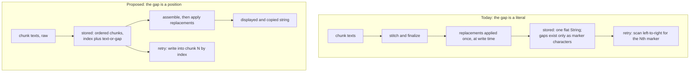
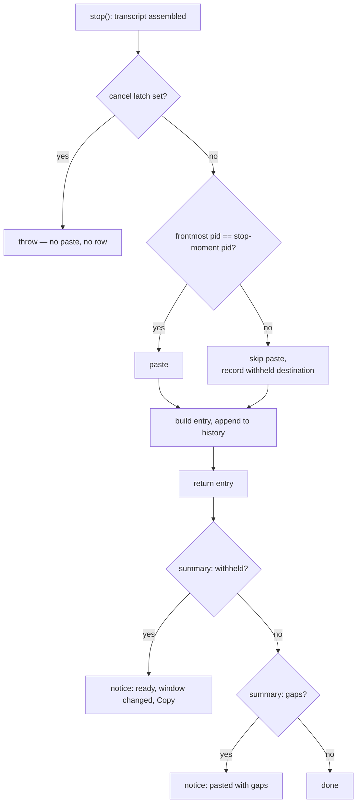
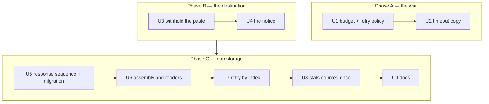

# Dictation Delivery Reliability - Plan

## Goal Capsule

- **Objective.** Make a dictation arrive intact, or fail in a way the user can recover from in seconds. Three defects share that goal: a lost chunk's position is stored as bracket characters a dictionary pair can erase; a stalled network freezes the app for about a minute; and a transcript that arrives late is pasted into whatever window the user has since moved to.
- **Product authority.** The maintainer, acting as product owner, settled the storage shape, the raw-text posture, the display-time replacement pass, the migration reading, the wait budget, and the withheld-paste behaviour. Nothing about which errors abort a session, and nothing about audio retention, is reopened.
- **Authority hierarchy.** Requirements (R-IDs) win on product behavior. Key Decisions (KD-IDs) constrain them and carry provenance. Where this plan and a module `CLAUDE.md` disagree on an existing invariant, the module doc wins and the conflict is a blocker — except for the statements R16 names, which this work amends deliberately.
- **Execution profile.** One refactor of the persisted history shape plus two bounded fixes, across `NoType/History/`, `NoType/Recording/`, `NoType/Gemini/`, `NoType/UI/`, and `AppState`. Roughly 58 existing tests change; see Dependencies / Assumptions.
- **Stop conditions.** Stop and surface a blocker if: satisfying R1 would require serializing anything audio-shaped into `history.json`; satisfying R5 would require storing a copy of the dictionary on the entry; R12's marker parse would run on a row this build wrote; or satisfying R23 would require reading window-level accessibility state the session does not already capture.
- **Tail ownership.** This plan does not own branch, commit, or PR mechanics. The retry feature it builds on has merged, so work starts from a branch off `origin/main`.
- **Open blockers.** None. Three questions are deferred to planning. See Outstanding Questions.

---

## Product Contract

### Summary

Fix three ways a dictation fails to arrive intact. Store a lost chunk's position as a position rather than as bracket characters inside the transcript. Give up on a stalled network in seconds instead of a minute, and let the user re-send. Never paste a transcript into an application the user has left — write it to history and offer to copy it.

### Problem Frame

The three defects are independent in mechanism and linked in effect: each one turns a dictation the user already spoke into work they have to redo.

**The gap is stored as characters.** Where a lost chunk sat exists today only as the marker literal in the row's text. `HistoryEntry` has no index, offset, or segment field — `text` is one flat `String` (`NoType/History/HistoryEntry.swift:3-37`), and the only structural fact stored beside it is `failedChunkCount` (`:31`), a count with no positions.

Three consequences follow from that one root cause. The first is a live defect: `TextReplacementEngine.apply(...)` runs over the stitched transcript at `NoType/Recording/RecordingSession.swift:1124`, before `makeHistoryEntry(text: final)` at `:1148`, and its Unicode boundary is `(?<![\p{L}\p{N}])…(?![\p{L}\p{N}])` (`NoType/Dictionary/TextReplacementEngine.swift:109`). Brackets are neither letters nor numbers, so a pair as ordinary as `…` → `...` erases every marker in the row. The row is still broken and still holds audio, but `RetryMerge`'s left-to-right marker scan (`NoType/History/RetryMerge.swift:192-205`) has nowhere to substitute into. The shipped mitigation hides the retry action in that case — `canAcceptRecovery` at `:103-105`, read as the retry gate at `NoType/UI/HistoryRowView.swift:238` — which drops the user's ability to recover rather than fixing the model.

The second is a split representation. A session that lost every chunk stores `text: ""` (`RecordingSession.swift:976-978`) and the view synthesizes markers from the count (`HistoryRowView.swift:280-285`); a session that lost some chunks stores the markers as characters. The same fact has two encodings, and every reader has to know both.

The third is inferred position. After a partial recovery, `settleRetry` decrements by `max(0, row.failedChunkCount - placedCount)` (`NoType/AppState.swift:1096`) — derived from how many recoveries landed, not from which indices recovered. That is correct only because the retry loop stops at the first failure and chunks are ascending. It is a property of today's loop, not of the data.

**The wait blocks the user.** The session's `URLSession` allows thirty seconds of silence per request and grants one retry, so a stalled transport costs about sixty seconds before the session gives up. Measured on 2026-08-11 across 33 consecutive healthy requests, a live request answers in 0.88–3.49 s. During the wait the hotkey does nothing: `AppState.swift:1411` refuses a press with a bare `guard case .idle = recordingState else { return }` and no feedback of any kind, the only silent refusal in that handler. Two sessions that morning cost 67 s and 60.5 s; the second pasted nothing at all.

The stalls are not the app's doing and not the user's connection. Connection setup to the API measured 3 ms with TLS at ~200 ms across four cold attempts, and a request that stalled for 30 s succeeded on a fresh connection 1.7 s later. They arrive in windows minutes long, during which every request fails and every retry ladder short enough to be acceptable falls entirely inside the window.

**The transcript follows the user.** Because the wait is long, the user switches windows, and the paste lands wherever the cursor now is. The source application is frozen at session start while ⌘V posts to whatever is frontmost after the network round-trip. This was identified in `docs/plans/2026-07-10-001-fix-code-review-remediation-plan.md:86` with a recommended guard-and-notify default, and left unimplemented pending a decision.

### Key Decisions

- KD1. **The entry stores an ordered chunk list; each chunk carries its index and either text or a gap flag.** (session-settled: user-approved — chosen over a text-plus-offset map, whose offsets shift on substitution and reproduce today's failure class, and over storing both a chunk list and a frozen pasted string, which puts two sources of truth in one row.) Governs R1, R3, R7.
- KD2. **Chunk text is stored raw as the model returned it; the user's dictionary replacements are applied to the assembled string at display and copy time.** (session-settled: user-approved — chosen over applying replacements per chunk at write time, where a pair whose phrase spans a chunk seam would stop matching, and over freezing the session's dictionary into the row.) Governs R2, R5, R9, R10.
- KD3. **A gap renders as `[…]` on screen, unchanged.** (session-settled: user-directed — chosen over changing the marker while the storage model was already changing: users recognise it and the retry feature just shipped it.) Governs R4.
- KD4. **The gap-storage work follows the retry feature rather than folding into it.** (session-settled: user-directed — chosen over folding it into that branch: the branch was tested and worked; the accepted cost is that the history format changes twice.) The retry feature has since merged, so this decision is satisfied and constrains only sequencing.
- KD5. **A row already on disk migrates into whatever shape reproduces what it looks like today.** (session-settled: user-directed — chosen over migrating every row as a single un-gapped segment, which strips the error slot and the always-visible actions from broken rows the user already has. Parsing markers is a one-time read of legacy data, never a working model.) The case rules live on R12, which owns them. Governs R12.
- KD6. **Lifetime word counts continue to be taken from the assembled, post-replacement string.** (session-settled: user-approved — chosen over counting raw chunk text: a replacement pair that expands or collapses words would otherwise shift lifetime totals against their current meaning.) Governs R14.
- KD7. **Give up on a stalled transport quickly and hand recovery to the user, rather than waiting longer or trying more times.** (session-settled: user-directed — chosen over a patient final attempt and over a longer ladder of shorter attempts: the observed stall windows lasted minutes, so no ladder that fits inside an acceptable wait outlives one. The accepted cost is that some dictations end with nothing pasted and need a manual re-send.) Governs R20, R21, R22.
- KD8. **A transcript is never pasted into an application the user has since left; it goes to history with a notice instead.** (session-settled: user-directed — chosen over pasting wherever the cursor now is, over dropping it silently, and over pulling focus back to the original window: a wrong-window paste is the only outcome that edits a document the user did not intend to touch.) Governs R23, R24, R25.
- KD9. **Process identity decides whether the destination is "the same place", not the application bundle.** (session-settled: user-approved — chosen over bundle-identifier matching, following the recommendation already recorded in `docs/plans/2026-07-10-001-fix-code-review-remediation-plan.md:86`. The cost is that an application which quits and relaunches mid-transcription counts as changed.) **Amended 2026-08-11 (user-directed, after U3 shipped): the destination is the process that was frontmost when the user *stopped* recording, not the one frontmost when they started.** "Там, где курсор стоял в момент нажатия стоп, туда и нужно записывать." Read "the process the user dictated into" throughout this plan as *the process the user was in when they finished dictating*. The start-frozen reading broke hands-free lock mode outright: dictate in application A, walk to B, tap to stop there, and the transcript was withheld — a whole hands-free dictation delivering nothing. KD8's protection is fully preserved, because what withholds is the user moving away **during transcription**, which is the long wait this plan is about; moving around **during recording** simply stopped costing the delivery. (Chosen over pulling the destination back to the starting application and over exempting locked sessions only: the stop-moment reading is one rule for both interaction modes.) Governs R23, R25, R26.
- KD10. **Starting a new recording while one is transcribing stays out of scope.** (session-settled: user-directed — chosen over redesigning the interaction now: shortening the wait is the cheaper half of the same pain, and concurrent sessions raise their own ordering questions.)

### What changes shape

### Requirements

**Entry model**

- R1. A history entry stores the session's ordered response sequence. Each segment covers one or more chunk positions and carries either the text the model returned for them or a gap. A segment spans several positions because one Gemini call can cover several chunks and answer with a single joined transcript; the stored unit therefore matches what the sender actually receives.
- R2. A segment's text is stored exactly as the model returned it, before any dictionary replacement pair is applied.
- R3. A row is broken when its sequence contains at least one gap segment. The predicate is derived from the sequence, so a row's brokenness and its rendered gaps can no longer disagree.
- R27. A segment whose text is the empty string is a text segment, not a gap. Only a gap segment marks a lost chunk; this distinction is what keeps R3, R18, and R19 from disagreeing.

**Display and copy**

- R4. A row's sequence assembles into one string, with each gap segment rendered as `[…]` and the segments joined by the existing stitching rule. This assembled string is the input to R5, not yet what the user sees.
- R5. The user's current dictionary replacement pairs are applied to the assembled string at display and copy time, which means editing a pair changes how already-stored rows read.
- R6. Display and copy produce the same string, so a row copies what it shows.

**Retry and recovery**

- R7. A recovered chunk's text is written into the gap segment covering that chunk's own index, with no scan over the row's text. A gap segment spanning several indices splits when only some of them recover.
- R8. A retry is offered whenever the row has a gap and retained audio for it, and is no longer withheld because a replacement pair rewrote the row's markers.
- R9. Recovered chunk text is stored raw and therefore receives the user's replacements at display and copy time — which it does not today.
- R10. The priors a retry sends to Gemini are the row's text-carrying chunks, raw; a gap contributes nothing.
- R11. A row's remaining gap segments after a retry cover exactly the chunks that did not recover, read from the per-chunk results rather than from a count.

**Migration and compatibility**

- R12. Every row already in `history.json` migrates into the sequence shape without changing how it renders. **The stored failure count decides brokenness; the text only supplies positions.** Four cases:
  - Count zero — one text segment holding the text verbatim, whatever it contains. A `[…]` the user happened to dictate does not make the row broken.
  - Count non-zero, text carries that many markers — split on them into alternating text and gap segments.
  - Count non-zero, text carries fewer markers than the count — a replacement pair rewrote some or all of them. Split on whatever markers remain, then append gap segments until the gap count equals the stored count. This is the row the whole plan exists for; it must stay broken.
  - Count non-zero, text empty — that many gap segments.

  Migrated positions are ordinal rather than recovered, and nothing may depend on them, because no migrated row can be retried: its audio did not survive the restart that produced the migration.

**Accounting and derived consumers**

- R13. `NoType/History/StatsStore.swift:523` and every other reader that needs a row as one string reads the assembled, post-replacement string, so no reader has to know the chunk shape unless it acts on gaps.
- R14. Lifetime word counts are taken from the assembled, post-replacement string, so the numbers keep their current meaning.
- R15. The post-session dictionary harvester (`NoType/AppState.swift:1656`) receives the same string it receives today — the finalized pasted string, not the assembled row string. Raw storage does not change what it harvests.
- R31. `history.json` persists pre-replacement text. Display-time substitution is presentation-only: it removes nothing from disk, and deleting a pair restores the original in the row. This is the consequence of KD2, recorded because the file is unencrypted and readable by anything running as the user.

**Documentation**

- R16. The statements describing the old model are amended: the `History stores post-replacement text` hard rule in `NoType/Dictionary/CLAUDE.md` and the paragraph in the same file explaining why a replacement pair reaching `[…]` is contained at the retry's release gate; the positional-scan rationale in `NoType/History/RetryMerge.swift` and the "Broken rows and retry" section of `NoType/History/CLAUDE.md`; invariant 7 and the row-state hard rule in `NoType/UI/CLAUDE.md`, both of which cite `RetryMerge.canAcceptRecovery` as the retry gate. The three-state chunk tables in `docs/solutions/architecture-patterns/partial-recovery-with-markers-2026-05-16.md`, `docs/solutions/architecture-patterns/hallucination-length-gate-2026-05-20.md`, and `docs/solutions/design-patterns/local-chunk-concatenation-2026-05-15.md` restate the same model and are amended with it. In `NoType/History/CLAUDE.md` the amendment also covers the Schema section's `HistoryEntry` listing and its "Only the count is persisted" note, invariant 4's "stores `text` and `failedChunkCount`" phrasing, and invariant 8's `isBroken && text.isEmpty` gate. The retry-policy section of `NoType/Gemini/CLAUDE.md`, the HUD inventory in `NoType/UI/CLAUDE.md`, and invariant 5 of `docs/architecture/overview.md` ("text is pasted exactly once") are amended for R20, R21, R25, and the withheld-paste path.

**Tidy-up riding along**

- R17. The unrecognised-network error message stops showing the user a raw `URLError code=…` diagnostic string.

**Accounting under the chunk model**

- R18. A session's lifetime statistics are counted exactly once across the original session and any number of retries. The signal that a row was never counted is that **every** segment in its sequence is a gap. An empty-text segment still counts as text (R27), so a session that pasted `[…]` beside a gate-filtered chunk is never mistaken for one that pasted nothing.
- R19. A segment whose model output the hallucination gate filtered is stored as a text segment holding the empty string, not as a gap, so it does not make its row broken.

**Waiting on a stalled network**

- R20. A transcription request gives up after a short silence rather than the current thirty seconds. The threshold is set from measured healthy-response times, not from preference. **Amended 2026-08-13 (measurement + product ruling — see the Planning Contract's fourth preservation pass): the threshold is a function of how many audio parts the request carries, not a flat value.** A flat cut is not available: the common single-part request needs ~8 s and a four-part batch needs ~27 s, so any one number either leaves the common case waiting four times longer than it can need or kills the batch. The whole-transfer ceiling moves with it, on the same axis.
- R21. A request that fails on the stalled-transport class is retried once and no more. The rate-limit and server-error ladders are unchanged.
- R28. The single retry is issued over a fresh connection rather than the pooled one that just failed. The measured failure is a dead connection, not a dead network, so this is what can make the retry succeed instead of merely halving the wait.
- R22. The user regains the hotkey as soon as the shortened budget is exhausted. Recovery for an abandoned dictation is the existing retry action on its history row, followed by copying the recovered transcript by hand — re-pasting at the cursor stays out of scope.

**Pasting into the right place**

- R23. A transcript is pasted only when the application receiving it is the same process the user was in **when they stopped recording** (KD9 as amended). Where the session *started* does not enter the comparison — walking to another application mid-recording is how hands-free lock mode is used.
- R24. When the process differs, nothing is pasted and the transcript is written to history as usual.
- R25. A notice tells the user the transcript is ready, names the application it was destined for — **the one they stopped in**, frozen at the stop and never re-read at notice time — and offers to copy it. When the session also lost chunks, the same notice says how many — the two conditions share a cause, so this is the ordinary bad session rather than a rare intersection.
- R29. Neither the notice's title nor its description contains transcript content. The notice renders above whatever application the user moved to, which may be a screen share or a call.
- R30. The notice's Copy action places exactly the string the row shows (R4 then R5), so the notice and the history row cannot disagree about what was transcribed.
- R26. Window identity is not considered: two windows of the same process count as the same place.

### Key Flows

- F1. A replacement pair that used to erase the gaps
  - **Trigger:** The user has a replacement pair on the ellipsis, and a session loses one chunk.
  - **Steps:** The sequence is stored with a gap segment at that position; the row assembles to text plus one `[…]`; the user's pair rewrites the ellipsis in the assembled string as the user asked.
  - **Outcome:** The row reads the way the user's dictionary dictates, and the retry action is still offered because the gap is a position, not a bracket the pair could delete.
  - **Covered by:** R1, R4, R5, R8

- F2. Recovery lands by index
  - **Trigger:** The user taps retry on a row with gaps.
  - **Steps:** Each retained chunk is re-sent and its result is written into the gap at that chunk's index; the row's remaining gaps are the chunks that did not recover; recovered text is stored raw.
  - **Outcome:** Placement is correct regardless of which chunks recovered and in what order.
  - **Covered by:** R7, R9, R11

- F3. First launch after the upgrade
  - **Trigger:** A user with existing rows — some normal, some broken with markers, some broken with no text — launches the new build.
  - **Steps:** Each stored row is read into the chunk shape per R12; no retained audio exists for any of them.
  - **Outcome:** Every row's text survives verbatim and none of them offers a retry, which is already true today.
  - **Covered by:** R3, R12

- F4. A stalled dictation, abandoned quickly
  - **Trigger:** The transport stalls while a session's chunk is in flight.
  - **Steps:** The request gives up after the short silence budget; one retry is issued and also fails; the session ends without pasting and writes a broken row holding its audio.
  - **Outcome:** The user waits seconds rather than a minute, keeps the hotkey, and re-sends from the row once the transport recovers.
  - **Covered by:** R20, R21, R22

- F5. A transcript that arrives after the user has moved on
  - **Trigger:** Transcription finishes while the user is in a different application.
  - **Steps:** The paste is withheld; the transcript is written to history; a notice appears offering to copy it.
  - **Outcome:** No foreign document is edited, and the text is one action away.
  - **Covered by:** R23, R24, R25

### Acceptance Examples

- AE1. An ellipsis pair no longer costs the user their recovery
  - **Covers R1, R5, R8.**
  - **Given** a replacement pair `…` → `...` and a session that lost one of three chunks.
  - **When** the row is written and displayed.
  - **Then** the row shows the pair applied to the marker, and the retry action is present because the gap survives as a position.

- AE2. The two encodings of a gap collapse into one
  - **Covers R1, R3, R4.**
  - **Given** two sessions recorded under the new build, one that lost every chunk and one that lost its second of three.
  - **When** both rows are displayed.
  - **Then** each renders its gaps from the same sequence, with no separate count-driven synthesis path for the all-failed row.

- AE3. Placement does not depend on the retry loop's stop rule
  - **Covers R7, R11.**
  - **Given** a row with gaps at chunks 1 and 4, and a per-chunk result set in which chunk 4 recovered and chunk 1 did not.
  - **When** those results are written back.
  - **Then** chunk 4 holds its recovered text, chunk 1 is still a gap, and the outcome does not depend on which chunk failed first.

- AE4. Recovered text receives the user's replacements
  - **Covers R9.**
  - **Given** a replacement pair `kubernetes` → `Kubernetes` and a broken row whose retry recovers a chunk containing `kubernetes`.
  - **When** the row is displayed after the retry settles.
  - **Then** the chunk reads `Kubernetes`, which is not what happens today.

- AE5. An existing row still looks like itself after the upgrade
  - **Covers R12.**
  - **Given** four stored rows — one reading `Ship it by […] and review after.` with a failure count of one; one with empty text and a failure count of three; one reading `Ship it by ... and review after.` with a failure count of one, whose marker a replacement pair erased; and one reading `He said […] and left.` with a failure count of zero, dictated verbatim.
  - **When** the new build loads `history.json`.
  - **Then** the first two render as they do today, the third stays visibly broken with one gap, the fourth is not broken, and none of the four offers a retry.

- AE6. Copy matches display
  - **Covers R6.**
  - **Given** a broken row with one gap and a replacement pair that affects its text.
  - **When** the user copies the row.
  - **Then** the clipboard holds the same string the row shows, gap marker included.

- AE7. Editing a pair changes an existing row
  - **Covers R5.**
  - **Given** a stored row containing a phrase covered by a replacement pair.
  - **When** the user deletes that pair and reopens the popover.
  - **Then** the row reads without the substitution.

- AE8. Lifetime totals keep their meaning
  - **Covers R13, R14.**
  - **Given** a session whose replacement pairs expand two abbreviations into longer phrases.
  - **When** the session is recorded into lifetime stats.
  - **Then** the word count matches what today's build would have recorded for the same session.

- AE9. A recovered session is counted once, not twice
  - **Covers R18.**
  - **Given** a session that lost every chunk, wrote a broken row, and was then recovered by two successive retries.
  - **When** lifetime statistics are read.
  - **Then** the session contributes one session and one word count, as it does today.

- AE10. A gate-filtered chunk does not make its row broken
  - **Covers R19.**
  - **Given** a session of three chunks in which the hallucination gate filtered the second chunk's output and no chunk failed.
  - **When** the row is written.
  - **Then** the row is not broken, renders no marker for that chunk, and offers no retry.

- AE11. A stalled chunk costs seconds, not a minute — **for the common case, and honestly not for a batch**
  - **Covers R20, R21, R22.**
  - **Given** a transport that returns nothing at all.
  - **When** a **single-chunk** dictation is sent and its single retry also returns nothing.
  - **Then** the session ends and the hotkey is usable again in well under half the ~60.5 s today's budget takes, and the row carries its audio for a re-send.
  - **And when the request is a multi-chunk batch instead**, the wait is longer than that and deliberately so: the measurement says a 4-part batch legitimately needs ~27 s, so its budget cannot be cut to the single-chunk figure without converting a slow-but-successful request into a lost chunk. **Restated 2026-08-13** — before the measurement this example asserted "well under half" for every shape, which is now known to be unachievable for a batch. The compensation is that a batch is rarer than a single chunk, and that the alternative for it is not a shorter wait but a `[…]` the user cannot remove from the text already pasted.

- AE12. The transcript does not follow the user
  - **Covers R23, R24, R25.**
  - **Given** a dictation started in one application and a transcription slow enough for the user to switch to another.
  - **When** the transcript becomes ready.
  - **Then** nothing is pasted, the row appears in history, and a notice offers to copy it.

- AE13. Coming back in time still pastes
  - **Covers R23, R26.**
  - **Given** the user leaves the application mid-transcription and returns to it — or to another of its windows — before the transcript is ready.
  - **When** the transcript becomes ready.
  - **Then** it is pasted normally, because the process matches.

### Scope Boundaries

- The on-screen appearance of a gap. It stays `[…]`.
- The terminal versus recoverable error classification. `RecordingSession.isTerminal(_:)` and `shouldRetain(_:)` are untouched.
- Audio on disk, in any form. The memory-only carve-out is unchanged.
- Re-pasting a recovered transcript at the cursor. Still never.
- The ten-entry history cap and its eviction contract.
- Whether a retry may run beside a recording session. Unchanged from the shipped behavior.
- The user's network path. The stalls originate outside the app; this plan bounds the app's response to them and does not attempt to remove their cause.
- Window-level focus identity, per KD9 and R26.

#### Deferred to Follow-Up Work

- Letting a new recording start while a previous transcription is in flight, and giving the ignored hotkey press some feedback in the meantime. Today that press is refused silently at `NoType/AppState.swift:1411` — the only refusal in that handler with no log line and no on-screen signal, while every other refusal there surfaces something. Record this as a tech-debt entry under `docs/solutions/documentation-gaps/` and link it from `docs/TECHDEBT.md`, per the convention at `docs/TECHDEBT.md:30-32`.

### Dependencies / Assumptions

- Roughly 58 existing tests change across six files: 16 that pin the marker-scanning model this plan removes, and 42 whose assertions shift from a stored string to a derived one. `AppStateRetentionTests` and `RecordingSessionPartialRecoveryTests` survive almost entirely; `RetainedAudioStoreTests` is UUID-keyed and unaffected. Three separate fixture helpers build `HistoryEntry` memberwise and carry most of the mechanical churn.
- The index a recovery needs already exists on the audio side (`NoType/Recording/RetainedRecording.swift:54-58`), and the session already tracks responses as index-ranges rather than per-chunk texts — which is why R1 stores segments. One new fact does have to travel further than it does today: the finalized pasted string, which U6 carries on `SessionSummary` for the harvester.
- **A rollback to a pre-chunk build stays readable only because of KTD10's legacy mirrors.** Without them the old decoder throws on the whole array and `JSONFileStorage` renames the file, losing all ten transcripts. With them, an older build reads `text` and `failedChunkCount` and behaves as it did before.
- The "roughly 58 changed tests" figure was estimated, not audited line by line; the six named files hold about 130 test functions between them. The estimate does not shape any unit's approach.
- What gets pasted at the cursor need not change: the paste string is computed at `NoType/Recording/RecordingSession.swift:1145` and the entry is built afterwards at `:1148`.
- The assembled row text is the transcript, not the insertion-normalized string. `TextInjector.finalizeForInsertion` operates on the stitched whole using cursor context and stays on the paste path, so a row may keep a sentence-final period that today's insertion normalization trimmed.
- `history.json` has no version envelope — it is a bare top-level array and `HistoryEntry` carries no version field, unlike `StatsSnapshot`. The migration discriminator available without changing the file's top-level shape is the absence of the new key, the same precedent `durationSeconds` and `failedChunkCount` already set.
- Retained audio is memory-only and cannot survive a restart, which is why R12 can reproduce a legacy broken row's appearance without owing it a working retry.
- Replacements move from once per session to once per render of a row. The pair list is user-authored and short and the strings are a few hundred characters.
- The fast-fail decision in KD7 leans on the retry action shipped in PR #90 as its recovery path. That action is what makes an abandoned dictation recoverable rather than lost, which is why the gap-storage work that makes retry reliable is sequenced first.
- Gap storage and the focus guard both touch the paste region of `RecordingSession.stop()`. They land in sequence, not in parallel.
- `RecordingSession` already retains the frontmost application at session start (`NoType/Recording/RecordingSession.swift:476`, assigned at `:709-710`), and it stays the source of `HistoryEntry.sourceAppName`. **It is not what the destination guard compares** — KD9 as amended freezes the destination at the stop instead, which `AppState.finalizeRecording` captures before the stop path suspends. Two pure `nonisolated static` guards already sit immediately before the paste, so a focus guard follows an established shape.
- The notice R25 asks for needs no new design: the HUD family already supports a neutral severity and an action-button label, and the "pasted with gaps" notice is the worked precedent.
- Measurements behind KD7 come from one machine on 2026-08-11: ~35 healthy requests answering in 0.88–6.05 s, against stalls of 20–30 s per attempt clustered into windows minutes long. They are a sample, not a distribution.
- ~~**Healthy latency tracks payload size, and the tail is what R20's threshold must clear.**~~ **Superseded 2026-08-13 by the KTD2 measurement: latency tracks the number of audio parts, not the payload size.** The 2026-08-11 field sample supported the payload reading only because part count and payload size happened to move together in it; the controlled measurement separated them and the 4-part batch (653 KB, 159 s) took roughly four times as long as the single-part force-cut (735 KB, 180 s). The clause that survives unchanged is the one that mattered: a threshold chosen against the median converts a slow-but-successful request into a `[…]` the retry cannot remove from the pasted document.

### Outstanding Questions

**Deferred to Implementation**

- ~~The exact silence threshold R20 sets.~~ **Answered 2026-08-13.** The measurement landed at 26.85 s for a 4-part batch, which is the "near 30 s" case KTD2 called a blocker rather than a value — so it was raised, and the product owner replaced the flat cut with a budget that is a function of the audio-part count. The threshold is now `2 s + 10 s × parts`, clamped to `[10 s, 90 s]`, at a near-uniform ~1.55× over each measured maximum. Arithmetic and derivation live beside the constant.
- ~~Which timer produces the 20-second stalls.~~ **Answered 2026-08-13 by the same measurement**, without a separate task-metrics capture. Upload is 0.06–0.31 s on every row and the response is not streamed, so essentially all of the wait is the inactivity window and the inactivity timer is the right control. Phase A therefore addresses the observed problem rather than part of it.

**Open for the product owner**

- Whether a row whose paste was withheld should be distinguishable in the history list. Today it will look identical to a delivered row, so a user who misses the eight-second notice cannot tell which transcript never arrived. Two reviewers raised it independently. Left out of scope because the notice plus the row's own copy button was the settled shape (KTD8); reopening it is a product call, not a defect fix.

(The migration shape — one-time heal versus on-read adaptation — is settled by KTD10 and implemented by U5.)

### Sources / Research

- `NoType/History/HistoryEntry.swift:3-37` — the current schema: no index, offset, or segment field; `failedChunkCount` at `:31`; `isBroken` computed at `:37`.
- `NoType/Recording/RecordingSession.swift:1124,1148` — replacements applied before the entry is built; `:1145` — the paste that precedes it; `:143` — `failureMarker`; `:976-978` — `brokenHistoryEntry()` writing `text: ""`; `:953-971` — the doc-comment naming the never-counted-session signal R18 must re-express.
- `NoType/Dictionary/TextReplacementEngine.swift:109` — the Unicode look-around that matches the `…` inside `[…]`.
- `NoType/History/RetryMerge.swift:103-105,192-205` — `canAcceptRecovery` and the left-to-right marker scan; the file header records that the one-to-one correspondence it relies on is not guaranteed today.
- `NoType/UI/HistoryRowView.swift:238` — `canAcceptRecovery` consumed as the retry gate; `:280-285` — `displayText` synthesizing markers from the count.
- `NoType/AppState.swift:1096` — `settleRetry` decrementing by how many recoveries landed; `:1122` — the `isBroken && text.isEmpty` stats gate R18 replaces; `:1411` — the silent hotkey refusal; `:1656` — the harvester's input.
- `NoType/Gemini/GeminiClient.swift:239,250` — the 30-second request and resource budgets; `:1022-1024` — the single status-0 retry.
- `docs/plans/2026-07-10-001-fix-code-review-remediation-plan.md:86` — the July open question that identified the cross-app paste and recommended a process guard plus a notice, left unimplemented pending this decision.
- `docs/plans/2026-08-09-001-feat-failed-recording-retry-plan.md` — the retry feature this refactors, including the Planning Contract assumption that gap-slot merging can be done positionally and the clause naming index-carrying state as its successor.

---

## Planning Contract

**Product Contract preservation:** changed, in four passes. First, the latency sample was refreshed from 0.88–3.49 s to 0.88–6.05 s with a note that the tail tracks payload size. Then a document review found defects in the contract itself, and the maintainer directed the corrections: R1–R4, R7, R11, R12, R15, R18, R19, R21, R22, R25 were rewritten, and R27–R31 added. R12 grew from three migration cases to four (a broken row whose markers a replacement pair erased was silently losing its broken state, and a normal row containing a dictated `[…]` was gaining one). R1 became a sequence of response segments because one Gemini call can cover several chunks and answer with one joined transcript, so per-chunk text does not exist for most sessions. Third — after U3 had already shipped — a reviewer surfaced that the destination frozen at session start withheld every hands-free locked dictation that walked to another application, and the maintainer amended **KD9**: the destination is the process the user was in when they *stopped*, so "the process the user dictated into" now reads as *the process the user was in when they finished dictating*. R23 and R25 were rewritten to match, U3's and U4's approach steps and the design diagram moved the freeze point, and the manual-smoke row gained the hands-free flow. KD8 was not reopened and neither was any other Key Decision: the withhold still fires on exactly the case KD8 names, a user moving away during transcription.

Fourth — after U1's first two commits had landed — **KTD2's measurement was taken and its stop condition fired.** Four repetitions of each of the two missing shapes, against the live API with the real request shape and real AAC encoding (2026-08-13, one machine, one network):

| shape | audio | bytes | max idle | max total |
|---|---|---|---|---|
| 4-chunk batch | 159 s | 653 KB | 26.85 s | 27.16 s |
| 1-chunk 180 s force-cut | 180 s | 735 KB | 7.62 s | 7.81 s |

Three things follow, and together they **replace R20's approach rather than tune it**:

1. **Latency tracks the number of audio parts in the request — not the byte size and not the audio duration.** The 4-part batch carries *less* audio and *fewer* bytes than the single-part force-cut and takes roughly four times as long. Per part the two shapes agree (5.1–7.6 s idle).
2. **KTD2's stop condition fired: 26.85 s is near the retired 30 s ceiling, so the flat cut R20 asked for is dead.** No single value both shortens the common single-part wait and spares a large batch. The maintainer, as product owner, ruled that **the inactivity budget becomes a function of the audio-part count** — a short budget for the common single-part request, the room it legitimately needs for a batch.
3. **The whole-transfer ceiling moves too, and KTD1's "leave it at 30 s" no longer holds** (technical ruling). The measured max *total* for a 4-part batch is 27.16 s against a 30 s ceiling, so a 5-part batch was already exceeding it — killing a legitimate request and producing a silent `[…]` in text the user had already had pasted. That is a live shipped defect the measurement uncovered, not a future risk. The ceiling scales on the same axis with its own margin above the budget.

R20 and AE11 were rewritten, KTD1 and KTD2 were rewritten, KTD4 gained the concrete derivation the variable budget forces, and U1's approach and test scenarios were replaced. U2 gained the pause-ladder prose its step 4 had explicitly excluded on the strength of KTD1's now-retired promise. No Key Decision was reopened: KD7 still says give up quickly and hand recovery to the user, and what changed is only *how many seconds "quickly" is* for a request shape KD7 was never measured against.

### Key Technical Decisions

- KTD1. **Cut the inactivity budget; scale the whole-transfer ceiling with it.** The inactivity timer is what fires on a stalled transport — and the measurement confirmed it is also what bounds Gemini's own think time: the response is not streamed and upload was 0.06–0.31 s in every row, so essentially the entire wall-clock *is* the idle window. The cut is therefore a direct cap on how long any chunk may take, and the transfer ceiling cannot rescue a request the idle timer already killed: it is an additional ceiling, never a fallback. **Amended 2026-08-13: "leave the whole-transfer budget at 30 s" is retired** (technical ruling). The measured max total for a 4-part batch is 27.16 s against that 30 s ceiling, so a 5-part batch was already exceeding it — a live shipped defect that killed a legitimate request and produced a silent `[…]`. The ceiling now scales on the same part-count axis, sized for the largest request the budget function will serve plus an upload allowance. Consequence: the pause-ladder prose that cites this budget by name is no longer correct and moves into U2's scope. (Inherits KD7.) Governs R20.
- KTD2. **Measure before fixing the constant — done 2026-08-13, and the stop condition fired.** The mandate was: measure the two shapes the field sample lacked, set the budget above the measured maximum with margin, record the arithmetic beside the constant, and **stop if the measurement lands near 30 s**. It did — 26.85 s idle for a 4-part batch — so the flat cut is dead and the ruling that replaced it makes the budget a function of the audio-part count (fourth preservation pass above). Step 2's diagnosis is answered by the same data rather than by a separate task-metrics capture: upload is under 1.5 % of the total on every row and the response is not streamed, so the inactivity timer is the right control and the whole-transfer ceiling can only bind on a trickling upload. Governs R20.
- KTD3. **Hoist the budget to a `nonisolated static let` and make `retryDecision` `nonisolated static`, widening both past `private`.** Neither is reachable from a test today, so the change that alters them is also the change that makes them provable; the access widening is deliberate, not incidental. Governs R20, R21.
- KTD4. **Re-derive `abandonMinChunkFailureLatency` against the new budget rather than restating it structurally.** What the floor protects is the *strength* of the evidence that the transport is down: two full-budget timeouts justify skipping every remaining chunk, two short-budget timeouts do not, and each abandoned chunk becomes a `[…]` no retry can remove from the pasted document. Express it as a multiple of the request budget so it shrinks in step, and move the prose that names 30 s with it. Governs R20.

  **Amended 2026-08-13 — what "a multiple of the request budget" means now that the budget is a function.** It resolves cleanly, because **`splitRetry` only ever issues single-chunk `transcribe` calls**: the request whose latency this threshold measures is always a one-part request, so the variability collapses and the anchor is `GeminiClient.requestInactivityBudget(audioPartCount: 1)` = 12 s. That is not an arbitrary pick from the family — it is the actual shape of the call being timed. U1's recommendation to U2, stated precisely:
  - Express it as `requestInactivityBudget(audioPartCount: 1) / 6`, which evaluates to **exactly the 2 s shipping today**. The value does not change; only its derivation does, so the threshold now shrinks in step with any future cut at zero behavioural risk.
  - The two clearances the constant exists to hold both survive at 1/6. Far above a pre-check short-circuit (microseconds — a cached path-status read), and comfortably below the timeout it must be clearable by (12 s, so every genuine timeout counts as evidence). A fast *real* failure — connection refused, DNS NXDOMAIN — still fails to clear 2 s and so still dispatches every remaining chunk, which is the conservative direction and matches today's behaviour exactly.
  - `SplitRetryNetworkBoundTests:110` asserts `abandonMinChunkFailureLatency < .seconds(30)`. Retarget it at the property that actually matters — strictly less than the single-part budget — rather than at a literal, and it stops needing an edit the next time the budget moves.
  - Carry one caveat into the doc-comment: if a future change ever made `splitRetry` re-issue *batches* instead of single chunks, the anchor moves with it.
  - The prose in `NoType/Recording/CLAUDE.md` and `RecordingSession.swift` that reads "far below the 30 s timeout" becomes "far below the single-part request budget".
- KTD13. **Issue the single retry over a fresh connection, not the pooled one that just failed.** The measured failure is a dead pooled connection — a request stalled 30 s and the same payload answered in 1.7 s on a new connection moments later — so this is the axis that can make the retry succeed rather than merely halve the wait. It is distinct from the longer-wait and longer-ladder alternatives KD7 rejected. Governs R28.
- KTD5. **Compare process identifiers at the last synchronous instruction before the paste, and skip only the paste.** The history write already sits after the paste and does not depend on it, so falling through reaches it unchanged. **The identifier compared against is frozen at the stop** (KD9 as amended), at the first statement of `AppState.finalizeRecording` — the single funnel all three stop paths reach without an intervening `await`. A later capture reopens the window the freeze exists to close, since `stop()` itself runs from a `Task` that method schedules. (Inherits KD8, KD9.) Governs R23, R24, R26.
- KTD6. **Do not reuse `shouldAbortBeforePaste`.** It aborts by throwing, which routes to the catch arm and writes no row — the opposite of what R24 requires. The new gate is a separate predicate with its own exit.
- KTD7. **The withheld fact travels on `SessionSummary` as a defaulted field.** `summary` is computed from session state, so the fact is stored during `stop()` and read by `AppState` through the same channel `retained` already uses; the initializer is hand-written to accept defaulted additions without breaking existing call sites. Governs R24, R25.
- KTD8. **The notice is a new `NoTypeErrorKind` case carrying its transcript, at neutral severity, with the standard 8 s dismiss.** (session-settled: user-directed — chosen over holding the notice until dismissed: the case is rare and the history row carries its own copy button, so a sticky panel buys little.) Governs R25.
- KTD9. **When a session both lost chunks and changed destination, one notice carries both facts.** (session-settled: user-approved — chosen over showing the gap notice instead: `showErrorHUD` replaces rather than stacks, and only the withheld notice carries an action.) The two conditions share a cause — a stalled network drops chunks *and* creates the wait in which the user switches away — so this is the ordinary bad session, and folding the gap count in is what stops Copy from handing over a transcript with unannounced holes. Governs R25.
- KTD10. **Migrate rows by the absence of the new key, using the existing tolerant decoder, and keep writing the legacy fields.** `history.json` is a bare top-level array with no version envelope, and adding one changes the file's top-level shape. Absence is the discriminator `durationSeconds` and `failedChunkCount` already established, and it makes the legacy marker parser structurally unreachable for any row this build wrote. **A row this build writes still emits `text` (the assembled, post-replacement string) and `failedChunkCount` beside the sequence, as write-only mirrors the new decoder ignores** — without them an older build hits a non-optional decode, the whole array fails, and `JSONFileStorage` renames the file, losing all ten transcripts. Governs R12.
- KTD11. **"Lifetime stats never counted this session" becomes "every segment is a gap".** The empty-text signal used today stops being true the moment a fully-failed row stores gap segments. The structural form is what makes it isomorphic: an empty-text segment still counts as text (R27), so a success-arm row carrying a gate-filtered chunk beside a gap stays out of the never-counted branch exactly as its non-empty stitch does today. Governs R18.
- KTD12. **R17's raw diagnostic is removed at the seam that produces it, not papered over at the display.** The wrapped body is `"URLError code=N: <the OS sentence>"`; passing the sentence instead of the whole body makes both network paths carry identical copy and needs no invented wording. Governs R17.

### High-Level Technical Design

The paste decision, after the fix:

Unit order and what forces it:

Phase A and Phase B are independent of each other and may land in either order. Only B before C is forced: both edit the paste region of `RecordingSession.stop()`, B is the smaller diff, and C rewrites what surrounds it.

---

## Implementation Units

### U1. Make the request budget and the retry policy named and testable

- **Goal.** Replace the flat 30 s inactivity budget with one derived from the number of audio parts in the request, raise the whole-transfer ceiling on the same axis, retry over a fresh connection, and expose the budgets and the retry ladder to tests for the first time.
- **Requirements.** R20, R21, R22, R28. KTD1, KTD2, KTD3, KTD13.
- **Dependencies.** None.
- **Files.** `NoType/Gemini/GeminiClient.swift`; `NoType/Gemini/CLAUDE.md`; `NoTypeTests/GeminiRetryPolicyTests.swift` (new); `NoTypeTests/GeminiClientOfflineShortCircuitTests.swift`.
- **Approach.** *(Steps 1–2 are done; steps 3–4 were replaced by the ruling in the fourth preservation pass. Recorded as amended rather than rewritten, so the retired approach and the evidence that retired it stay legible.)*
  1. ~~**Measure first (KTD2).**~~ **Done 2026-08-13.** Four repetitions of each shape; the table is in the fourth preservation pass. The stop condition fired.
  2. ~~**Diagnose the 20 s class.**~~ **Answered by the same measurement**, without a separate task-metrics capture: upload is 0.06–0.31 s on every row — under 1.5 % of the total — and the response is not streamed, so the whole window from the last uploaded byte to the first response byte is idle. The inactivity timer *is* the control; the whole-transfer ceiling can only bind on a trickling upload. Recorded in the budget's doc-comment.
  3. ~~Hoist the inactivity budget to a `nonisolated static let`.~~ **Replaced:** make it a `nonisolated static func` of the audio-part count, applied **per request** via `URLRequest.timeoutInterval` at the point the request is built, which is where the part count is known. Its doc-comment carries the measurement table, the two-term model fitted to it, the safety factor, and the step-2 answer.
  4. ~~Leave `timeoutIntervalForResource` at 30 s.~~ **Replaced:** raise it, on the same axis, with its own margin above the budget. It stays an additional ceiling and never a fallback (KTD1 as amended).
  5. Widen `retryDecision(for:attempt:)` past `private` and make it `nonisolated static`. It reads no instance state; its nested result type widens with it.
  6. Leave the status-0 arm at one retry and the 429 and 5xx arms unchanged — R21 binds the stalled-transport class only.
  7. Issue that one retry over a fresh connection (R28), so it cannot reuse the pooled connection that just failed.
- **Execution note.** **Verify the per-request timeout actually takes effect rather than assuming it.** `URLSessionConfiguration` carries both budgets today, and a per-request value the configuration silently clamped would leave every assertion green while nothing changed — the same trap `test_shippedSession_isBuiltFromTheNamedBudgetFactory` exists for one level down. Two platform facts were measured against a stalling loopback socket and are recorded beside the constants: `URLRequest.timeoutInterval` **overrides** `timeoutIntervalForRequest` in both directions (config 3 s / request 9 s failed at 9.01 s; config 9 s / request 3 s failed at 3.01 s), and `timeoutIntervalForResource` has **no** `URLRequest` counterpart (resource 3 s with request timeout 30 s failed at 3.27 s), which is why the whole-transfer ceiling is a single session-wide value sized for the largest request the budget function serves.
- **Patterns to follow.** `RecordingSession.abandonMinChunkFailureLatency` and `AudioRecorder.outputSampleRate` for the named-constant-with-rationale shape; `SplitRetryNetworkBoundTests`' status-space sweep for the test shape.
- **Test scenarios.**
  - The status-0 arm returns a delay on attempt 1 and none on attempt 2.
  - The 429 arm returns 500 ms, then 2 s, then none — unchanged by R21.
  - The 5xx arm returns a delay on attempt 1 and none on attempt 2, swept across `500...599`.
  - Every 4xx other than 429 returns no retry, swept across `400...499`.
  - Terminal classes (`missingKey`, `blocked`, `empty`, `decoding`, `truncated`) return no retry.
  - **The budget clears every measured maximum with margin**, asserted against the measurement table carried as a fixture rather than against the literals — so a future re-tune has to argue with the data. Both terms of the model fail this when mutated downward.
  - **The safety factor is near-uniform across the measured shapes.** A budget generous at one part count and tight at another is a coincidence, not a model.
  - The budget grows monotonically with the part count, and a 4-part batch gets strictly more than a single chunk — the difference is the whole finding.
  - The floor binds for an audio-less request; the ceiling binds for a pathological part count, and still serves 8 parts at the full derived budget.
  - **The whole-transfer ceiling stays above every derivable budget by the upload allowance**, swept across the part-count space, and clears the measured totals that the retired 30 s did not.
  - The upload allowance covers the largest measured payload on a ~200 kbit/s uplink — derived, so the constant has mutation coverage despite appearing on both sides of the ceiling's own definition.
  - The audio-less (classifier) budget is unchanged, so the transcription cut does not silently retime a grounded background call.
  - **Covers AE11 as restated.** Two exhausted attempts at the *single-part* budget sum to well under half the retired ~60.5 s wait; a batch costs more, and a test says so out loud rather than leaving it to be discovered.
  - **A per-request timeout genuinely overrides a shorter session default** — measured in-suite against a loopback socket that listens and is never accepted, so the derivation is not resting on an assumption about Foundation.
  - Every `URLRequest` built in the module sets a budget of its own (counted, so a *new* request path without one breaks the equality), and the transcription path's is derived from `audios.count` rather than a literal.
  - A status-0 retry does not reuse the connection that failed.
- **Verification.** The suite passes; every budget constant and the retry ladder fail a mutation of their value; the request-path source scans still anchor.

### U2. Rewrite the copy and prose that assert the old ceiling

- **Goal.** Stop telling the user to check a connection that is fine, and stop asserting a 30 s network ceiling that no longer exists.
- **Requirements.** R16, R17. KTD4, KTD12.
- **Dependencies.** U1.
- **Files.** `NoType/AppState.swift`; `NoType/Gemini/GeminiClient.swift`; `NoType/Gemini/NetworkReachability.swift`; `NoType/Gemini/CLAUDE.md`; `NoType/Recording/RecordingSession.swift`; `NoTypeTests/ErrorCopyRetentionTests.swift`; `NoTypeTests/GeminiClientOfflineShortCircuitTests.swift`; `NoTypeTests/NetworkReachabilityTests.swift`; `NoTypeTests/SplitRetryNetworkBoundTests.swift`.
- **Approach.**
  1. Fix R17 at the producing seam: the wrapped-URLError caller passes the OS sentence, not the whole body. The `default:` arm keeps its shape.
  2. Rework the timed-out copy so the cause stays a diagnosis and the advice does not blame the user's link. Preserve the `cause` / `ifKept` / `ifLost` split — advice in `cause` renders twice on the lost arm.
  3. Replace every mention of 30 s that names the *request* budget with a structural phrase, including `abandonMinChunkFailureLatency`'s doc-comment, the two inline comments beside it, and the three test files that carry the figure — one of them in a live `XCTAssertLessThan` rather than prose. The count is fifteen-plus occurrences across ten files, not five. **U1's precise recommendation for `abandonMinChunkFailureLatency` under the now-variable budget is on KTD4** — including why the anchor is the *single-part* budget, why the shipped 2 s does not change, and which assertion to retarget.
  4. ~~**Leave the pause-ladder prose alone.**~~ **Reversed 2026-08-13.** That exclusion rested on KTD1's promise to keep `timeoutIntervalForResource` at 30 s, and the measurement retired it — a 4-part batch measured 27.16 s against that ceiling. So the prose is now wrong and **is** in scope: `PauseDetector.swift:30`, `Recording/CLAUDE.md` invariant 4 ("fits inside the 30 s `timeoutIntervalForResource` budget"), invariant 5's "revisit the resource timeout in `GeminiClient.init` first", `docs/solutions/design-patterns/adaptive-pause-threshold-2026-05-16.md` (three occurrences), and `AppState.swift:880`. The ladder's *shape* is unaffected — it is still sized so chunks stay small — but the sentence justifying it by a 30 s network ceiling no longer describes the code. `NoType/Gemini/NetworkReachability.swift:9` names `timeoutIntervalForRequest = 30` in its doc-comment and is in this unit's Files for the same reason; U1 left it deliberately rather than reaching into U2's scope.
- **Test scenarios.**
  - The unrecognised-network payload's description contains no `URLError code=` substring, for a representative wrapped body.
  - Both network paths — native and wrapped — produce the same description for the same code.
  - The reworked timed-out copy matches its fixture exactly, on both the retained and not-retained arms.
  - No kept branch renders its imperative twice.
- **Verification.** `ErrorCopyRetentionTests` passes with updated fixtures; no source file outside `CHANGELOG.md` still names 30 s as the request budget.

### U3. Withhold the paste when the destination process changed

- **Goal.** Never paste into an application the user has left; still write the row.
- **Requirements.** R23, R24, R26. KTD5, KTD6.
- **Dependencies.** None (may land beside Phase A).
- **Files.** `NoType/Recording/RecordingSession.swift`; `NoType/AppState.swift`; `NoTypeTests/RecordingSessionFocusGuardTests.swift` (new).
- **Approach.**
  1. Freeze the destination process identifier — **and its application name** — at the stop, not at session start (KD9 as amended): the first statement of `AppState.finalizeRecording`, which every stop path reaches without an intervening `await`, handing them to the session through a small setter.
  2. Add a pure `nonisolated static` predicate over two identifiers, conservative: only a positively-known mismatch withholds.
  3. Call it immediately after the cancellation re-check, before the paste. Skip only the paste; fall through to the entry build and history append unchanged.
  4. Record the outcome on a stored property and surface it, with the destination's name, through defaulted `SessionSummary` fields (KTD7).
  5. Leave `HistoryEntry.sourceAppName` / `sourceBundleID` frozen at session start. That is where the dictation *happened* and it feeds lifetime per-app statistics; only the destination guard and its notice read the stop-moment identity.
- **Execution note.** Write the predicate's truth table first; it is the whole contract and the surrounding class cannot be stood up in a test. The freeze *point* is not reachable from that table at all — pin it with a source guard, since deleting the freeze leaves the identifier at its unknown default and every case in the table stays green.
- **Patterns to follow.** `shouldAbortBeforePaste` and `shouldRunOCR` for the pure-gate shape — the latter already takes a raw process identifier. `RecordingSessionCancellationTests` for the truth-table test shape.
- **Test scenarios.**
  - Covers AE13. Matching identifiers paste.
  - Covers AE12. Differing identifiers withhold.
  - An unknown destination identifier pastes — a missing fact is never evidence of a mismatch.
  - An unknown current identifier pastes, same reason.
  - Covers R26. Two windows of one process compare equal, since the identifier is per process.
  - NoType itself frontmost — the user opened the popover mid-transcription — withholds, since it is not the process they stopped in.
  - A hands-free walk during recording is not a mismatch: the identity compared is where the user stopped, and the same predicate fed the start-moment identity would have withheld.
  - The freeze is present in `finalizeRecording`, ahead of both the first `await` and the stop `Task`, and absent from `start()`.
  - The summary reports the withheld destination and its application name when the gate fired, and reports neither when it did not.
- **Verification.** The predicate's table passes; a session whose destination changed still produces a history entry; a locked session that walks to another application and stops there pastes.

### U4. The withheld-paste notice

- **Goal.** Tell the user the transcript is ready, where it went, and let them copy it.
- **Requirements.** R25, R29, R30. KTD8, KTD9.
- **Dependencies.** U3.
- **Files.** `NoType/AppState.swift`; `NoType/UI/HistoryRowView.swift`; `NoTypeTests/MissingKeyHUDRetryTests.swift`; `NoTypeTests/AppStateFocusNoticeTests.swift` (new).
- **Approach.**
  1. Add a sixth `NoTypeErrorKind` case carrying the transcript, the name of the application the transcript was **destined for** — the one the user **stopped in**, frozen at the stop by U3 and carried on `SessionSummary`; never re-read the frontmost app at notice time, since by then the user has moved again — and the session's failed-chunk count.
  2. Build a neutral payload in the "pasted with gaps" shape: neutral severity, an `INFO_` code, a non-alarming icon, a cause sentence plus a consequence sentence. Neither string carries transcript content (R29).
  3. When the session also lost chunks, fold the existing count sentence in ahead of the copy consequence (KTD9), reusing the wording `.partialTranscription` already ships.
  4. Fire it from the success arm after the transcribing HUD hides, **in place of** the gap notice — when the destination changed, the gap notice is skipped entirely, because `showErrorHUD` replaces rather than stacks and firing both would leave whichever ran last.
  5. Wire the Copy action through the existing action-button slot and its handler channel; it places the same string the row shows (R30).
  6. Extend the catalog's hand-maintained case inventory, and record why an action button here is not the dead-retry-button case that test was written against.
- **Patterns to follow.** The `.partialTranscription` payload for shape and tone; `HistoryRowView.copyToClipboard` for the clipboard write. Reuse it as it stands — extracting a shared helper across a module boundary is a separate change.
- **Test scenarios.**
  - The payload is neutral severity with an `INFO_` code.
  - The description names the application the transcript was destined for — the one the user stopped in — and does not blame the user.
  - Neither title nor description contains any part of the transcript.
  - When the session also lost chunks, the description names the count.
  - When a session both lost chunks and changed destination, exactly one notice is surfaced and it is this one.
  - Copying places the same string the row's own copy button produces for the same entry.
  - Every catalog case advertising an action label also ships a handler, and the new case is in the inventory the guard sweeps.
- **Verification.** The catalog guard passes with the sixth case; the notice renders with a working Copy button in a manual check, and reads as coming from NoType while another application is frontmost.

### U5. `HistoryEntry` stores a response sequence, and legacy rows migrate on read

- **Goal.** Replace the flat string plus count with an ordered sequence of chunks, without changing how any existing row looks.
- **Requirements.** R1, R2, R3, R12, R19, R27, R31. KTD10.
- **Dependencies.** U4 (Phase B lands first).
- **Files.** `NoType/History/HistoryEntry.swift`; `NoType/Recording/RecordingSession.swift`; `NoType/AppState.swift`; `NoTypeTests/HistoryStoreTests.swift`; plus the three memberwise fixture helpers in `NoTypeTests/AppStateRetryTests.swift`, `NoTypeTests/HistoryRowActionsTests.swift`, `NoTypeTests/AppStateRetentionTests.swift`.
- **Approach.**
  1. Add the segment sequence; each segment carries the chunk positions it covers and either text or a gap (R1).
  2. Derive brokenness from the sequence; stop *reading* the stored count.
  3. Keep *writing* `text` and `failedChunkCount` beside the sequence as legacy mirrors, so a rollback to a pre-chunk build still decodes the file (KTD10).
  4. In the tolerant decoder, absence of the sequence routes to R12's four-case migration, keyed on the stored count first and the text second.
  5. Store a gate-filtered chunk as a text segment holding the empty string, never as a gap (R19, R27).
- **Execution note.** The legacy fixture in the history tests is an inline literal on purpose; add a sibling literal per pre-chunk shape rather than a file. The producers and the three fixture helpers are in this unit's Files because dropping the stored-count read breaks them at compile time.
- **Test scenarios.**
  - Covers AE5. A marker-bearing legacy row with a matching count migrates to alternating text and gap segments and renders identically.
  - Covers AE5. An empty-text legacy row with a count of three migrates to three gaps.
  - **A legacy row with a non-zero count and no markers left — a replacement pair erased them — stays broken, with gaps appended to match the count.**
  - **A legacy row with a zero count whose text contains a literal `[…]` migrates to one text segment and is not broken.**
  - A row this build wrote decodes its sequence directly and never reaches the marker parser.
  - A row this build wrote still decodes under the pre-change decoder.
  - A legacy row of unexpected or partial shape degrades to one text segment rather than throwing out of the decoder.
  - Covers AE10. A sequence with a gate-filtered empty-text segment and no gap is not broken.
  - Round-trip across a fresh reader preserves segment order and positions.
- **Verification.** Existing history tests pass or are replaced deliberately; a legacy `history.json` loads with every row rendering as before **and produces no `history.json.corrupt-*` sibling**.

### U6. Assemble for display and copy, with replacements applied late

- **Goal.** One assembled string, replacements applied at render time, and every derived reader fed from it.
- **Requirements.** R4, R5, R6, R13, R14, R15. KD2.
- **Dependencies.** U5.
- **Files.** `NoType/History/HistoryEntry.swift` or a sibling assembler; `NoType/UI/HistoryRowView.swift`; `NoType/UI/HistoryPopover.swift`; `NoType/UI/HomeView.swift`; `NoType/History/StatsStore.swift`; `NoType/Recording/RecordingSession.swift`; `NoType/AppState.swift`; `NoTypeTests/HistoryRowActionsTests.swift`; `NoTypeTests/StatsStoreTests.swift`.
- **Approach.**
  1. Assemble by rendering each gap segment as the marker and joining with the existing stitching rule.
  2. Apply the user's current replacement pairs to the assembled string at display and at copy, from the observable mirror so an edit re-renders stored rows. Thread the pair list down to the row rather than re-deriving it per surface.
  3. Feed the word count the assembled, post-replacement string; the counter stays text-agnostic by receiving the string rather than the entry.
  4. **Carry the finalized pasted string on `SessionSummary`** — the same defaulted-field channel KTD7 opens for the withheld flag — and feed the harvester from it. It exists today only as a local inside `stop()`, and `entry.text` stops being that string, so R15 has no channel without this.
  5. Delete the count-driven marker synthesis, the `canAcceptRecovery` retry gate, **and the sibling copy gate** — copy-ability derives from the sequence (any text segment holding non-whitespace text), not from splitting the row's text on the marker, which a replacement pair can rewrite.
- **Test scenarios.**
  - Covers AE1. A pair on the ellipsis rewrites the rendered marker and the row still offers retry.
  - Covers AE2. An all-gap row and a partially-gapped row render from the same path.
  - Covers AE6. Copy returns exactly what display shows.
  - Covers AE7. Removing a pair changes how a stored row reads.
  - Covers AE8. Word counts for a session match what the current build records.
  - An assembled string with no gaps equals the row's single segment text.
  - An all-gap row offers no copy action, whatever the user's replacement pairs say.
  - The harvester receives the pasted string, not the assembled row string.
- **Verification.** Display and copy agree on a broken row with an affecting pair; lifetime totals are unchanged for a replayed session.

### U7. A retry writes into the gap at its own index

- **Goal.** Replace the left-to-right marker scan with an index write.
- **Requirements.** R7, R8, R9, R10, R11.
- **Dependencies.** U6.
- **Files.** `NoType/History/RetryMerge.swift`; `NoType/AppState.swift`; `NoTypeTests/RetryMergeTests.swift`; `NoTypeTests/AppStateRetryTests.swift`.
- **Precondition — read before writing anything by index.** `AppState.settleRetry` currently rebuilds the row it just merged through `HistoryEntry`'s **reconstruction** initializer (`text:` plus `failedChunkCount:`), which derives a sequence by parsing markers out of the merged string. Those positions are **ordinal, not real**: a retried row's segments carry indices that stand for their place in the parse, not for the chunk index any audio was ever recorded under. U5's review surfaced this and accepted the deferral because nothing reads those positions today — the merge is still positional, so the sequence and the text stay in step by construction, and U6 only renders. **This unit is the one that breaks that.** Writing a recovery into "the gap segment covering chunk N" against fabricated ordinals silently lands text in the wrong slot on the second retry of a row the first retry already rewrote. Converting `settleRetry` to the `segments:` initializer — so the row it writes carries the indices the payload's chunks actually have — is this unit's **first** step, before any index write is introduced.

  **U6's review widened this precondition twice, and both additions are live defects rather than future risks — read them before scheduling U7 behind anything else.** The deferral's stated premise ("U6 only renders") turned out to be the problem, because rendering is not passive: it re-applies the user's pairs.

  - **The merge input, not just the merge output.** `settleRetry` passes `RetryMerge.mergeDetailed` the row's `text` mirror, which is *post-replacement*. On the ellipsis-pair row this whole plan exists for, that string contains no `[…]` at all, so `placedCount` is 0, the run is billed, and R19's nothing-recovered exit surfaces a "no speech" HUD — every time, permanently. U6 removed the `canAcceptRecovery` gate that used to hide the button for exactly that row (R8), so between U6 and U7 the affordance is offered and cannot land. No audio is lost (Exit 2 re-`put`s the payload). Feeding the merge `HistoryText.assemble(row.segments)` instead of `row.text` is what makes the marker present again.
  - **Content purity, not just position.** Reconstructing `updated` from the merged *post-replacement* string stores already-substituted text into `segments`, and `historyStore.update` persists it. From that point the row's raw text is gone from disk, so `HistoryText.rendered` re-applies the current pairs on top of an old substitution: a pair whose `to` contains its `from` double-applies, and deleting or editing the pair no longer changes how the row reads — R2, R5/AE7 and R31 all fail for any row that has been retried, and no later unit can recover what the write destroyed. Three reviewers found this independently.

  Both are fixed by the same conversion, which is why it is step one. Until it lands, U6 must not ship on its own.
- **Approach.**
  1. Replace the scan with a write keyed on chunk index, returning which writes landed.
  2. Keep placement a reported outcome, not a re-derivation — the audio release still gates on what actually landed.
  3. Derive remaining gaps from the per-chunk results, not by decrementing a count.
  4. Build priors from text-carrying chunks; a gap contributes nothing.
  5. Store recovered text raw so it picks up replacements at render.
- **Execution note.** Give every chunk in a fixture a distinct value — an ordering or merge defect is invisible to a fixture whose elements are equal.
- **Test scenarios.**
  - Covers AE3. Gaps at two indices where only the later recovers: the later holds its text, the earlier stays a gap.
  - A recovery whose index has no gap is reported as not placed, and its audio is not released.
  - Covers AE4. Recovered text receives the user's replacements at display.
  - Priors carry no gap and no marker.
  - Remaining gaps equal the set that did not recover, independent of the loop's stop order.
  - A retry on a row whose markers a pair rewrote still offers and still lands (R8).
- **Verification.** The retry suite passes; a broken row recovers fully across two runs.

### U8. Lifetime statistics count a session once

- **Goal.** Keep the never-counted signal true under the chunk model.
- **Requirements.** R18. KTD11.
- **Dependencies.** U7.
- **Files.** `NoType/AppState.swift`; `NoType/Recording/RecordingSession.swift`; `NoTypeTests/AppStateRetryTests.swift`.
- **Approach.** Replace the `isBroken && text.isEmpty` gate with the chunk-derived form, and move the doc-comment that justifies it onto the new predicate.
- **Test scenarios.**
  - Covers AE9. A never-counted row recovered across two retries counts one session and one word total.
  - A row that already carried text takes the token-only path on every retry.
  - A retry that recovers nothing records its spend and counts no session.
  - A partially-broken row from the success arm is never treated as never-counted.
  - **A success-arm row whose sequence is one gate-filtered empty-text segment beside one gap is never treated as never-counted** — recovering its gap records tokens only. This is the case a "no segment carries text" reading would double-count.
- **Verification.** ~~Totals after a recovered session match a directly-successful session of the same content.~~ **Corrected 2026-08-13 (U8's review, folded in by U2) — that overstates what R18 promises and what the code does.** It does not hold for a **two-stage** recovery: the word count is frozen at the *first* recovery's rendering, which still contains `[…]` for the gaps then open, and later recoveries add none. That is R18's "counted exactly once" working exactly as specified, and it is pinned by the AE9 test. What the unit can actually promise: **a recovered session contributes exactly one session and one word count across any number of retries, and every retry run's token spend is recorded.**

### U9. Amend the documentation the chunk model invalidates

- **Goal.** Leave no doc asserting the marker-scanning model or the erasable-marker mitigation.
- **Requirements.** R16.
- **Dependencies.** U8.
- **Files.** `NoType/Dictionary/CLAUDE.md`; `NoType/History/CLAUDE.md`; `NoType/History/RetryMerge.swift`; `NoType/UI/CLAUDE.md`; `NoType/Context/CLAUDE.md` — invariant 6 still justifies capturing the insertion target once at session start with the parenthetical "(user holds the hotkey)", which hands-free lock mode makes untrue; `NoType/Recording/CLAUDE.md` — the Destination guard section's closing clause still says the withheld-paste notice "is a separate unit; until it lands, a withheld session is silent apart from a `.notice` log line", which U4 shipped; `docs/solutions/architecture-patterns/partial-recovery-with-markers-2026-05-16.md`; `docs/solutions/architecture-patterns/hallucination-length-gate-2026-05-20.md`; `docs/solutions/design-patterns/local-chunk-concatenation-2026-05-15.md`; `docs/TECHDEBT.md`; `docs/solutions/documentation-gaps/` (new entry).
- **Approach.** Amend each statement R16 names, then file the deferred item: starting a recording while one transcribes, together with the silent hotkey refusal, as a tech-debt entry linked from the index.
- **Added 2026-08-13 by U2's review — one edit in this list is not an R16 statement and must not be skipped as out-of-topic.** `docs/solutions/architecture-patterns/partial-recovery-with-markers-2026-05-16.md:57` names `NetworkErrorTranslator.extractURLErrorCode(from:)`, which **U2 deleted**; the parser is now `NetworkErrorTranslator.parse(_:)` and it returns the URLError code *and* the OS sentence beside it, the second of which is what R17 passes to the HUD instead of the whole body. Three independent reviewers flagged it and each noted the same hazard: the file is already on this unit's list for a different reason, so a sweep scoped to "the marker-scanning model" closes without touching the line. Suggested replacement: "`AppState.payloadForSessionFailure` takes the wrapped body apart via `NetworkErrorTranslator.parse(_:)`, which returns the URLError code **and** the OS sentence beside it; the HUD is built from the sentence, never from the body (R17)."
- **Test expectation: none — documentation only.**
- **Verification.** No doc still names `canAcceptRecovery` as the retry gate or post-replacement text as what history stores; the tech-debt entry is linked from the index.

---

## Verification Contract

| Gate | Command or check | Applies to |
|---|---|---|
| Unit suite | `xcodebuild -project NoType.xcodeproj -scheme NoType test -destination 'platform=macOS'` | every unit |
| Post-build sweep | Refresh `/Applications/NoType.app` from the freshly built bundle, then delete that bundle from DerivedData per `docs/build.md` | every unit that builds |
| Guard fidelity | After U1 hoists the budget, widens `retryDecision`, and changes the retry's connection, confirm the request-path source scan still anchors; re-derive the property it pins rather than re-spelling its needles | U1 |
| Wait smoke | Dictate against a stalled transport and confirm the hotkey accepts a fresh press once the new budget plus its single retry is exhausted | U1 |
| Mutation check | Break each new predicate and each moved constant; confirm the owning test goes red before shipping it | U1, U3, U5, U7, U8 |
| Migration smoke | Load a copy of a real pre-change `history.json` and confirm every row renders as before | U5 |
| Manual smoke | Dictate into one app, switch away mid-transcription, confirm nothing pastes and the notice copies; dictate and stay, confirm it pastes; **hands-free — engage the lock, dictate, move to another application, stop there, and confirm the transcript pastes into the application you stopped in** | U3, U4 |

There is one scheme and one test target; `-only-testing:NoTypeTests/<Class>` is the only way to narrow a run. Live-API tests self-skip without a key.

---

## Definition of Done

**Global.** Every requirement R1–R31 is satisfied or explicitly deferred in writing. The unit suite is green. No documentation still asserts the marker-scanning model, the `canAcceptRecovery` retry gate, or a 30 s request budget. Abandoned or experimental code from approaches that did not pan out is removed, not left in the diff.

**Per unit.**

| Unit | Done when |
|---|---|
| U1 | The budget is derived per request from the audio-part count, clears every measured maximum with a near-uniform margin, and is *proven* to override the session default rather than be clamped by it; the whole-transfer ceiling stays above it by the upload allowance; the retry ladder is named and testable; each constant fails a mutation of its value |
| U2 | No user-facing string contains a raw diagnostic; the timed-out copy no longer blames a healthy link; fixtures updated |
| U3 | A destination change withholds the paste and still writes the row; the predicate's table is pinned; the destination is frozen at the stop, ahead of the path's first suspension, and a hands-free walk mid-recording still delivers |
| U4 | The notice renders neutral with a working Copy action and the catalog guard covers the new case |
| U5 | Every legacy row shape migrates on read with unchanged appearance; the marker parser is unreachable for new rows |
| U6 | Display equals copy; replacements apply at render; word counts keep their meaning |
| U7 | Recovery lands by index; placement is reported, never re-derived; the audio release still gates on what landed |
| U8 | A recovered session counts exactly once across any number of retries |
| U9 | Every statement R16 names is amended and the deferred item is filed and linked |
